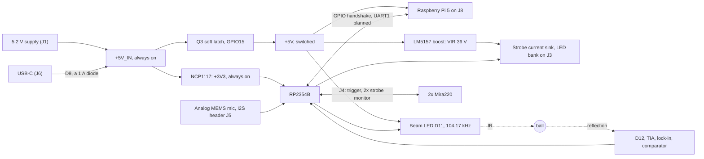
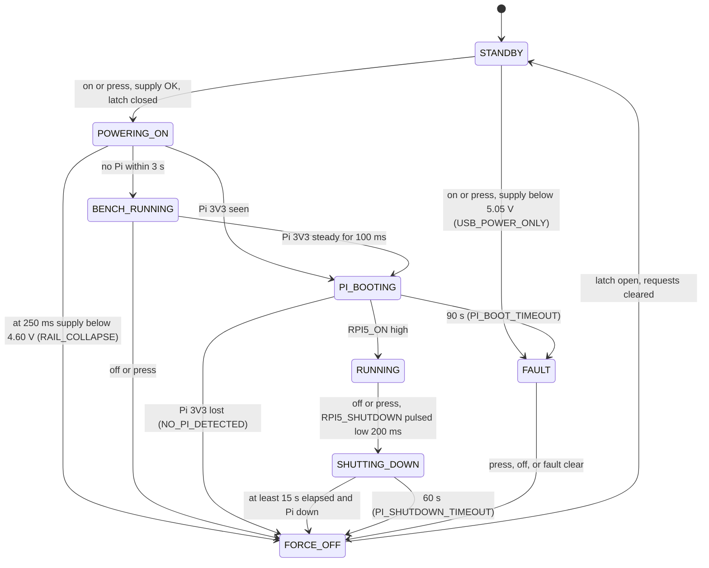

<!-- SPDX-License-Identifier: GPL-3.0-or-later -->
<!-- Copyright (C) 2026 PiTrac contributors -->

# PiTrac V2 — Developer Guide

This is the entry point to the repository. It covers:

- what is here;
- how the controller board is wired;
- how the RP2354 firmware is built, and why it is shaped the way it is;
- what has not been built yet.

It is a map: it summarises, then links to the detailed records rather than repeating them.

> **State as of 2026-10-09** — commit `a8e08b3` ("Phase 6 strobe: dry tests, live-current mode,
> host tests, handoff docs"), which holds the changes listed in
> [Appendix D](#appendix-d-changes-made-alongside-this-guide), the 2026-10-05 audit fixes, the
> PROGRESS split into live + [`PROGRESS_ARCHIVE.md`](Hardware/firmware/PROGRESS_ARCHIVE.md)
> (PROGRESS §6 2026-10-05), the strobe 6a–6d firmware and its host tests, and the 2026-10-09
> handoff audit (PROGRESS §6 2026-10-09).
>
> **Live status** is always [`Hardware/firmware/PROGRESS.md`](Hardware/firmware/PROGRESS.md)
> §0 and the top block of §10. When this guide disagrees with that file, with `board.h` or with
> the netlist, **they win** ([§1.4](#14-sources-of-truth)).

## Contents

1. [Orientation](#1-orientation)
2. [Safety rules and invariants a software change can break](#2-safety-rules-and-invariants-a-software-change-can-break)
3. [Repository structure](#3-repository-structure)
4. [Hardware primer for a software engineer](#4-hardware-primer-for-a-software-engineer)
5. [PCB pinout](#5-pcb-pinout)
6. [Build, flash, test, debug](#6-build-flash-test-debug)
7. [Firmware architecture: how it was built and why](#7-firmware-architecture-how-it-was-built-and-why)
8. [Per-board bring-up: only what repeats](#8-per-board-bring-up-only-what-repeats)
9. [Pi-to-board interface](#9-pi-to-board-interface)
10. [Relationship to the upstream feature/pico branch](#10-relationship-to-the-upstream-featurepico-branch)
11. [Pi-side software in this repo](#11-pi-side-software-in-this-repo)
12. [TODO: what is not implemented or not done](#12-todo-what-is-not-implemented-or-not-done)
- [Appendix A: CLI command reference](#appendix-a-cli-command-reference)
- [Appendix B: Persistent config record](#appendix-b-persistent-config-record)
- [Appendix C: Glossary](#appendix-c-glossary)
- [Appendix D: Changes made alongside this guide](#appendix-d-changes-made-alongside-this-guide)

---

## 1. Orientation

### 1.1 What the board does

*"The Second Board To Rule Them All"* (Rev V1) is the real-time controller for a PiTrac launch
monitor. In one shot, it does five things:

1. Detects a golf ball crossing a vertical IR light curtain. The beam is a modulated 104.17 kHz
   carrier, read back with synchronous (lock-in) detection and a comparator.
2. Times the transit, which gives ball speed.
3. Triggers two Mira220 global-shutter cameras.
4. Fires a high-current (~9 A) IR strobe in a scheduled burst, so that each camera freezes the
   ball about ten times in one exposure.
5. Hands the result to a **Raspberry Pi 5**.

The Pi 5 sits on the 40-pin header and is **powered by this board**; it does image capture and
analysis.

**The RP2354 owns everything with microsecond timing. The Pi owns everything with pixels.**



### 1.2 Status at a glance

Bring-up is **phased**, and each phase is proven on the bench before the next starts. The
procedures are in the `BENCH_*.md` files and the results in `PROGRESS.md`.

| Phase | Scope | Status |
|---|---|---|
| 0 | Toolchain, CLI, ADC/DMA capture, erratum E9 check | ✅ |
| 0.5 | Rails, 36 V boost, virtual ground | ✅ |
| 1 | Power button, latch, USB/supply guards | ✅ — including Test 6 (stale power requests), an **owner-reported pass on 2026-09-28** |
| 1b | Pi soft-shutdown state machine against a *simulated* Pi | ✅ |
| 1c | Panel indicators | ✅ |
| 2 | Beam carrier and phase-locked demodulator | ✅ |
| 3 | Photodiode chain and calibration | 🟡 §3.1–3.6 done on board 3, and the first real ball waveform was captured (3.102 V peak, ~22.7 ms wide). Still open: comparator edge timing, the 20-pass repeatability set, and the R98 gain decision |
| 4 | Trigger-source experiment (comparator vs. ADC refinement) | 🟡 firmware written; the bench run is blocked by the acquisition window ([§12.1](#121-firmware-features)) |
| 5 | Microphone | 🟡 analog front end validated. No onset/veto firmware, and no real ball impact captured yet (CR-18) |
| 6 | High-current strobe | 🟡 **6a/6b dry tests PASS on board 1 (2026-10-06)** — U5 clamp 135 µs, PIO timing, schedule, A7, interlock, gate DAC. **6c/6d live-current firmware written 2026-10-07** (`strobe live on confirm`: staircase, 70 % ceiling, ADC0 readback per firing, overcurrent / stuck-on faults, pacing, watchdog, `strobe cal`); host-tested (78/78). **No live pulse fired yet** |
| 7 | Cameras | ❌ **no firmware**; J4 needs a 1.8 V level translator first (CR-09) |
| 8 | Real Pi integration | 🟡 the power/shutdown handshake is proven against a simulated Pi. The UART protocol and halt telemetry are not written, and no real Pi has been seated |

**Boards.**
- **Board 3** is the optics board. It has a reworked TIA (Rf 116 kΩ, Cf 0.99 pF), is
  calibrated, and has its calibration saved in flash.
- **Board 2** has the stock TIA. A probe on R61 sparked on 2026-10-05; damage check pending.
- ⚠ **One of boards 2/3 reads 10 Ω from R61 to GND** even with R62 removed — parked, R62 off;
  which board is to be confirmed ([PROGRESS §6](Hardware/firmware/PROGRESS.md)).
- **Board 1** is out of service **for optics** (foil across D12 destroyed U11B,
  [PROGRESS §11](Hardware/firmware/PROGRESS.md)) and is the **strobe board** since 2026-10-06.

**Next, per PROGRESS §0 (priority changed by owner 2026-10-02):**
1. ✅ [`BENCH_P6_STROBE.md`](Hardware/firmware/BENCH_P6_STROBE.md) **6a and 6b passed on
   board 1 (2026-10-06)** with the 2026-10-05 build, on the logic analyser, DMM and scope (Q10's
   gate: ≈ 12 V, clean edges).
2. **6c/6d on board 1** with the 2026-10-07 build. The gate loop's stability check (TP3 at a
   static setpoint) passed on 2026-10-08. Next is the 6c procedure — first live pulse at gate
   0, 3 % staircase with ADC0 against TP4, 6d at ~2 A, `strobe cal 9`, bursts.
3. Optical acquisition-window work ([§12.1](#121-firmware-features)), the §3.7 20-pass
   comparison and Phase 4 remain open; they do not block strobe testing.

The mic's real-ball-impact test (CR-18) can run in parallel.

### 1.3 How the work is organised

- **Phased bring-up, with the documents as the record.** Each phase has a procedure document
  that states, for every step, the board state and a pass criterion. Every measurement, decision
  and error lands in `PROGRESS.md` (§6 measurements, §8 decisions, §9 deferred items).
- **Design validation vs. per-board steps.** Work is split into two kinds. Design validation asks
  "how does this design behave?" and is done **once**. Per-board steps ask "what are *this*
  board's constants?" and are repeated **on every board**. The rule for deciding which kind a
  test is: *what would have to change for the answer to change?* If the answer is "a design
  respin", it is done once ([§8](#8-per-board-bring-up-only-what-repeats)).
- **"The CPU orchestrates; hardware executes."** Anything that must happen at a *specific time*
  goes to PWM, PIO, DMA or the ADC sequencer. Anything that merely has to happen *soon* stays
  on a core ([§7](#7-firmware-architecture-how-it-was-built-and-why)).
- **Who does what.** The owner runs the bench and commits. Most analysis and firmware was written
  with an AI assistant, which is why the docs are unusually explicit about conventions and traps
  ([`HANDOFF.md`](Hardware/firmware/HANDOFF.md)). HANDOFF.md also holds owner-machine specifics,
  such as the COM port and capture folders, on purpose.

### 1.4 Sources of truth

Several real bugs here came from hand-written hardware summaries that had drifted from the
board. The precedence is:

1. **The KiCad netlist**,
   [`The_Second_Board_To_Rule_Them_All.net`](Hardware/The_Second_Board_To_Rule_Them_All/The_Second_Board_To_Rule_Them_All.net),
   for connectivity and part values.
2. **[`Hardware/firmware/src/board.h`](Hardware/firmware/src/board.h)** — every pin and hardware
   constant. It is netlist-verified and heavily commented; read its "HARDWARE FACTS" block before
   touching a pin.
3. **[`HARDWARE_REFERENCE.md`](HARDWARE_REFERENCE.md)** — *generated* from the netlist by
   `tools/netlist_report.py`. Running `--check` fails if it drifts. Every claim is tagged
   [E]xtracted, [D]erived or [I]nterpreted.
4. **[`PROGRESS.md`](Hardware/firmware/PROGRESS.md)** — §0 and §10 hold live status, §6 the
   measurements, §8 the decisions ("do not re-litigate").
5. Everything else, including this guide and the original design document, which predates
   bring-up ([§4.6](#46-where-the-design-document-is-out-of-date)).

---

## 2. Safety rules and invariants a software change can break

Much of the firmware looks over-cautious or oddly specific. Almost every such case traces back to
one of the rules below. Each rule exists because of something that was measured, broke, or
nearly broke. **Keep these in mind when refactoring.**

| # | Invariant | Why | Enforced in |
|---|---|---|---|
| 1 | **GPIO27 `PULSE_LIMIT_DIS` is written 0 in exactly one place.** There is no CLI path and no config flag, and it is never put on PWM. | It defeats **U5**, the strobe's hardware pulse-width watchdog. A stuck-high strobe with U5 defeated runs ~9 A through a linear-mode FET until something burns. GPIO27 also shares PWM slice 5B with the panel LED. | `safe_state_init()` in [`safe_state.c`](Hardware/firmware/src/safe_state.c); `board.h` fact 2 |
| 2 | **GPIO15 `LATCH_CONTROL` is the Pi's power switch.** It stays SIO and is never PWM (it shares slice 7B with the beam carrier). | Closing or opening it with a Pi seated is a power event for the Pi. On PWM it would chop the Pi's rail at 104 kHz. | `power_fsm.c` |
| 3 | **Every RP2354 reset is a hard power cut to the Pi.** That covers SW2, `reset`, `bootsel`, the watchdog and a +5V_IN brownout. | On any reset GPIO15 goes high-Z, R12 pulls Q2's gate low, and the latch opens. This is deliberate: the rail must drop if the MCU dies on a 9 A board. The cost is that a Pi can never be shut down gracefully through a reset. | `reset` and `bootsel` refuse while a Pi is powered (`force` overrides). The watchdog is **off by default**. SW2 is operator discipline: tape it over when a Pi is seated. |
| 4 | **The +5 V rail never runs from USB.** Three thresholds apply: `V5_MIN_FOR_LATCH` 5.05 V before latching; `V5_MIN_UNDER_LOAD` 4.60 V once, 250 ms after latching; `V5_MIN_SUSTAINED` 4.90 V continuously with a **500 ms debounce**. The +5V_IN reading uses a default scale of **1.063**. | USB VBUS feeds +5V_IN through **D8, an SS14 rated 1 A**, and a Pi 5 draws amps. The debounce is load-bearing, because strobe bursts are *expected* to sag the rail for milliseconds. The raw ADC reading is ~5.9 % low (PROGRESS Q9). | `power_fsm.c`, `board.h`. Per board, `adc5vcal` is a safety gate ([§8](#8-per-board-bring-up-only-what-repeats)) |
| 5 | **`on` is accepted only from STANDBY with no stop pending.** Requests never queue across a power cycle. | On 2026-09-18 a stale `on` re-closed the latch after an `off`. | `power_request_on()`; power FSM host tests ([§6.6](#66-host-tests)) |
| 6 | **Beam duty: 25 % operating, with a 35 % ceiling on the *effective* duty** (after U9's clamp). It is enforced inside `beam_configure()` and applies to every caller. The beam powers up at 2 %. | At 30 % duty the LED junction reaches 123–133 °C against a 145 °C maximum (CR-12). | [`beam.c`](Hardware/firmware/src/beam.c) |
| 7 | **PWM "same-channel" pairs share one compare register:** 12/28 (6A), 15/31 (7B), 11/27 (5B), 36/44 (10A), 2/18 (1A), 3/19 (1B). Slices are always resolved at runtime with `pwm_gpio_to_slice_num()`; there are deliberately no `PWM_SLICE_*` constants. | Putting one pin of a pair on PWM silently drives the other pin, which may be a safety line or Pi-facing, with the same waveform. Three hand-written slice constants were once wrong. | `board.h` slice map; [HARDWARE_REFERENCE §11](HARDWARE_REFERENCE.md) |
| 8 | **The PIO GPIOBASE partition.** GPIO46 is reachable only from a block with base 16, and GPIO4–10 only from base 0. `pio_alloc_init()` runs before any `pio_add_program()`. | The SDK refuses to change a block's base once it holds code, and rejects configs that reach outside the window. This fails at run time, not at compile time. | [`pio_alloc.c`](Hardware/firmware/src/pio_alloc.c) (with `_Static_assert`s) |
| 9 | **`safe_state_now()` reverts every pin to SIO.** Call `safe_state_reclaim_pins()` if the board should keep working afterwards. | Otherwise `beam on` reports success and emits no light. | `safe_state.h` |
| 10 | **GPIO33 (HPF SEL) goes HIGH (= HOLD) only while +5VA is up.** | Driving SEL into an unpowered TMUX1219 back-feeds the analog rail. | `detect_hpf_set()` refuses otherwise; `detect_hpf_safe_off()` runs on every rail drop |
| 11 | **Never sample ADC channels 3, 4 or 6**, which are digital pins. **The round-robin channel count must be 1, 2 or 4.** | Sampling an output is a bug, not a measurement. A 3-channel round-robin can't divide the power-of-two DMA ring, so the channel labels rotate on every wrap. | `ADC_VALID_MASK`; `adc_engine.c` |
| 12 | **Nothing on the armed or firing path may block.** Bench commands may, but they wait with `pitrac_yield_ms()`, never `sleep_ms()`. | A blocked superloop starves the supply monitor and the **5 s long-press escape hatch**. That is the operator's only handle once 9 A strobes exist. | [`service.h`](Hardware/firmware/src/service.h) |
| 13 | **Switch the ADC to BURST only after the shot's ch5 and ch7 analysis has finished.** | BURST restarts the DMA ring with a new stride, so earlier detect and mic samples become unreadable (ARCHITECTURE A9). The failure is silent. | [`shot.h`](Hardware/firmware/src/shot.h) documents it; the sequencer is meant to own it |
| 14 | **Flash writes happen only when the machine is quiet.** | A 4 KB erase stalls XIP and blinds the supply monitor for tens of ms. | `cfg_save_blocked_reason()` |
| 15 | **Physical rules:** keep **J4 disconnected** (the Mira220 I/O is 1.8 V and not 3.3 V tolerant, CR-09). Keep **nothing conductive near D12**, whose cathode sits at 36 V. **No Pi on J8** until Phase 7c. | — | procedure docs |

---

## 3. Repository structure

### 3.1 Tree

```
PiTrac_V2/
├── DEVELOPER_GUIDE.md             this file
├── HARDWARE_REFERENCE.md          GENERATED from the netlist by tools/netlist_report.py; do not edit
├── LICENSE                        GPL-3.0 text (firmware, host tools, Software/)
├── LICENSES/CERN-OHL-S-2.0.txt    CERN-OHL-S v2 text (board design)
├── LICENSING.md                   which licence covers what, and why
├── .gitattributes, .gitignore     LF for *.sh/*.cfg/*.py; ignores build/, captures/, *.uf2, *.kicad_prl ...
│
├── Hardware/
│   ├── README.md
│   ├── The_Second_Board_To_Rule_Them_All.md   original design doc: theory of operation, pin map,
│   │                                           firmware pseudocode, protocol proposal, timing budget
│   ├── The_Second_Board_To_Rule_Them_All/     KiCad 10 project (sheet table in §3.2)
│   │   ├── *.kicad_pro, *.kicad_sch (root + sheets), *.kicad_pcb, *.kicad_dru
│   │   ├── The_Second_Board_To_Rule_Them_All.net            netlist export: the firmware's source of truth
│   │   ├── The_Second_Board_To_Rule_Them_All (netlist).txt  second export, identical except its timestamp
│   │   ├── The_Second_Board_To_Rule_Them_All.csv            BOM export (agrees with the fab BOM)
│   │   ├── The_Second_Board_To_Rule_Them_All.pdf            schematic PDF
│   │   ├── MCU_RaspberryPi_RP2350.kicad_sym, "Pi Connector Parts.kicad_sym"   symbol libraries
│   │   ├── Library.pretty/, RP2350_80QFN_minimal.pretty/, fp-lib-table        footprints
│   │   ├── KiCad TXT Files/SVG/                             per-layer SVG plots (plain and Color/)
│   │   └── jlcpcb/                                          gerber/, production_files/ (BOM, CPL and
│   │                                                        gerber zip as sent to fab), project.db
│   └── firmware/                    RP2354B firmware: C11, Pico SDK 2.3.0, ARM
│       ├── CMakeLists.txt           forces PICO_BOARD=pitrac_ltb_v1, PICO_PLATFORM=rp2350
│       ├── pico_sdk_import.cmake
│       ├── boards/pitrac_ltb_v1.h   SDK board header: RP2350B (48 GPIO), 2 MB flash, 12 MHz XOSC, UART1
│       ├── src/                     15 C modules + 2 PIO programs (§7.4)
│       ├── tests/                   native host tests for power_fsm.c, strobe_plan.c, strobe_live.c and service.c (CMake + CTest, mocks/)
│       ├── tools/                   netlist_report.py, scope.py, la_phase.py, pilot_analysis.py, check_doc_links.py, openocd_pi5.cfg, flash_swd.sh
│       └── *.md                     bring-up record and procedures (§3.3)
│
└── Software/
    ├── README.md
    └── camera-comparison/           Pi 5 Mira220 vs IMX296 raw NIR capture, preview, conversion (§11)
        ├── scripts/                 bash: install-mira220.sh, configure-cameras.sh, record-dual.sh, ...
        ├── preview/                 Python focus-preview server (+ tests)
        ├── web/                     browser UI for the preview (+ node tests, *.test.mjs)
        ├── conversion/              Python: raw -> MP4 viewing copies, beam composites (+ tests)
        ├── tests/                   bash tests for the installer and writer
        └── versions.env             pinned driver commit, kernel and validation state (data, never sourced)
```

**Generated vs. hand-written.**
- Generated: `HARDWARE_REFERENCE.md` (by `netlist_report.py`); `build/` (CMake, gitignored); the
  PIO headers `detect.pio.h` and `strobe_burst.pio.h` (by `pioasm`, inside `build/`).
- Hand-written: everything else.
- Exported from KiCad, and not to be hand-edited: the netlists, BOM CSVs, SVGs and gerbers.

### 3.2 KiCad sheets

The file names do not match the sheet names, and one of them is actively misleading. The map
below comes from the root schematic:

| File | Sheet name | What is on it |
|---|---|---|
| `The_Second_Board_To_Rule_Them_All.kicad_sch` | *(root)* | Hierarchy, mounting holes H1–H8 |
| `Power.kicad_sch` | Power | J1 input, Q1 reverse-polarity FET, **Q3 soft latch** (Q2 driver, J2 bypass), NCP1117 +3V3, LM5157 36 V boost, 12 V shunt, J3 VIR out, TP1/TP2. The title block still reads "V3 Connector + IRLED", a leftover of the board's lineage. |
| `RP2350_80QFN_minimal.kicad_sch` | MCU and Connectors | RP2354B (U3) and its core buck, crystal, USB-C J6, SW1/SW2, **Pi header J8**, J4 cameras, J5 I2S mic, J7 panel, J9 USB-A, status LEDs |
| `strobe.kicad_sch` | **LED Trigger** | The **beam** LED D11 driver: U9 one-shot, U10 gate driver, Q11, TP5. *Despite the file name, this is not the strobe.* |
| `Strobe Generation.kicad_sch` | Strobe Generation | The high-current strobe sink: gate DAC filter, U6 LM358, U7 follower, Q9/Q10, U5 one-shot, Q8 watchdog defeat, TP3/TP4 |
| `photodiode.kicad_sch` | Photodiode Amplification | D12, U11 TIA and DC servo, +2V5 buffer, TP6/TP7 |
| `photodiode_demodulation.kicad_sch` | Photodiode Demodulation | U13 demodulator, LPF, U14 gated HPF, U12B gain, U15 comparator, threshold filter, TP8–TP10 |
| `microphone.kicad_sch` | Audio Trigger | U16 MEMS mic, U17 LMV321 |
| `IRLED.kicad_sch`, `MCU.kicad_sch` | *not instantiated* | Legacy files that no sheet references (`MCU.kicad_sch` is empty). Editing them changes nothing on the board. |

### 3.3 Documentation map

About 15 documents and 23,000 lines, most of them a bench record. Suggested path for a new
developer:

1. This guide.
2. [`HANDOFF.md`](Hardware/firmware/HANDOFF.md) §3, §7 and §8.
3. [`PROGRESS.md`](Hardware/firmware/PROGRESS.md) §0, §0.5, §8 and §10.
4. [`ARCHITECTURE.md`](Hardware/firmware/ARCHITECTURE.md).
5. [`board.h`](Hardware/firmware/src/board.h).
6. The module you are about to change.

| Document | What it is | Read it when |
|---|---|---|
| [`Hardware/firmware/START_HERE.md`](Hardware/firmware/START_HERE.md) | Beginner walkthrough: install, build, flash, first commands | Skim only; §6 of this guide is the condensed version |
| [`HANDOFF.md`](Hardware/firmware/HANDOFF.md) | Conventions, safety rules, tooling traps, measurement lessons that were expensive to learn | Before any bench work or signal analysis |
| [`PROGRESS.md`](Hardware/firmware/PROGRESS.md) | The living record: §0 status, §0.5 settled vs. per-board, §1 safety, §2 verified hardware facts, §3 open questions Q1–Q12, §5 phase checklist, §6 measurement log, §7 source layout, §8 decisions, §9 deferred items, §10 resume point, §11 the board-1 incident | Whenever you need a number, a reason, or the current state |
| [`ARCHITECTURE.md`](Hardware/firmware/ARCHITECTURE.md) | Hardware-offload audit A1–A9: PWM/PIO/DMA/ADC allocation and why | Before touching any peripheral allocation |
| [`BRINGUP_NEW_BOARD.md`](Hardware/firmware/BRINGUP_NEW_BOARD.md) | The per-board procedure with a sign-off table | Bringing up a new board ([§8](#8-per-board-bring-up-only-what-repeats)) |
| [`BENCH.md`](Hardware/firmware/BENCH.md) | Phases 0–1c, including Test 6 | Power-path work |
| [`BENCH_P2_BEAM.md`](Hardware/firmware/BENCH_P2_BEAM.md) | Phase 2: carrier, phase lock, clamp, duty fidelity | Beam work |
| [`BENCH_P3_DETECT.md`](Hardware/firmware/BENCH_P3_DETECT.md) | Phases 3–4, the largest document. Run order is 3.5 → 3.6b → 3.6 → 3.7 | Detection-chain work |
| [`BENCH_P5_P7_MIC_CAMERA.md`](Hardware/firmware/BENCH_P5_P7_MIC_CAMERA.md) | Phases 5 and 7 | Mic or cameras |
| [`BENCH_P6_STROBE.md`](Hardware/firmware/BENCH_P6_STROBE.md) | Phase 6: 9 A, linear-mode FET. **Read fully before powering** | Writing strobe firmware |
| [`BENCH_P8_PI.md`](Hardware/firmware/BENCH_P8_PI.md) | Phase 8: the gate checklist, Q4/Q7/Q10/Q11, 20-cycle shutdown acceptance, halt-telemetry design | Pi integration |
| [`NEXT_BOARD_REV.md`](Hardware/firmware/NEXT_BOARD_REV.md) | Hardware change requests CR-01…CR-18 and layout rules | Anything that looks like a board bug |
| [`SETUP.md`](Hardware/firmware/SETUP.md) | Toolchain install, VS Code route and manual route | Setting up a machine |
| [`The_Second_Board_To_Rule_Them_All.md`](Hardware/The_Second_Board_To_Rule_Them_All.md) | Original design document | For the concept; then see [§4.6](#46-where-the-design-document-is-out-of-date) |
| [`HARDWARE_REFERENCE.md`](HARDWARE_REFERENCE.md) | Generated netlist digest: GPIO/ADC maps, test points, DNP parts, corner frequencies, PWM collisions | Any hardware value |
| [`Software/camera-comparison/`](Software/camera-comparison/README.md) | Pi camera setup, focus preview, conversion | [§11](#11-pi-side-software-in-this-repo) |

---

## 4. Hardware primer for a software engineer

This section covers only what you need to reason about the firmware. The design document and
`HARDWARE_REFERENCE.md` go deeper. Values are measured unless marked otherwise.

### 4.1 Power domains

- **Always on:** `+5V_IN` comes from J1 through Q1 (reverse-polarity P-FET), or from USB-C VBUS
  through **D8**. From it:
  - `+3V3` (NCP1117) feeds the RP2354, both 74LVC1G123 one-shots, status LEDs D5/D6 and the
    comparator pull-up.
  - `+3.3VA` feeds the analog mic.

  **The MCU runs whenever J1 or USB has power.** The panel button does not power the MCU; it asks
  the running firmware to close the latch.
- **Switched `+5V`:** high-side switch Q3, driven by Q2 from **GPIO15**. R13 holds it off, R12
  holds GPIO15 low through reset, and jumper **J2** forces it on for rail smoke tests. It feeds:
  - the Pi 5 (J8.2/4);
  - the **LM5157 boost** to **VIR 36 V** (J3 LED bank, D12 bias, and the ~5 mA 12 V shunt for
    the strobe gate drive);
  - the beam LED, the LM393, USB-A J9, the panel LEDs and D3;
  - through FB2, `+5VA`: the OPA4323s, the TMUX1219s, and the `+2V5` virtual ground.
- **Supply reference points:**

  | Condition | Measurement |
  |---|---|
  | USB-only `+5V_IN` | 4.6–4.85 V (port dependent) |
  | Bench PSU | 5.20 V |
  | Standby current | 32 mA |
  | Rail-up idle current (no beam, no Pi) | 129 mA; about 40 mA of it is the 12 V shunt (CR-07) |
- **No VIR sense and no PGOOD** (CR-08). Boost readiness is timed: an 86 ms soft start, and
  `RAIL_SETTLE_MS` is 250 ms. Set the **bench PSU current limit to ≥ 2 A**. At a lower limit the
  boost parks near 27 V and everything *looks* fine ([BRINGUP §1](Hardware/firmware/BRINGUP_NEW_BOARD.md)).

### 4.2 The optical detection chain

```mermaid
flowchart LR
    C["GPIO31 carrier<br/>PWM 7B, 104.17 kHz, 25 %"] --> U9["U9 one-shot<br/>clamps high phase ≤ 122.68 µs"]
    U9 --> D11["U10 → Q11 → D11 beam LED<br/>~3 A peak"]
    D11 -.->|IR, via ball| D12["D12 photodiode<br/>reverse-biased 36 V"]
    D12 --> TIA["U11A TIA + DC servo<br/>TP7, ADC2 tap"]
    TIA --> DEM["U13 sign-switching demod<br/>clock: GPIO39, PWM 11B, phase-locked"]
    DEM --> LPF["4th-order LPF<br/>f0 15.39 kHz, TP9"]
    LPF --> HPF["C81 + U14 gated HPF<br/>GPIO33: 0 TRACK, 1 HOLD"]
    HPF --> G["U12B, gain 14.5<br/>R98 DNP gain option"]
    G --> CMP["U15 LM393<br/>vs Threshold_DC (GPIO44 DAC, TP8)"]
    CMP --> GP46["GPIO46 D_Comparator<br/>active high"]
    G --> ADC5["R102/D14 → ADC5"]
```



What matters to firmware:

- **Lock-in detection.** Only light modulated at the carrier survives, and ambient rejection
  measured about **48 dB** at 120 Hz. The noise floor is set by the *optical background* (0.65 to
  14 mV at ADC5 depending on the scene), not by the electronics.
- **The demod phase must be calibrated.** The chain behaves as a **pure delay**: 340 ns on board
  3, 553–600 ns on board 2. The demod clock is offset by `demod_phase_ticks`, where
  1 tick = 6.67 ns = 0.25°. That tick value also contains a duty-dependent geometric term, so
  **compare chain delay between boards, never ticks**.
- **TRACK vs. HOLD.**
  - **TRACK** (GPIO33 = 0) is a 0.66 s high-pass (measured τ ≈ 0.75 s) that follows slow drift.
  - **HOLD** (GPIO33 = 1) is a genuine open circuit, used while armed so that a slow ball is not
    filtered away. In HOLD, C81 drifts on switch leakage: 50–250 pA across three boards, or
    2.3–11 mV/s at ADC5.
  - **Any measurement taken within ~5 s of a beam or HPF change measures the HPF recovering.**
- **ADC5 idles near 0 V.** U12B is ground-referenced, and a ball is a positive bump. It saturates
  at 3.3 V (ADC full scale), even though U12B can swing to 5.2 V (CR-16). Because the quiescent
  point is U12B's bottom rail, **a rail sag blinds the detector**.
- **U15 has no hysteresis** (CR-13). Slow edges chatter, and the firmware counts the fragments
  rather than filtering them ([§7.8](#78-decision-log)).
- **The virtual ground is `+5VA/2` and tracks the rail.** In HOLD, a rail step reaches the
  comparator at **×7.43** (measured, Q8/CR-02). At a 300 mV threshold, a 39 mV rail step reads
  as a ball. Keep the rail stiff while armed.
- **LED-to-photodiode crosstalk** (CR-15) is optical. It is mitigated by baffling (linear to 25 %
  duty), and it depends on the mechanics.

### 4.3 The strobe driver (Phase 6; dry-test firmware written 2026-10-02, no current yet)

- **Current path.** VIR 36 V → external LED strings on J3 → **Q9 IRLR2905** (linear mode; current
  set by gate voltage) → **Q10 AO3400A** (fast series switch) → R65 ∥ R66 = 0.135 Ω sense → GND.
- **"How much".**
  - GPIO28 `Gate_PWM` (**PWM 6A**) drives a 2-pole RC, then an LM358 ×3 stage with an MMDT2227
    follower, which sets Q9's gate (0–9.9 V).
  - There is **no analog current loop**. Current is calibrated in firmware against ADC0 at
    135 mV/A, read through R32 4.7 kΩ. At 9 A, ADC0 reads 1.215 V.
- **"When".** GPIO25 `Strobe_Pulse` (**PIO0**) → **U5** one-shot (hardware width clamp; its twin
  U9 measured 122.68 µs) → MCP1416 → Q10 gate. GPIO27 drives Q8, which defeats U5 (test only;
  invariant 1).
- **Design point:** 2 strings × 4.5 A = 9 A pulses, about 10 per burst, width ≤ 100 µs
  (`STROBE_SW_MAX_US`), ≤ 6 mC per burst (`BURST_CHARGE_MAX_MC`, not yet validated).
- **Why the timing chain is hardware.** The PIO produces the pulse train and U5 clamps each pulse
  regardless of firmware state. Firmware limits sit below the hardware limit, so the one-shot is a
  backstop, not a pulse-shaper.

### 4.4 Cameras, audio, USB and indicators

- **Cameras (J4).** Pins:
  - D_Cam_Trigger: GPIO10, out, shared by both cameras;
  - Cam_Strobe_0/1: GPIO8/9, in — the exposure-active monitors;
  - all through 220 Ω.

  The intended flow is: trigger → wait for **both** strobe monitors → measure `t_cam` → fire the
  burst. **The Mira220 I/O is 1.8 V with no 3.3 V tolerance.**
  - The RP2350 cannot read a 1.8 V high: its VIH is about 2.15 V.
  - Driving 3.3 V through 220 Ω injects about 3.6 mA into the sensor.

  CR-09 needs a translator and a 1.8 V reference at J4. **Do not connect J4.**
- **Analog mic.**
  - Signal path: U16 MEMS → U17 LMV321 band-pass (~2.41–24 kHz, gain ≈ −6.7) → GPIO47/ADC7,
    biased at 1.65 V. It is on the always-on rail.
  - Measured: noise 0.5 mV σ (sub-LSB), clap/snap SNR 51–54 dB.
  - **45 % of a clap's energy is below the 2.41 kHz corner** (CR-18). Whether that matters depends
    on a real ball impact, which has not been captured yet.
- **I2S mic header (J5).** Optional: GPIO4 SCK, GPIO5 WS, GPIO6 DATA, 220 Ω each. PIO1 is reserved
  for it. No firmware yet.
- **USB.**
  - J6 USB-C is a device port: CDC CLI plus BOOTSEL.
  - J9 USB-A is a switched accessory outlet (GPIO32 → Q6 → Q7). It is **not** a Pi power path.
- **Buttons.**
  - SW1 is BOOTSEL (QSPI_SS via R22).
  - SW2 is RUN/reset.
  - The panel button (off-board, J7) is GPIO14: active low, with **no external pull-up**, so the
    internal pull-up is load-bearing.
- **LEDs.**
  - D3 (green) is hard-wired to +5V.
  - D6 (red, GPIO18) and D5 (yellow, GPIO19) are firmware status LEDs, always powered, active
    high. D5 blinking slowly means "standby, healthy".
  - The panel ring (GPIO11) and ready LED (GPIO12) are fed from the *switched* rail, so they
    cannot show standby (CR-05).

### 4.5 Clock, flash, debug

- **Clock and flash.** 12 MHz crystal (Y1, ABM8), `sysclk` 150 MHz, 2 MB flash stacked inside the
  RP2354B (QSPI data pins not bonded out).
- **Silicon.** Board 1 read back as revision **A4**, on which erratum E9 (an input with pull-down
  latching near 2.2 V) did not appear. Each die is different, so the `pins` check repeats on
  every board.
- **Debug.** SWDIO and SWCLK go straight to **J8.18 / J8.22** (Pi GPIO24/25), with no series
  resistors and **no separate debug connector**. A Pi 5 on flying leads can act as the SWD probe
  ([§6.4](#64-flash)).

### 4.6 Where the design document is out of date

[`The_Second_Board_To_Rule_Them_All.md`](Hardware/The_Second_Board_To_Rule_Them_All.md) was
written before bring-up. Its concept and topology are right, but these values and methods are
superseded:

| Topic | Design document says | Current truth | Evidence |
|---|---|---|---|
| `+2V5` virtual ground | 2.50 V, "regulated" | **+5VA ÷ 2 = 2.59 V** on a 5.2 V rail, and it tracks the rail | PROGRESS §2, Q8; CR-02 |
| TP6/TP7/TP9/TP10 quiescent | 2.50 V | 2.59 V | PROGRESS_ARCHIVE §6 |
| One-shot clamp (U9, U5) | 113 µs | **U9 measured 122.68 µs** (K ≈ 1.0, not the 0.7 a datasheet K implies). U5 not yet measured | PROGRESS Q1 |
| PWM slices | carrier 3B, demod 7B, gate DAC 2A | **7B, 11B, 6A** (RP2350B mapping). 6A collided with the ready LED; **fixed in firmware 2026-10-02** (ready LED SIO) | `board.h`; ARCHITECTURE A7 |
| `HPF_Toggle` polarity | 1 = tracking | **0 = TRACK, 1 = HOLD** | `HPF_SEL_TRACK`; TMUX1219 truth table plus four bench confirmations |
| LPF corner | 15.9 kHz | **15.39 kHz** (the annotation is stale) | HARDWARE_REFERENCE §5 |
| USB-only supply / guard | ~4.6–4.7 V; one threshold `V5_MIN_FOR_PI` 4.90 V | 4.6–4.85 V; **three thresholds** (5.05 / 4.60 / 4.90 V + 500 ms) and a **1.063** ADC scale | `board.h`; PROGRESS Q9 |
| Carrier | "~100 kHz at 30 %", a firmware parameter | **104.1667 kHz fixed for every board**; **25 %** operating, 35 % ceiling | PROGRESS §8; CR-12 |
| Demod phase calibration (§13.8) | Static reflector; sweep phase and read ADC5 | **Cannot work**, because ADC5 sits behind the 0.66 s HPF. Replaced by the chopped-beam differential `cal demod` plus the `cal model` fit, with **no** reflector | PROGRESS §8; `cal.h` |
| Comparator timing | GPIO IRQ, RAM handler on core 1 | **PIO transit timer** (PIO2 SM0, GPIOBASE 16), one FIFO word per pulse | ARCHITECTURE A2 |
| ADC scheduling | "Mode A" ch1/2/5/7 including while armed | IDLE {1,2,5,7} at 125 ksps each; ARMED {5,7} at 250 ksps; BURST {0} at 500 ksps; one continuous DMA ring | `adc_engine.h` |
| Threshold DAC settle | 10 ms, two 1 ms poles | **20 ms**: the cascaded RC's poles are 2.62 ms and 0.382 ms | `DAC_SETTLE_MS` |
| `RPI5_SHUTDOWN` | Pulses high | **Active-low 200 ms** (the `gpio-shutdown` default), confirmed on hardware | `board.h`; PROGRESS Q7 |
| Pi presence | One sample at 250 ms, fault at 2 s | **3 s detection window**, then `BENCH_RUNNING`, with a debounced late promotion | `power_fsm.c`; PROGRESS §8 |
| Watchdog | Enabled at boot (500 ms), fed on a core-1 heartbeat | **Off by default**, because a watchdog reset cuts the Pi's power. `wdog on` arms 1 s per session; **live strobe mode (6c, 2026-10-07) arms it itself** and disarms it on exit, and `wdog off` is refused while live | `main.c`, `service.h`, `strobe.c` |
| `PULSE_LIMIT_DIS` | A CLI "unlock-watchdog" command with a token | **No CLI path at all** | `safe_state.c` |
| Boost frequency | 1.055 MHz | The only switcher tone on +5 V is **801 kHz**, dithered. Whether it comes from L1 or L2 is unresolved | PROGRESS_ARCHIVE §6 |
| R98 | "Fit 2 kΩ for gain 28" | R98's *value* is a continuous gain knob, chosen after measuring the ball signal (`cal gain`) | HARDWARE_REFERENCE §6 |
| Sheets | "8 sheets" | Root + 7 sub-sheets, plus 2 legacy files ([§3.2](#32-kicad-sheets)) | root schematic |

---

## 5. PCB pinout

Every row in this section was checked against the netlist on 2026-09-28. The generated
[`HARDWARE_REFERENCE.md`](HARDWARE_REFERENCE.md) §1–3 holds the raw GPIO→net map and cannot
drift silently. The firmware names come from [`board.h`](Hardware/firmware/src/board.h).

**Column key.**
- **Boot**: the level or pull that `safe_state_init()` applies before anything else runs. A dash
  means the pin is left at the pad's reset default, which is an input with the internal
  pull-down enabled.
- **Peripheral**: the current owner of the pin. "(planned)" means it is reserved but has no code
  yet.

### 5.1 RP2354B GPIO map

| GPIO | Firmware name | Dir | Boot | Peripheral | Goes to | Notes |
|---:|---|---|---|---|---|---|
| 0 | `PIN_RPI5_ON` | in | pull-down | SIO | R29 1 kΩ → **J8.15** (Pi GPIO22) | Pi "userspace up". E9-sensitive |
| 1 | `PIN_HANDSHAKE_0` | bidir | pull-down | SIO | R36 1 kΩ → **J8.16** (Pi GPIO23) | Spare, uncommitted |
| 2 | `PIN_SYSTEM_READY` | out | low | SIO | R41 1 kΩ → **J8.13** (Pi GPIO27) | Armed mirror. Shares slice 1A with GPIO18: keep SIO |
| 3 | `PIN_IRQ_OUT` | out | low | SIO | R43 1 kΩ → **J8.11** (Pi GPIO17) | "Capture complete" poke. Shares 1B with GPIO19 |
| 4 | `PIN_I2S_SCK` | out | — | PIO1 SM0 (planned) | R28 220 Ω → J5.5 | Optional I2S mic |
| 5 | `PIN_I2S_WS` | out | — | PIO1 SM0 (planned) | R26 220 Ω → J5.3 | |
| 6 | `PIN_I2S_DATA` | in | — | PIO1 SM0 (planned) | R25 220 Ω → J5.1 | |
| 7 | `PIN_HANDSHAKE_1` | bidir | pull-down | SIO | R37 1 kΩ → **J8.36** (Pi GPIO16) | Spare, uncommitted |
| 8 | `PIN_CAM_STROBE_0` | in | pull-down | SIO; PIO0 SM1 (planned) | R19 220 Ω → J4.7 | Camera 0 exposure monitor. E9-sensitive; 1.8 V issue (CR-09) |
| 9 | `PIN_CAM_STROBE_1` | in | pull-down | SIO; PIO0 SM1 (planned) | R24 220 Ω → J4.8 | Camera 1 exposure monitor |
| 10 | `PIN_CAM_TRIGGER` | out | low | SIO; PIO0 SM1 (planned) | R18 220 Ω → J4.3 + J4.4 | Both cameras, one net |
| 11 | `PIN_PWR_BTN_LED` | out | low | **PWM 5B** (~1 kHz) | Q4 → R48 47 Ω → J7.2 | Panel ring LED, switched rail. 5B is shared with GPIO27 |
| 12 | `PIN_READY_LED` | out | low | **SIO** on/off (since 2026-10-02) | Q5 → R49 220 Ω → J7.6 | Panel ready LED. Same PWM channel as GPIO28, so it must **never** go back on PWM (A7; CR-01 optional) |
| 13 | — | — | — | — | unconnected | Slice 6B is free; CR-01 moves the ready LED here |
| 14 | `PIN_PWR_TOGGLE` | in | **pull-up** | SIO | R42 1 kΩ + C40 100 nF → J7.3 | Panel button, active low. **No external pull-up** |
| 15 | `PIN_LATCH_CONTROL` | out | low | SIO | Q2 gate, R12 10 kΩ to GND | 🔴 **+5 V latch = the Pi's power.** Never PWM (it shares 7B with GPIO31) |
| 16–17 | — | — | — | — | unconnected | |
| 18 | `PIN_LED_RED` | out | low | SIO | D6 red, R17 120 Ω | Fault indicator, always on. `PICO_DEFAULT_LED_PIN` |
| 19 | `PIN_LED_YELLOW` | out | low | SIO | D5 yellow, R16 120 Ω | Slow blink = standby, healthy |
| 20–23 | — | — | — | — | unconnected | |
| 24 | `PIN_PI_3V3_SENSE` | in | no pull | SIO | R45 10 kΩ / R44 100 kΩ from **J8.1 / J8.17** | Pi presence: 3.3 V × 0.909 ≈ 3.0 V when the Pi is powered. E9-sensitive |
| 25 | `PIN_STROBE_PULSE` | out | low | SIO low; **PIO0 SM0** only during an admitted burst | R33 0 Ω → `Strobe_Pulse` → U5 one-shot (R57 1 kΩ pull-down) | Strobe pulse gate, hardware-clamped |
| 26 | — | — | — | — | unconnected | |
| 27 | `PIN_PULSE_LIMIT_DIS` | out | **low, forever** | SIO | Q8 gate (R54 1 kΩ) | 🔴 **Defeats U5.** Written once, in `safe_state_init()` |
| 28 | `PIN_GATE_PWM` | out | low | **PWM 6A** (146.5 kHz, owned by `strobe.c`) | R55 10 kΩ → 2-pole RC → U6 | Strobe current setpoint DAC. Zero at boot and on every rail-down |
| 29–30 | — | — | — | — | unconnected | |
| 31 | `PIN_MOD_PWM` | out | low | **PWM 7B** | R38 0 Ω → `Modulation_PWM` → U9 one-shot (R69 1 kΩ pull-down) | Beam carrier, 104.1667 kHz |
| 32 | `PIN_USB_ENABLE` | out | low | SIO | Q6 (R52 10 kΩ) → Q7 high-side | USB-A J9 accessory power |
| 33 | `PIN_HPF_TOGGLE` | out | low | SIO | U14 TMUX1219 SEL | **0 = TRACK, 1 = HOLD.** HIGH only with +5VA up |
| 34–35 | — | — | — | — | unconnected | |
| 36 | `PIN_UART_TX` | out | — | UART1 (reserved) | R30 220 Ω → **J8.10** (Pi GPIO15, RXD) | Pi link, not yet used. Never PWM (it shares 10A with GPIO44) |
| 37 | `PIN_UART_RX` | in | — | UART1 (reserved) | R31 220 Ω → **J8.8** (Pi GPIO14, TXD) | |
| 38 | — | — | — | — | unconnected | |
| 39 | `PIN_DEMOD_PWM` | out | low | **PWM 11B** | R40 0 Ω → `Demodulation_PWM` → U13 SEL (R91 1 kΩ pull-down) | Demod clock, phase-locked to 7B |
| 40 | ADC0 `ADC_CH_CURRENT` | in | — | ADC | R32 4.7 kΩ ← `CurrentSense_ADC` (TP4) | Strobe current, 135 mV/A |
| 41 | ADC1 `ADC_CH_5VIN` | in | — | ADC | R46/R47 100 kΩ/100 kΩ from +5V_IN | Supply discriminator (scale 1.063) |
| 42 | ADC2 `ADC_CH_TIA` | in | — | ADC | R82 1 kΩ + D13 clamp ← TIA_Out | Raw carrier tap |
| 43 | `PIN_RPI5_SHUTDOWN` | out | **high** (deasserted) | SIO | R39 1 kΩ → **J8.37** (Pi GPIO26) | **Active-low**, 200 ms pulse. ADC3: never sample |
| 44 | `PIN_THRESHOLD_PWM` | out | low | **PWM 10A** | R86 10 kΩ → 2-pole RC → `Threshold_DC` (TP8) → U15 − | Comparator threshold DAC. ADC4: never sample |
| 45 | ADC5 `ADC_CH_DETECT` | in | — | ADC | R102 1 kΩ + D14 clamp ← U12B out | Detect signal; idles ≈ 0 V |
| 46 | `PIN_D_COMPARATOR` | in | no pull | **PIO2 SM0** | U15 LM393 output, R103 10 kΩ pull-up | Ball in beam = HIGH. ADC6: never sample |
| 47 | ADC7 `ADC_CH_MIC` | in | — | ADC | U17 LMV321 out | Mic, 1.65 V bias |

**Unconnected:** 13, 16, 17, 20–23, 26, 29, 30, 34, 35, 38. The next board spin could use these
for VIR sense (CR-08) or a comparator test point (CR-17).

### 5.2 ADC channels

On the RP2350B, ADC channel *n* is GPIO 40 + *n*. `ADC_VALID_MASK` admits only 0, 1, 2, 5 and 7.

| Ch | GPIO | Signal | Scale / notes |
|---:|---:|---|---|
| 0 | 40 | Strobe current | 135 mV/A (0.135 Ω sense), so 9 A → 1.215 V. Used in BURST mode |
| 1 | 41 | +5V_IN ÷ 2 | The read path is ~5.9 % low, corrected by the 1.063 default scale plus a per-board `adc5vcal` |
| 2 | 42 | TIA_Out (raw carrier) | Only ~4.8 samples per carrier period, so health and amplitude only |
| 3 | 43 | — | `RPI5_SHUTDOWN` output. **Never sample** |
| 4 | 44 | — | `Threshold_PWM` output. **Never sample** |
| 5 | 45 | Detect signal (comparator +) | Idles ≈ 0 V and saturates at 3.3 V |
| 6 | 46 | — | `D_Comparator` digital input. **Never sample** |
| 7 | 47 | Mic | Biased at 1.65 V (~2048 codes) |

### 5.3 Connectors

**J8 — Raspberry Pi 5 header (2×20).** The board powers the Pi through pins 2 and 4.

| Pin | Net | Pi function | Board side |
|---:|---|---|---|
| 1, 17 | `+3V3_Pi5` | Pi 3V3 out | R45/R44 divider → GPIO24 (presence) |
| 2, 4 | `+5V` (switched) | Pi 5 V in | **The latch output.** It powers the Pi |
| 6, 9, 14, 20, 25, 30, 34, 39 | GND | GND | |
| 8 | `Pi5_TX / Pico_Rx` | GPIO14 TXD | R31 220 Ω → GPIO37 (UART1 RX) |
| 10 | `Pi5_RX / Pico_TX` | GPIO15 RXD | R30 220 Ω ← GPIO36 (UART1 TX) |
| 11 | `IRQ_OUT` | GPIO17 | ← GPIO3 via R43 1 kΩ |
| 13 | `System_Ready` | GPIO27 | ← GPIO2 via R41 1 kΩ |
| 15 | `RPI5_ON` | GPIO22 | → GPIO0 via R29 1 kΩ |
| 16 | `RPI5_RP2350_0` | GPIO23 | ↔ GPIO1 via R36 1 kΩ |
| 18 | `SWD` | GPIO24 | ↔ RP2354 **SWDIO** (no series R) |
| 22 | `SWCLK` | GPIO25 | → RP2354 **SWCLK** (no series R) |
| 36 | `RPI5_RP2350_1` | GPIO16 | ↔ GPIO7 via R37 1 kΩ |
| 37 | `RPI5_SHUTDOWN` | GPIO26 | ← GPIO43 via R39 1 kΩ (active low) |
| 3, 5 | GPIO2/SDA1, GPIO3/SCL1 | I2C1 | not connected on the board |
| 7, 29, 31, 32, 33 | GPIO4, 5, 6, 12, 13 | GPIO / PWM | not connected |
| 12, 35, 38, 40 | GPIO18, 19, 20, 21 | PCM | not connected |
| 19, 21, 23, 24, 26 | GPIO10, 9, 11, 8, 7 | SPI0 | not connected |
| 27, 28 | ID_SD, ID_SC | HAT EEPROM | not connected |

**The other connectors:**

| Ref | Type | Pin → net |
|---|---|---|
| **J1** | 2-pos screw terminal | 1 `+VDC` (5.2 V in, via Q1 to +5V_IN), 2 GND. CR-06 notes it cannot take 14 AWG stranded |
| **J2** | 1×2 header | 1 latch-gate node (Q3 gate, R13, Q2 drain), 2 GND. **Jumper fitted = +5 V forced on** (rail smoke test only) |
| **J3** | 2-pos screw terminal | 1 `VIR` (36 V), 2 `VIR_RTN`, the strobe sink's return |
| **J4** | 2×4 header | 1, 2, 5, 6 GND; **3 + 4** `D_Cam_Trigger` (GPIO10); **7** `Cam_Strobe_0` (GPIO8); **8** `Cam_Strobe_1` (GPIO9). ⚠ 3.3 V logic facing a 1.8 V sensor (CR-09) |
| **J5** | 2×3 header | **1** DATA (GPIO6), **2** +3.3VA, **3** WS (GPIO5), 4 GND, **5** SCK (GPIO4), 6 GND |
| **J6** | USB-C (device) | D+/D− via R34/R35 27 Ω to the RP2354. VBUS → D8 (SS14) → +5V_IN. CC1/CC2 5.1 kΩ (UFP). SBU not connected |
| **J7** | 1×6 panel header | 1 +5V (switched), 2 `PWR_LED−` (Q4 sink, GPIO11), 3 `PWR_TOGGLE` (GPIO14), 4 GND, 5 +5V (switched), 6 `RDY_LED−` (Q5 sink, GPIO12) |
| **J9** | USB-A | VBUS from Q7 (GPIO32), with an SMAJ6.0A TVS; D+ tied to D− (DCP signature). **Accessory power only; never the Pi** |

### 5.4 Buttons, jumper, LEDs

| Ref | What | Notes |
|---|---|---|
| SW1 | BOOTSEL | QSPI_SS via R22 1 kΩ. Hold it while tapping SW2 to reach the `RPI-RP2` drive |
| SW2 | RUN (reset) | **Is a hard power cut to the Pi.** No firmware guard is possible |
| Panel button | Off-board, on J7 | GPIO14. A short press asks for on / orderly shutdown; a 5 s hold forces off in any state |
| D3 (green) | Hard-wired +5 V indicator | Lit whenever the switched rail is up |
| D5 (yellow), D6 (red) | Firmware status | Always-on rail, active high |
| Panel ring, ready LED | GPIO11 / GPIO12 via Q4/Q5 | Switched rail, so dark in STANDBY (CR-05) |

### 5.5 Test points

All ten are bare 1.0 mm pads. Values are for a 5.2 V supply with the rail latched.

| TP | Net | Expect |
|---|---|---|
| TP1 | GND | Scope ground |
| TP2 | +12 V (zener shunt) | 12.3 V measured (11.4–12.7 V window). A low reading means an extra load or VIR parked low |
| TP3 | Q9 gate drive | 0 V at `Gate_PWM` = 0; about 4.5–6 V at the 9 A point |
| TP4 | `CurrentSense_ADC` | 135 mV/A pulses |
| TP5 | `Strobe_GND`, the beam-LED low side (Q11 drain) | Carrier switching waveform. ⚠ **Not ground**, despite the name (CR-11) |
| TP6 | +2V5 | **2.59 V** (= +5VA/2) |
| TP7 | TIA_Out | 2.59 V DC; the beam's carrier rides on it |
| TP8 | `Threshold_DC` | 3.3 V × DAC duty; no clamp |
| TP9 | LPF out (pre-HPF) | 2.59 V; a ball is a smooth positive bump. **The best single scope point** |
| TP10 | `Demodulated_Signal` | 2.59 V plus 2× carrier ripple |

The comparator's own + input has **no test point** (CR-17). Read it on ADC5.

### 5.6 Power rails

| Rail | Source | Domain | Feeds |
|---|---|---|---|
| +5V_IN | J1 via Q1, or USB via D8 | always on | NCP1117, latch input, ADC1 divider |
| +3V3 | NCP1117 | always on | RP2354, U5/U9 one-shots, D5/D6, R103 pull-up |
| +3.3VA | +3V3 via FB1 | always on | Mic, J5 |
| +1V1 | RP2354 internal regulator (L2) | always on | RP2354 core |
| +5V | Q3 latch | switched | Pi 5, boost, beam LED, LM393, J9, panel LEDs, D3 |
| +5VA | +5V via FB2 | switched | OPA4323 ×2, TMUX1219 ×2, +2V5 |
| +2V5 | R75/R76 ÷ 2, buffered by U11C | switched | TIA/demod reference. **Tracks +5V** |
| VIR 36 V | LM5157 boost | switched | LED bank (J3), D12 bias, +12 V |
| +12 V | VIR via R15 4.7 kΩ + D4 zener | switched | Strobe gate driver, LM358, MMDT2227 |

### 5.7 PWM slice map and PIO allocation

The RP2350B has 12 PWM slices. The mapping is `slice = (gpio >> 1) & 7` below GPIO32 and
`8 + ((gpio >> 1) & 3)` from GPIO32 up. Two GPIOs on the **same slice *and* channel** share one
compare register, so they emit the same waveform.

| Slice/ch | Pins | Status |
|---|---|---|
| 5B | 11 (panel ring, PWM) + 27 (watchdog defeat) | Safe only while GPIO27 stays SIO |
| **6A** | **12 (ready LED, now SIO) + 28 (gate DAC, PWM)** | ✅ **Resolved in firmware 2026-10-02** (A7): ready LED is SIO on/off. Never put GPIO12 back on PWM. Respin option CR-01 |
| 7B | 15 (latch) + 31 (beam carrier, PWM) | Safe only while GPIO15 stays SIO |
| 10A | 36 (UART TX) + 44 (threshold DAC, PWM) | Safe only while GPIO36 stays UART/SIO |
| 1A / 1B | 2/18, 3/19 | Latent. Do not dim the status LEDs with hardware PWM, or you toggle Pi-facing lines |
| 11B | 39 (demod clock, PWM) | Clear (its partner, GPIO47, is an ADC input) |

**PIO.** Each RP2350 PIO block sees one 32-pin window, either base 0 (GPIO 0–31) or base 16
(GPIO 16–47). That constraint fixes the allocation:

| Block | GPIOBASE | SM0 | SM1 | SM2–3 |
|---|---|---|---|---|
| PIO0 | 0 | Strobe burst, GPIO25 (6a/6b dry-test firmware, 2026-10-02) | Camera handshake, GPIO8/9/10 (Phase 7, planned) | free |
| PIO1 | 0 | I2S mic, GPIO4/5/6 (Phase 5, optional) | free | free |
| PIO2 | **16** | **Comparator transit timer, GPIO46** (running) | free | free |

---

## 6. Build, flash, test, debug

### 6.1 Toolchain

| Component | Version in use | Requirement |
|---|---|---|
| Pico SDK | **2.3.0** (pinned in `CMakeLists.txt`) | ≥ 2.1 (earlier releases do not know the RP2354) |
| Arm GNU toolchain | **15_2_Rel1** (`arm-none-eabi`) | **ARM, not RISC-V.** The image family must be `rp2350-arm-s` |
| CMake / Ninja | 4.3.4 / 1.13.2 | CMake ≥ 3.13 (≥ 3.20 for `ctest --test-dir`) |
| picotool | 2.3.0 | Optional but useful (`info -a`, `load`) |
| Python 3 | 3.14 on the owner's machine | Host tools. `scope.py` needs `pyserial` and `matplotlib`; the others use only the standard library |

There are two install routes; [`SETUP.md`](Hardware/firmware/SETUP.md) has both in full.

- **The VS Code "Raspberry Pi Pico" extension** (`raspberry-pi.raspberry-pi-pico`).
  - It installs private copies of everything into `~/.pico-sdk`.
  - The "DO NOT EDIT" block at the top of `CMakeLists.txt` lets the extension's
    `pico-vscode.cmake` point the build at those copies.
  - They are **not on `PATH`**. To use them from a shell (Git Bash on Windows shown):
    ```bash
    export PATH="$HOME/.pico-sdk/cmake/v4.3.4/bin:$HOME/.pico-sdk/ninja/v1.13.2:$HOME/.pico-sdk/toolchain/15_2_Rel1/bin:$PATH"
    ```
    On Windows use `$USERPROFILE` in place of `$HOME`.
- **Manual (typical on Linux/macOS).**
  ```bash
  git clone -b 2.3.0 --recurse-submodules https://github.com/raspberrypi/pico-sdk.git ~/pico-sdk
  export PICO_SDK_PATH=~/pico-sdk
  # plus arm-none-eabi-gcc, cmake, ninja (and ideally picotool) on PATH
  ```
  `pico_sdk_import.cmake` picks up `PICO_SDK_PATH` whenever `~/.pico-sdk/cmake/pico-vscode.cmake`
  does not exist.

### 6.2 Build

```bash
cd Hardware/firmware
cmake -S . -B build -G Ninja -DCMAKE_BUILD_TYPE=Release
cmake --build build
arm-none-eabi-size build/pitrac.elf
```

- **The board and platform are forced.** `CMakeLists.txt` sets `PICO_PLATFORM=rp2350` and
  `PICO_BOARD=pitrac_ltb_v1` with `CACHE … FORCE`. Otherwise IDE wizards pass `pico2`, an RP2350A
  with 30 GPIOs, and GPIO31/33/39/43–47 would silently not exist.
  `_Static_assert(NUM_BANK0_GPIOS >= 48)` in `main.c` catches any override. If it fires, delete
  `build/` and reconfigure.
- **Pass `Release` explicitly.** `CMakeLists.txt` does not set a build type, and the VS Code
  extension can default to Debug. Check `CMAKE_BUILD_TYPE` in `build/CMakeCache.txt`.
- **Outputs.** `pitrac.uf2` (to flash), `pitrac.elf` (gdb), plus `.bin/.hex/.dis/.elf.map`.
  `pioasm` generates `detect.pio.h` and `strobe_burst.pio.h` into `build/`. `strobe.c` loads the
  strobe program (since 2026-10-02); before that it was assembled every build so it could not rot.
- **Build settings.**
  - Flags are `-Wall -Wextra -Wno-unused-parameter`; the build produces **zero warnings**.
  - stdio goes to **USB CDC only**, because UART1 is reserved for the Pi link.
  - `pico_multicore` is **not** linked; core 1 is unused.
- **Size.** 145,152 B text, 0 data and 88,308 B bss, against 2 MB flash and 520 KB SRAM. Most of
  the RAM is the 32 KB capture buffer, the 32 KB ADC ring, and the detect pass log and waveforms.
  On 2026-09-28 a fresh configure plus build reproduced exactly these numbers.
- **Config area.** The last 8 KB of flash hold the config record. `cfg_init()` falls back to
  defaults if the image ever grows into them.

### 6.3 Check the image before flashing

```bash
picotool info -a build/pitrac.uf2
```

The family must be `rp2350-arm-s` and the board `pitrac_ltb_v1`; check the build type too. The
owner's habit is to check the UF2 timestamp and this output before approving any flash.

### 6.4 Flash

- **BOOTSEL.** Hold SW1, tap SW2, release SW1. A drive named `RPI-RP2` appears; copy
  `pitrac.uf2` onto it, or run `picotool load -f build/pitrac.uf2`. The drive disappearing
  means success.
- **From a running image.** Type `bootsel` at the CLI. It disarms the watchdog first, and it is
  refused while a Pi is powered unless you type `bootsel force`.
- **After any flash.** Run `id` to see the build stamp and chip UID, then `cfg` to confirm the
  saved calibration is still there (source slot and sequence number).
- **SWD from a Raspberry Pi 5** over flying leads, with the Pi *not* seated on J8:
  - Pi GPIO24 → J8.18 (SWDIO), Pi GPIO25 → J8.22 (SWCLK), plus GND.
  - Use [`tools/openocd_pi5.cfg`](Hardware/firmware/tools/openocd_pi5.cfg) and
    [`tools/flash_swd.sh`](Hardware/firmware/tools/flash_swd.sh).
  - On a Pi 5, use OpenOCD's `linuxgpiod` driver; `bcm2835gpio` does not work behind RP1.
  - The header is `gpiochip4` on older kernels and `gpiochip0` on ≥ 6.6.47; check with
    `gpioinfo`. You need an OpenOCD build with `target/rp2350.cfg`.
  - **This path has not been exercised on this board yet.** A Raspberry Pi Debug Probe avoids the
    Pi-GPIO quirks entirely.

### 6.5 Talk to the board

- **The CLI** is a USB-CDC line interface. Any terminal works; the baud rate is irrelevant, and
  lines end with CR or LF.
- Start with `help`, `id`, `stat` and `cfg`. `help` also flags any command in the dispatch table
  that its own text fails to document. The full command list is in
  [Appendix A](#appendix-a-cli-command-reference).
- **`capture`** turns the board into a logging oscilloscope; [`tools/scope.py`](Hardware/firmware/tools/scope.py)
  is its host side:
  ```bash
  python tools/scope.py --port /dev/ttyACM0 --mask 0x20 --samples 8000 --rate 250000   # ADC5
  python tools/scope.py --port /dev/ttyACM0 --roll                                      # live view
  python tools/scope.py --port /dev/ttyACM0 --trig 80 --channel 7                       # triggered, mic
  ```
  Auto-named captures land in `captures/`, which is gitignored.
- **Log long outputs to a file**, not scrollback. A 16k-sample capture outruns a typical terminal
  buffer (HANDOFF §4).

### 6.6 Host tests

```bash
cmake -S Hardware/firmware/tests -B build-tests
cmake --build build-tests --config Release
ctest --test-dir build-tests -C Release        # CMake >= 3.20; otherwise cd build-tests && ctest -C Release
```

- **What it builds.** A **native** (not cross-compiled) C11 project with no test framework. It
  compiles the real [`src/power_fsm.c`](Hardware/firmware/src/power_fsm.c),
  [`src/strobe_plan.c`](Hardware/firmware/src/strobe_plan.c),
  [`src/strobe_live.c`](Hardware/firmware/src/strobe_live.c) and
  [`src/service.c`](Hardware/firmware/src/service.c) with the real `board.h` against small
  mocks: `tests/mocks/hardware/gpio.h`, `tests/mocks/hardware/watchdog.h`,
  `tests/mocks/hardware/structs/watchdog.h`, `tests/mocks/pico/stdlib.h`, and test-local stubs
  for the ADC, beam, detect, strobe-safe-off, fault and FSM interfaces.
- **Flags.** `-Wall -Wextra -Werror` (MSVC: `/W4 /WX`). It is not linked into the firmware.
  Relations between `board.h` constants are `_Static_assert`s in the test files (MSVC rejects a
  runtime check on a constant expression, C4127).
- **Coverage: 78 cases.**
  - Power FSM (21): redundant `on`/`off`; requests during startup, shutdown and fault;
    cancelling a pending request; supply loss, rail collapse and the USB guard; button press
    cycle, 5 s long press, stale fault acknowledgement; Pi boot and shutdown timeouts; and
    `strobe_teardown` — every rail-down route stops the strobe **before** the latch drops.
  - Strobe plan (16): the §15 schedule at 90/50/20/10/2/100 m/s, shedding, bad speeds,
    burst limits, clamp-test bounds, PIO word encoding, burst duration, the dry admission
    policy over **all 256 input combinations**, the 20 ms gate-decay window, and the **live
    policy** (6c): staircase limit, the typed 3 % steps up to the ceiling, refusal order, the
    readback-window span, and an exhaustive sweep of **all 65 536 combinations** of the 16
    safety and live inputs at every gate/staircase boundary.
  - Strobe live (33): the ADC0 record of a firing — plateau, edges, bursts, dip merging, noise
    spikes, and each verdict (overcurrent by plateau and by peak, stuck-on by baseline, early
    run, on-at-end and on-time over the clamp, more current pulses than fired, no data); the
    baseline/pulse split for every freeze delay; the rolling charge budget (window, 32-bit
    wrap, full table); interval and idle timeout; and the `strobe cal` steps, run end to end
    against a model of Q9.
  - Service (8): an abort key or a fault on the **final** yield slice is reported (SVC-03); a
    fault is detected by its latch generation, so the same code re-latched mid-command still
    aborts (SVC-02); delays are never cut short or overshot; the watchdog is kicked every pass;
    the live-strobe hook runs every pass.
- **History.** The first 17 power tests reproduced the 2026-09-18 stale-request bug before
  the fix (13 failed); all pass after it. On 2026-10-02 a deliberate mutation (removing
  `strobe_safe_off()` from `FORCE_OFF`) made `strobe_teardown` fail, as it should. On
  2026-10-07 five more mutations were each caught: comparing fault codes instead of
  generations (`same_code_relatched`), dropping the staircase from the live fire policy
  (`live_policy_exhaustive`), removing the on-time clamp check (`clamp_width_limit`), and
  undoing each fix from the independent review — judging extra conduction against 16 instead of
  the pulses fired (`extra_conduction`), and dropping the stop-instant margin from the
  baseline split (`baseline_split`).
- **Re-verified 2026-10-07:** 78/78 pass with MSVC, Release.
- **Covered so far: the power FSM, strobe planning and live math, and the service layer.**
  Other pure logic that could be covered the same way is listed in
  [§12.5](#125-tooling-tests-and-ci).

### 6.7 Host tools

| Tool | Purpose |
|---|---|
| [`tools/netlist_report.py`](Hardware/firmware/tools/netlist_report.py) | Regenerates `HARDWARE_REFERENCE.md` from the netlist. `--check` exits 1 if the file is stale, which makes it a good CI step. Standard library only |
| [`tools/scope.py`](Hardware/firmware/tools/scope.py) | Host side of `capture`: block, `--roll` live, and `--trig` single-shot. Needs `pyserial` and `matplotlib` |
| [`tools/la_phase.py`](Hardware/firmware/tools/la_phase.py) | Analyses a logic-analyser CSV of carrier vs. demod clock (Phase 2a checks 1–7) with circular statistics; streams multi-GB CSVs |
| [`tools/pilot_analysis.py`](Hardware/firmware/tools/pilot_analysis.py) | One triggered ADC5 ball pass (`capture trig 5 …`) from a serial log: windowed stats, peak, 0.2 ms-box FWHM, rail check; writes JSON + SVG next to the input. For the §3.7 20-pass set. Standard library only |
| [`tools/check_doc_links.py`](Hardware/firmware/tools/check_doc_links.py) | Checks every relative link and `#anchor` in this guide, `HARDWARE_REFERENCE.md`, `Hardware/README.md` and `Hardware/firmware/*.md`; exit 1 on a break. Standard library only |
| [`tools/openocd_pi5.cfg`](Hardware/firmware/tools/openocd_pi5.cfg), [`flash_swd.sh`](Hardware/firmware/tools/flash_swd.sh) | SWD flashing from a Pi 5 |

**Repo hygiene traps** ([HANDOFF §7](Hardware/firmware/HANDOFF.md)):
- Files mix CRLF and LF, so exact-match edits must respect each file's line endings.
- `.gitattributes` forces LF on `*.sh`, `*.cfg` and `*.py`, because they run on the Pi.
- Source should be ASCII. Double-encoded em-dashes once printed garbage to the serial console.

---

## 7. Firmware architecture: how it was built and why

### 7.1 How the firmware was developed

The firmware was written **phase by phase, alongside the bench bring-up**. It was not written
up front and then debugged.

- **Each phase adds the firmware its procedure needs, and nothing more.** Phase 0 added
  `safe_state`, the CLI and ADC capture. Phase 1 added the power FSM. Phase 2 added `beam`.
  Phase 3/4 added `detect`, `cal`, `config_store` and `pio_alloc`. Service, shot and the host
  tests arrived as the need appeared.
- **Every procedure carries the board state and a quantitative pass criterion.** Results,
  including wrong turns, are logged in `PROGRESS.md` §6.
- **Mistakes are retracted in the record, not silently fixed.** Several corrections in the code
  comments exist because an earlier comment was confidently wrong, for example the HPF polarity,
  the slice numbers and the Q10 write-up. The comments deliberately keep "this used to say X"
  notes, so the reasoning survives.
- **Review passes find real defects.** A two-pass review on 2026-08-14 found and fixed 14 defects
  in the Phase 3/4 code. Three of them would have produced *confidently wrong* bench results
  (PROGRESS §10).
- **Hardware facts are derived from the netlist, not the design doc.** That is where
  `HARDWARE_REFERENCE.md` came from ([§1.4](#14-sources-of-truth)).

### 7.2 Boot sequence ([`main.c`](Hardware/firmware/src/main.c))

The order is load-bearing. Each line below exists because a different order broke something or
would have.

| Step | Call | Why it is here |
|---:|---|---|
| 1 | `safe_state_init()` | **First**, before stdio and clocks: every output that could energise something lands at its safe level. GPIO27 is written for the only time. |
| 2 | `pio_alloc_init()` | Sets PIO0/1 to GPIOBASE 0 and PIO2 to 16. It must precede *any* `pio_add_program()`, because the SDK refuses to change the base afterwards. |
| 3 | `stdio_init_all()` | USB CDC. |
| 4 | `adc_engine_init()`, then `adc_engine_set_mode(IDLE)` | Starts the continuous DMA ring. The supply monitor depends on it. |
| 5 | `cfg_init()` | Loads the newest valid config slot and pushes the ADC scale, coalesce window and path width into their modules. It needs the ADC engine to already exist. |
| 6 | `power_fsm_init()`, `panel_init()` | |
| 7 | `beam_init()` | Configures the carrier and demod slices, but leaves GPIO31/39 as SIO driven low. **The beam cannot start at boot.** |
| 8 | `detect_init()` | Moves GPIO44 onto PWM at duty 0 and loads the PIO program into PIO2. |
| 9 | `shot_init()` | |
| 10 | `cfg_apply_beam()` | **After `beam_init()`.** `beam_init()` writes the compile-time carrier default and would overwrite the saved carrier and phase (a real bug, fixed 2026-08-14). |
| 11 | `sleep_ms(500)`, `cli_init()` | Lets USB enumerate before the banner. `cli_init()` also restores the saved phase model. |
| 12 | `pitrac_watchdog_enable(false)` | **The watchdog is off by default** ([§7.8](#78-decision-log), row 18). |
| 13 | `for (;;) { pitrac_service(); cli_service(); }` | The two-line superloop. |

### 7.3 Runtime model

- **One core, one superloop.** Core 1 is unused and `pico_multicore` is not linked.
  - `pitrac_service()` is *the* definition of background work. In order, it kicks the watchdog
    (if armed), then steps the power FSM, `detect_service()` (drains and coalesces the PIO FIFO),
    `shot_step()`, and the on-board and panel indicator updates.
  - `cli_service()` is called only from `main()`, because calling it from inside a command would
    re-enter the dispatcher.
- **Blocking is allowed only in bench commands, and they must yield.**
  - No command calls `sleep_ms()`. Every wait goes through `pitrac_yield_ms()`, which sleeps in
    5 ms slices and runs `pitrac_service()` between them.
  - A keypress or a *new* fault (one that **latched** during the command — detected by the
    fault generation counter, not the code, since 2026-10-07) is reported; the wait still runs
    its full length, and the command unwinds at its next loop boundary (beam off, chop ended,
    ADC mode restored).
  - Before this rule (2026-08-28), a 600 s `scan carrier` ran with no supply monitor, no fault
    handling and no button, including no 5 s escape hatch.
- **Nothing on the armed or firing path may block.** The pass log, the ring views and the shot
  sequencer are written to complete immediately or check a deadline.
- **Flash writes go through `flash_safe_execute()`,** and `cfg_save()` refuses unless the machine
  is quiet (invariant 14). **When core 1 is launched (Phase 6), `flash_safe_execute_core_init()`
  must run on it**, or an erase hard-faults core 1.
- **The target split, from the design, is not yet implemented.** Core 0 would take the power
  FSM, CLI, UART protocol, config and indicators. Core 1 would take the hot path: edge
  arithmetic, schedule computation, the camera handshake and the burst. The hot path is mostly
  PIO/DMA anyway, so "core 1 does arithmetic between events and nothing during them"
  ([ARCHITECTURE](Hardware/firmware/ARCHITECTURE.md) target allocation).

### 7.4 Module reference

All sources are in [`Hardware/firmware/src/`](Hardware/firmware/src/). Each header opens with a
long "why" comment that is worth reading.

| Module | Owns | Responsibility | Status |
|---|---|---|---|
| `main.c` | — | Boot order, superloop, wrong-chip `_Static_assert` | ✅ |
| `board.h` | — | **Every pin and hardware constant**, with the reasoning ("HARDWARE FACTS", PWM slice map, supply thresholds, carrier, clamps, Pi timings). No logic | ✅ |
| `safe_state.[ch]` | All pins at boot | Safe levels and pulls; `safe_state_now()` (safe + drop latch); `safe_state_reclaim_pins()`; the fault latch, where the **first fault wins** (`FAULT_USB_POWER_ONLY`, `RAIL_COLLAPSE`, `SUPPLY_LOST`, `NO_PI_DETECTED`, `PI_BOOT_TIMEOUT`, `PI_SHUTDOWN_TIMEOUT`, `ADC_OVERRUN`, `BEAM_BLOCKED`, `CAM_TIMEOUT`, `STROBE_OVERCURRENT`, `STROBE_CLAMP`, `INTERNAL`), and `fault_generation()`, which counts every latch | ✅ |
| `pio_alloc.[ch]` | PIO bases | Declares block → base → SM ownership; `_Static_assert`s that each pin is inside its block's window | ✅ |
| `adc_engine.[ch]` | ADC, 2 DMA channels | Modes OFF/IDLE/ARMED/BURST; the continuous ring and zero-copy views; disruptive one-shot reads for the CLI; blocking block capture and **triggered capture** (ring runs, trigger decides where to stop); +5V_IN in volts with scale; `adc_ring_freeze_copy()` (stop, copy the newest ch0 samples written in this mode, leave OFF) for the live strobe readback | ✅ |
| `power_fsm.[ch]` | GPIO15, GPIO14, GPIO24, GPIO0, GPIO43, GPIO2 | Latch, supply guards, Pi detect/boot/shutdown handshake, button debounce (25 ms) and 5 s long press, request API. Calls `strobe_safe_off()` on every route to rail-down | ✅ proven vs. a simulated Pi, plus 21 host tests |
| `panel.[ch]` | GPIO11 (PWM 5B), GPIO12 (SIO), GPIO18/19 | Ring patterns keyed to power state (breathing, solid, double-blink fault), plus on-board D5/D6. The ready LED is SIO on/off since A7 | ✅ (A4 outstanding) |
| `beam.[ch]` | GPIO31 (7B), GPIO39 (11B) | Carrier + phase-locked demod clock. `beam_configure()` rounds to the nearest period, engages clkdiv below ~2.3 kHz, and **enforces the effective-duty ceiling**. Chop (for calibration), ramp, and hardware readback | ✅ |
| `detect.[ch]` + `detect.pio` | GPIO44 (10A), GPIO33, GPIO46 (PIO2 SM0) | Threshold DAC (1024 steps, 146.5 kHz, 20 ms settle); HPF TRACK/HOLD and `hpf test`; the PIO transit timer, coalescing (2 ms) and fragment counting; ADC 50 %-of-peak refinement with quality flags; a pass log of 256 entries and 4 decimated waveforms; stats; threshold sweep | ✅ written. Arm/disarm smoke-tested on board 3; **comparator edge timing not yet bench-verified** |
| `cal.[ch]` | (uses beam, ADC) | `level` (live % FS), `cal demod` (64-point chopped-beam phase sweep, commits `demod_phase_ticks`), `cal model` (phase-vs-frequency fit over 80–200 kHz; the pure-delay verdict), `scan carrier` (verification only), `cal gain` (R98 recommendation) | ✅ |
| `config_store.[ch]` | Last 8 KB of flash | Versioned, CRC'd, dual-slot record ([Appendix B](#appendix-b-persistent-config-record)); `cfg_apply_beam()` split out of `cfg_init()` on purpose | ✅ |
| `service.[ch]` | Watchdog | `pitrac_service()` (now also runs `strobe_live_service()`), `pitrac_yield_ms()`, the abort latch, fault detection by latch generation, conditional watchdog (1 s) | ✅ 8 host tests |
| `shot.[ch]` | ADC BURST transition (by contract) | Firing sequencer: IDLE → ARMED → TRIGGERED → ANALYSING → CAM_WAIT → FIRING → LOGGING, plus ABORT | 🟡 **skeleton.** Stepped every loop, but the middle states are pass-throughs and **nothing calls `shot_arm()` yet** (`detect arm` arms only the PIO timer) |
| `cli.[ch]` | USB CDC | 29 table-driven commands ([Appendix A](#appendix-a-cli-command-reference)), guarded `reset`/`bootsel`, and an allowlist while live strobe mode is armed. It was a 1,064-line if/else chain until 2026-08-28 | ✅ |
| `strobe.[ch]` | GPIO25 (PIO0 SM0, DMA), GPIO28 (PWM 6A), ADC0 (live readback) | Dry (6a/6b): single pulses, uniform bursts, the U5 clamp test, the gate DAC, `strobe_safe_off()`, status with hardware readback. **Live (6c/6d)**: arm/disarm with watchdog ownership, ADC0 BURST readback around every firing, verdicts that latch `STROBE_OVERCURRENT` / `STROBE_CLAMP` and end live mode, hold checks and idle timeout from `pitrac_service()`, `strobe cal`. GPIO25 is SIO low except during an admitted burst | 🟡 dry: **6a/6b PASS on board 1 (2026-10-06)**; live: written 2026-10-07, **not yet fired** |
| `strobe_plan.[ch]` | none (pure) | §15 schedule, charge interlock, PIO word encoding, and both admission policies: **dry** (pulses only at gate 0 and ≥ 20 ms after it was lowered; gate raised only while no pulse can start) and **live** (arm from gate 0; staircase ≤ 31 levels above the highest measured level; 70 % ceiling; watchdog, beam, detector, ADC, interval and budget). Compiled into the host tests | ✅ 16 host tests |
| `strobe_live.[ch]` | none (pure) | 6c math: the ADC0 record of a firing (baseline, half-peak runs, edge-excluded plateaus, verdicts), the rolling charge budget, interval and idle timeout, the baseline/pulse split, `strobe cal` steps and interpolation | ✅ 33 host tests |
| `strobe_burst.pio` | GPIO25 (PIO0 SM0) | Phase 6 burst engine. It consumes DMA-fed `width, gap, …, 0` words (µs at 1 MHz), raises IRQ0 at the end, and deliberately does **not** enforce a width limit, because U5 does that in hardware | ✅ loaded by `strobe.c` since 2026-10-02; overhead constants confirmed on the LA in 6a.2 (board 1, 2026-10-06) |

### 7.5 State machines

**Power FSM** ([`power_fsm.c`](Hardware/firmware/src/power_fsm.c)). Faults are shown in
parentheses.



Rules that apply across states and are left out of the diagram:
- **Force-off from anywhere.** A 5 s long press, or `forceoff`, goes straight to FORCE_OFF.
- **The sustained supply monitor** (+5V_IN below 4.90 V for 500 ms) runs in PI_BOOTING, RUNNING,
  BENCH_RUNNING and SHUTTING_DOWN. It raises `SUPPLY_LOST` and goes to FORCE_OFF.
- **Request admission.** `on` is accepted only in STANDBY with no stop pending. `off` cancels a
  pending start. FORCE_OFF clears every request.
- **"Pi down"** means either `PI_3V3_SENSE` or `RPI5_ON` is low.
- **Known gap:** RUNNING never notices the Pi halting by itself ([§12.1](#121-firmware-features)).

**Shot sequencer** ([`shot.h`](Hardware/firmware/src/shot.h)). The states exist to make one
ordering structural:

```
comparator edge → ANALYSING (ch5 refinement + ch7 mic) → CAM_WAIT → FIRING (only now: ADC BURST) → LOGGING
```

Because the BURST switch sits behind ANALYSING, the ADC cannot move to BURST before the shot's
detect and mic samples have been read (invariant 13). Today the middle states only pass through;
Phases 5–7 fill them in.

**ADC modes and the ring** ([`adc_engine.h`](Hardware/firmware/src/adc_engine.h),
[ARCHITECTURE A1/A9](Hardware/firmware/ARCHITECTURE.md)):

| Mode | Round-robin set | Rate per channel | Used for |
|---|---|---|---|
| OFF | — | — | |
| IDLE | {1, 2, 5, 7} | 125 ksps | Supply monitor, health, detect, mic |
| ARMED | {5, 7} | 250 ksps | Detect (8× oversampled vs. the 15.4 kHz LPF), mic (10×) |
| BURST | {0} | 500 ksps | Per-pulse strobe current (Phase 6) |

- **The ring.** Every mode free-runs into a **16,384-sample (32 KB) ring**, filled by one DMA
  channel in RP2350 **ENDLESS** mode with hardware address wrap. That gives **32.8 ms of history
  per channel in every mode**, and costs zero CPU.
- **Reading it.**
  - `adc_ring_avg()` and `adc_ring_history()` read samples already captured.
  - `adc_ring_view()` gives zero-copy access for the firing path, with `adc_ring_view_valid()` to
    detect lapping.
- **Channel 1 is not in the ARMED set.** While armed, the supply reading *holds* its last value,
  and `stat` prints its age. It is re-checked automatically after every shot (ARMED → BURST →
  IDLE).
- **Changing mode restarts the ring with a new stride.** Every earlier sample becomes
  unreadable (A9).
- **Captures bypass the ring.** `capture` uses a separate 32 KB buffer, blocks, and restores IDLE.
  `capture trig` keeps its DMA running in a ring, so the buffer holds the pre-trigger baseline
  and the leading edge.

### 7.6 Hardware resource allocation

| Resource | Allocation | Status |
|---|---|---|
| PWM 7B / 11B | Beam carrier / demod clock, phase-locked | ✅ validated: 0.15-tick scatter across 6 reconfigurations |
| PWM 10A | Threshold DAC | ✅ |
| PWM 5B | Panel ring | ✅. The ready LED left PWM 6A on 2026-10-02 (A7) |
| PWM 6A | Strobe gate DAC | 🟡 written 2026-10-02; bench check 6b |
| PIO2 SM0 (base 16) | Comparator transit timer | ✅ |
| PIO0 SM0 / SM1 (base 0) | Strobe burst / camera handshake (A3) | ❌ planned |
| PIO1 SM0 (base 0) | I2S mic | ❌ optional |
| DMA | 1 channel for the ADC ring, 1 for block capture | ✅. Planned: strobe schedule → PIO, UART RX/TX, burst current capture |
| ADC | Continuous ring (see above) | ✅ |
| Cores | Core 0: everything. Core 1: unused | Planned: core 1 takes the hot path |
| UART1 | Pi link, 921600 8N1, framed binary, DMA both directions (A5) | ❌ not written |

### 7.7 Persistent configuration

- **Layout.** A 256-byte `pitrac_cfg_t` record in **two 4 KB sectors at the end of flash**
  (offsets `0x1FE000` and `0x1FF000`). Saves alternate between the sectors and the newest valid
  `seq` wins, so a reset mid-save loses only the newest write.
- **Integrity.** Each record has a magic value `"PiTC"`, a version, a size and a CRC32.
- **Changing the struct.** `sizeof(pitrac_cfg_t)` is part of the on-flash format
  (`_Static_assert == 256`). New fields are **carved out of `reserved[]`**, never appended, or
  every saved record becomes invalid and the board silently reverts to defaults.
- **Saving.** `cfg save` refuses unless the power state is STANDBY or BENCH_RUNNING, the beam is
  off, the detector is disarmed and no Pi is present.
- **What it holds.** The per-board calibration: carrier, demod phase, the duty the phase was
  measured at, the phase model, the +5V_IN scale, HPF polarity, U12B gain, path width and a few
  other fields. It also reserves 16 words for Phase 8 halt telemetry. Field list:
  [Appendix B](#appendix-b-persistent-config-record).

### 7.8 Decision log

These decisions are settled; PROGRESS §8 says "do not re-litigate". Each row gives the reason
and where the evidence lives.

| # | Decision | Why | Evidence / where |
|---:|---|---|---|
| 1 | **C11 and the Pico SDK**, not Rust or MicroPython | First-class PIO, DMA and dual-core support; matches the design pseudocode | PROGRESS §8 |
| 2 | **Force the board and platform; assert 48 GPIOs** | An RP2350A build silently loses GPIO31–47 | `CMakeLists.txt`, `main.c` |
| 3 | **"The CPU orchestrates, hardware executes"** | Deterministic timing without ISR jitter. With 3 PIO blocks and 12 SMs, it costs nothing | ARCHITECTURE |
| 4 | **Carrier fixed at 104.1667 kHz for every board and user.** TOP = 1439 at 150 MHz, so 1 tick = 6.67 ns = 0.25° | Uniformity (one `board.h`, one calibration matrix, field-replaceable boards) is worth more than a few % of per-board SNR. `scan carrier` put boost harmonics *inside* the band and the noise stayed flat | PROGRESS §8; §6 (2026-08-31) |
| 5 | **Beam duty 25 % operating, 35 % ceiling on *effective* duty**, enforced in `beam_configure()`; powers up at 2 % | LED junction temperature (CR-12). Peak current is set by the rail, Vf and ballast, not by duty | `board.h`, `beam.c` |
| 6 | **Phase lock by preloading both counters while disabled, then enabling both in one RMW of `PWM_EN`** | Exact phase with no ongoing CPU maintenance. RMW rather than `pwm_set_mask_enabled()`, which would switch off the panel slices | ARCHITECTURE (measured scatter 1.02 ns) |
| 7 | **Demod phase from a chopped-beam differential (`cal demod`) with no reflector, plus a phase-vs-frequency fit (`cal model`)** | The design doc's static-reflector method reads behind a 0.66 s HPF and sees noise. LED→PD crosstalk alone is a valid phase reference. The chain is a pure delay | `cal.h`; PROGRESS §3.4 |
| 8 | **Transit timing on a PIO SM** (PIO2 SM0, GPIOBASE 16, 2 cycles per 1 µs tick, `push noblock`) | One FIFO word *is* the interval: no handler, no jitter, no XIP stall. PIO2 is forced by GPIOBASE | `detect.pio`; ARCHITECTURE A2 |
| 9 | **No glitch filter in the PIO. Coalesce fragments within 2 ms in software and count them** | U15 has no hysteresis. A PIO filter would bake in a policy before any chatter had been measured, and hide exactly what Phase 4 characterises | `detect.h` |
| 10 | **The comparator starts the timing; the ADC refines it from 50 % of the bump's own peak** | A fixed threshold biases transit with reflectance; the refinement is amplitude-independent. It runs inside the camera-handshake wait, so it is free | `detect.h`; PROGRESS §8 |
| 11 | **One continuous ADC DMA ring in ENDLESS mode; channel sets of 1, 2 or 4; ARMED = {5, 7}** | Stopping the ADC per read punched holes in the pre-trigger history. An A↔B chained DMA stalls silently after one lap | ARCHITECTURE A1 |
| 12 | **Three supply thresholds** (5.05 / 4.60 / 4.90 V, the last with a 500 ms debounce) **plus a 1.063 default scale and per-board `adc5vcal`** | USB reads 4.6–4.85 V. The 50 kΩ divider source makes the ADC read ~5.9 % low. The sustained monitor came from a bench find: pulling the PSU left the Pi fed through a 1 A diode | `board.h`; PROGRESS_ARCHIVE §0; PROGRESS Q9 |
| 13 | **Pi presence is a 3 s window, plus a debounced late promotion** | A single sample classed a slow Pi as absent, and in BENCH_RUNNING a press is a hard power-off | PROGRESS §8 |
| 14 | **BENCH_RUNNING is a first-class state in shipping firmware** | Phases 2–6 run with no Pi | `power_fsm.h` |
| 15 | **RPI5_SHUTDOWN active-low, 200 ms; minimum holdoff 15 s, maximum wait 60 s** | Matches the `gpio-shutdown` overlay defaults. A glitch on a sense line must not cut power mid-sync | `board.h` |
| 16 | **`fault clear` is a full acknowledgement** (FAULT → FORCE_OFF → STANDBY) | Clearing only the code left two indicators disagreeing | PROGRESS §8 |
| 17 | **`reset` and `bootsel` refuse while a Pi is powered** | Both reset the pads, so the latch opens and the Pi loses power | `cli.c` |
| 18 | **Watchdog off by default.** `wdog on` arms 1 s per session; **live strobe mode arms it itself** (6c, 2026-10-07) and `wdog off` is refused while live | A watchdog reset drops the latch. Arming by default cost a reflash cycle and two sessions, and broke `bootsel` | `main.c`, `service.h`, `strobe.c` |
| 19 | **`on` only from STANDBY; stop cancels a pending start; FORCE_OFF clears all requests** | A stale `on` restarted the rail after `off` (2026-09-18) | `power_fsm.c`, host tests |
| 20 | **Every wait yields through `pitrac_yield_ms()`; there is one definition of background work** | Long commands (up to 600 s) starved the supply monitor and the escape hatch | `service.h` |
| 21 | **Dual-slot, versioned, CRC'd config; saves only when quiet; fixed 256-byte record** | Power-fail atomicity. An erase blinds the supply monitor. Growing the record would invalidate saved calibration | `config_store.h` |
| 22 | **Status commands read hardware registers**, not firmware variables | `beam` said "ON" while a probe had no ground, and that cost a session. Readback now includes `PWM_EN`, `CSR`/`TOP`/`CC`, funcsel, pad ISO and a live counter | ARCHITECTURE A8 |
| 23 | **No `PWM_SLICE_*` constants; slices are resolved at runtime** | Three hand-written slice constants were wrong | `board.h` |
| 24 | **Hardware reference generated from the netlist, with [E]/[D]/[I] tags and `--check`** | Hand-written summaries drifted and caused real bugs | `netlist_report.py` |
| 25 | **A shot sequencer exists before it does anything** | A9: BURST destroys ch5/ch7 history. The sequence needed a home, or it would have leaked into `cli.c` | `shot.h` |
| 26 | **stdio on USB only; UART1 reserved for a framed binary protocol with DMA in both directions** | `printf` must never reach the Pi link, and a blocking `uart_putc` would stall the FSM | `CMakeLists.txt`; ARCHITECTURE A5 |
| 27 | **Settle times sized to the analog chain:** DAC 20 ms, HPF 5 s | The DAC's cascaded RC has a 2.62 ms dominant pole and the HPF τ is 0.66 s. Shorter settles produced confidently wrong answers twice (`hpf test`, `scan carrier`) | `detect.h`, `cal.h` |

### 7.9 Assumptions not yet verified on hardware

From PROGRESS §10 and the headers. Treat these as hypotheses.

- **`DETECT_PIO_OVERHEAD_TICKS` = 2** is derived from the instruction listing and has never been
  measured. It is a constant offset, so it cancels between methods, but absolute transits need a
  check against known pulse widths.
- **The PIO transit timer has not yet timed a real comparator edge.** Arm/disarm and the FIFO path
  were smoke-tested on 2026-09-18 with no passes.
- **`STROBE_HW_LIMIT_US` (137 µs) is a worst case from one board.** U5 measured 135 µs on board 1
  (6a.1, 2026-10-06) and U9 122.68 µs on the same board, so the RC varies ~10 %; each new board's
  U5 is re-measured in 6a.1, and one above 137 µs raises the constant.
- **`BURST_CHARGE_MAX_MC` (6.0 mC)** is a thermal budget that has never been checked against the
  real LED bank.
- **`PI_DETECT_WINDOW_MS` (3 s) is a placeholder** until Q11 is measured with a real Pi.

---

## 8. Per-board bring-up: only what repeats

Phases 0–3 were design validation, done once. **A new board repeats only the steps below.** The
full procedure, with exact commands, expected output and a sign-off table, is
[`BRINGUP_NEW_BOARD.md`](Hardware/firmware/BRINGUP_NEW_BOARD.md). Budget about 2 hours, mostly
beam warm-ups.

**Not repeated** (settled once): GPIO33 polarity, the carrier choice, slice and PIO allocation,
the one-shot clamp mechanism and duty fidelity (Q1/Q2), ambient rejection, the pure-delay chain
model, the Pi soft-shutdown matrix, and the firmware itself.

| § | Step | Pass criterion | Persists via `cfg save` |
|---:|---|---|---|
| 0 | **Record the TIA variant first.** Read R80 and any parallel rework. Check whether C68/C70 (in series) have a cap added across **one leg or both**. | Stock: 470 kΩ / 0.5 pF. Board 3: 116 kΩ / 0.99 pF. Almost every Phase 3 number scales with Rf | — (sign-off table) |
| 1 | PSU current limit **2 A**. USB only, J2 off, flash, then `id` | 150 MHz, `pitrac_ltb_v1`; note the UID | — |
| 2 | Rail smoke test with J2 fitted | +5V, **VIR 36 V**, TP2 ≈ 12 V, +5VA, TP6 ≈ 2.59 V; sane current. Scope the boost SW node, decide on the R11/C9 snubber, record the frequency | — |
| 3 | E9 check: `pins` | GPIO24/0/8/9 all read 0 | — |
| 4 | 🔴 **ADC +5 V scale (safety gate).** Run `adc5v` on the PSU; if it is off, `adc5vcal <DMM volts>` | Reads ≈ 5.20 V and the latch is permitted. **A high reading is dangerous:** it could let the board latch on USB | ✅ `adc5v_scale` |
| 5 | 🔴 **Latch guards (safety gate)** | Refuses on USB (`USB_POWER_ONLY`); latches on the PSU; unlatches; SW2 drops the rail with no glitch; pulling the PSU gives `SUPPLY_LOST` within ~500 ms | — |
| 6 | Beam sanity | `beam` readback shows slices enabled, funcsel 4 and pad ISO 0. Carrier at TP5, 9.6 µs period. `beam ramp 25 500` while **watching temperature**. Record the U9 clamp width | — |
| 7 | Detect chain: `adc 2 256`, then `hpf test` (beam off, D12 shaded, steady temperature, hands clear, ~32 s) | ≈ 3212 codes (2.59 V); TP6/7/9/10 all agree. `CONFIRMED, GPIO33 = 0 is TRACK`. Record HOLD leakage | ✅ `hpf_sel_track` |
| 8 | CR-15 baffle acceptance: duty sweep with `capture 0x04 400 500000` | No sample at 4095, and none below ~20, up to 25 % duty | — |
| 9 | `cal demod`, then `cal model`: beam 104166 Hz at 25 %, **warm ≥ 5 min**, HPF track, **no reflector**, D12 attenuated to 50–70 % FS (aim with `level`) | Saturated 0 %; quadrature null ≈ 0; h3/h1 ≈ 0.111; model residual small; **PURE DELAY**. Record the **chain delay in ns** | ✅ phase, `cal_duty`, phase model |
| 10 | Threshold DAC / comparator cross-calibration: `threshold sweep` at a low and a high point, then a beam-off crosstalk check | vref ≈ 3.25–3.27 V; Vos within ±15 mV; beam-off crosstalk < ~3 mV | (vref is RAM-only) |
| 11 | Hand-off | `cfg` reads back the carrier, phase, model, HPF polarity, ADC scale and cal duty | — |

After bring-up, [`BENCH_P3_DETECT.md`](Hardware/firmware/BENCH_P3_DETECT.md) §3.7 is also per
board: `detect path`, ball transits, and the `cal gain` / R98 decision.

**Per-board constants measured so far:**

| Constant | Board 2 (stock TIA) | Board 3 (116 kΩ TIA) | Why it varies |
|---|---|---|---|
| `adc5vcal` scale | 1.0617 | 1.0620 | ADC gain + divider (board 1: 1.0627) |
| `demod_phase_ticks` at 104166 Hz | 1343–1350 | 1311 | Chain delay plus the duty term. **Compare delay, not ticks** |
| Chain delay | 553–600 ns | 340 ns | TIA variant and assembly |
| `cal model` residual | 0.07–0.08° | 0.26° | |
| HOLD leakage into C81 | ~52 pA | ~50–61 pA | Switch part and temperature (board 1: ~250 pA) |
| DAC vref / comparator Vos | 3.268 V / +11.0 mV | 3.256 V / +5.4 mV | LM393 Vos is ±15 mV per part |
| Beam-off GPIO44 crosstalk | 1.6 mV | 3.2 mV | |
| D11 base temperature at 25 % | 98 °C at 10 min (board 1: 87.5 °C plateau) | not recorded | Heatsink and airflow (CR-12) |

The duty term: `phase_ticks = t_chain_ticks − (duty/2)·(TOP+1)`. That is why the saved record
carries `cal_duty`, and why `cfg` warns when the live duty differs from it.

---

## 9. Pi-to-board interface

### 9.1 Signals

| Signal | Direction | Pi side (J8) | Semantics | State |
|---|---|---|---|---|
| **+5V** | board → Pi | pins 2, 4 | The Pi's only power. **The latch output** | ✅ |
| `PI_3V3_SENSE` | Pi → board | pins 1, 17 (Pi 3V3) | Pi presence: the detection window, the late promotion from BENCH_RUNNING, and shutdown completion | ✅ board side. **Q4:** does the header 3V3 actually drop at halt? Unmeasured |
| `RPI5_ON` | Pi → board | GPIO22, pin 15 | High = PiTrac userspace is up (PI_BOOTING → RUNNING). Low = down, during shutdown. Pull-down on the board side | ✅ board side. ❌ the Pi-side systemd unit is not written |
| `RPI5_SHUTDOWN` | board → Pi | GPIO26, pin 37 | **Active low, 200 ms pulse** = "please shut down". Idle high | ✅ board side (Q7 verified on hardware). Pi side: `dtoverlay=gpio-shutdown,gpio_pin=26`, untested ([BENCH_P8 §8.1](Hardware/firmware/BENCH_P8_PI.md)) |
| `SYSTEM_READY` | board → Pi | GPIO27, pin 13 | Intended to mirror "armed" | ⚠ Firmware only ever drives it low (in shutdown and force-off); the arming path does not set it yet. You can drive it by hand with `gpio 2 1` |
| `IRQ_OUT` | board → Pi | GPIO17, pin 11 | Intended as a short "capture complete, pull the images" pulse | ❌ No firmware drives it (`gpio 3 1` by hand only) |
| Handshake 0 / 1 | bidirectional | GPIO23 pin 16 / GPIO16 pin 36 | Uncommitted spares (1 kΩ series, board pull-downs) | — |
| UART1 | both | GPIO14/15, pins 8/10 | Reserved for the protocol in §9.3 (220 Ω series) | ❌ |
| SWD | Pi → board | GPIO24/25, pins 18/22 | RP2354 SWDIO/SWCLK, direct | ✅ wired; flying-lead method untested ([§6.4](#64-flash)) |

⚠ **SWD from a *seated* Pi defeats itself.** Any reset that reboots the RP2354, including the
one at the end of an SWD flash, opens the latch and cuts the power of the Pi doing the flashing.
That is why the documented setup uses a separately powered Pi on flying leads.

### 9.2 The power contract, from the Pi's point of view

1. **Power on.** A button press, or `on`, closes the latch. The Pi must raise its header 3V3
   within **3 s**, or the board settles in BENCH_RUNNING. A later 3V3 is still accepted after
   100 ms of stability.
2. **Boot.** Pi userspace must drive **GPIO22 high within 90 s**. Otherwise `PI_BOOT_TIMEOUT` is
   raised; the board sits in FAULT with the rail still up until the fault is acknowledged.
3. **Shutdown requested by the board** (button or `off`):
   - `SYSTEM_READY` drops, the beam goes off, and GPIO26 pulses low for 200 ms.
   - The board then waits **at least 15 s**. It cuts power as soon as the Pi's 3V3 **or** GPIO22
     reads low, and forces the cut at **60 s** (`PI_SHUTDOWN_TIMEOUT`).
   - So the Pi side must let GPIO22 fall at halt. Releasing the line is enough, because the board
     side has a pull-down.
4. **Shutdown started by the Pi on its own** (`sudo shutdown`). **The board does not notice
   today.** RUNNING watches only the button and shutdown requests, so the rail stays up under a
   halted Pi until someone presses the button ([§12.1](#121-firmware-features)).
5. **Any RP2354 reset or firmware crash with the watchdog armed is an instant power cut.** A
   filesystem that cannot tolerate that needs the board's cooperation, not a reset.

### 9.3 The UART protocol: a proposal, not implemented

The design document (§13.7, §14) proposes this; **none of it exists in firmware.**

- **Link:** UART1, 921600 8N1, DMA in both directions (ARCHITECTURE A5).
- **Frame:** `0xA5 | len | type | payload | CRC16-CCITT`.
- **Side channels:** `IRQ_OUT` for a low-latency "images ready", and `SYSTEM_READY` mirroring the
  armed state.

| Direction | Message | Payload |
|---|---|---|
| Pi → board | `ARM` / `DISARM` | — (the Pi has a placed ball and the cameras are in trigger mode) |
| Pi → board | `CONFIG_SET` / `CONFIG_GET` | spacing_mm, n_pulses, blur_mm, strobe_A, geometry, mode flags |
| Pi → board | `CAL` | demod_phase / threshold / strobe_current / mic |
| Pi → board | `PING`, `USB_PWR`, `SHUTDOWN`, `PREVIEW_TRIG` | |
| board → Pi | `ACK` / `NAK`, `STATUS` | state, 5V_IN, thresholds, stats |
| board → Pi | `EVENT_DETECT` | t_detect, transit_us, v_mps, sent before the burst completes |
| board → Pi | `CAPTURE_REPORT` | shot_id, v_mps, transit_us, t_cam_us, pulse schedule, per-pulse current, mic peak and offset |
| board → Pi | `FAULT` | CAM_TIMEOUT, BEAM_BLOCKED, PI_BOOT_TIMEOUT, OVERCURRENT, BUDGET, … |

**Decide the framing before any Phase 8 code is written.** The upstream `feature/pico` firmware
already has a working text protocol over USB CDC ([§10](#10-relationship-to-the-upstream-featurepico-branch)).
Reusing its shape would let one Pi-side driver serve both designs.

---

## 10. Relationship to the upstream feature/pico branch

> Read from [PiTracLM/PiTrac `feature/pico`](https://github.com/PiTracLM/PiTrac/tree/feature/pico)
> (`pico/`) on **2026-09-28**. That branch is moving, so check details against it before relying
> on them.

### 10.1 Side by side

| | This repo: RP2354B controller board | `feature/pico` (as read) |
|---|---|---|
| MCU and form factor | RP2354B on a custom board that also carries the power path, detection optics and a 9 A strobe driver, and **powers the Pi** | Raspberry Pi **Pico W (RP2040)** added to the existing **V3 connector board** |
| SDK / build | Pico SDK 2.3.0, `rp2350-arm-s`, forced custom board | Pico SDK 2.2.0, `PICO_BOARD` defaults to `pico_w`, Release |
| Primary trigger | **Optical:** modulated IR beam, lock-in, comparator, PIO transit timer | **Acoustic:** I2S SPH0645 at 48 kHz → decimated to 16 kHz → 2–6 kHz band → 1 ms RMS envelope threshold, with a 300 ms lockout (`impact_detect`) |
| Strobe engine | PIO0 SM0: DMA-fed `width, gap, …, 0` words at 1 µs per tick, IRQ0 when done (**loaded since 2026-10-02, dry-test only**). U5 hardware clamp; linear current sink with a gate DAC and current-sense ADC | `ir_strobe.pio`: **one 32-bit word per pulse** (16-bit high and 16-bit low counts at full sysclk, ~8 ns). `strobe_compile` builds the words from a pulse width and an interval list, rejecting bad counts and ON-time violations. It drives the V3 board's strobe through the DIAG net (GP13) |
| Cameras | 2 × Mira220 on J4 (one trigger, two exposure monitors); needs 1.8 V translation | Innomaker IMX296 trigger (GP15) |
| Pi link | USB-CDC bench CLI; UART1 binary protocol planned; GPIO handshake on Pi GPIO 22 / 26 / 27 | **USB-CDC text lines** (`/dev/ttyACM0`): `STATUS`, `HEARTBEAT`, `FIRE`, `FIRE_PEAK`, `CAM_PULSE <us>`, `SELFTEST`, `RESET`, `BOOTSEL`, `CFG KEY=value` (e.g. `MIC_THRESHOLD`, `ARMED`, `PULSE_WIDTH_US`, `PULSE_INTERVALS`, `ARM_TIMEOUT_MS`, `CAM_XTR_SETUP_US`, `MIN_INTER_SHOT_MS`, `PRE_TRIGGER_DELAY_MS`, `STREAM_RMS`, `STROBE_HOLD`). Handshake wires on Pi GPIO 26 / 27 / 22 to GP9 / 7 / 8 |
| Cores | Core 1 unused | Core 1 runs USB (`core1_usb.c`) |
| Tests | Native CMake/CTest suite for the power FSM | Host-side unit tests (`-DPICO_TESTS=ON`) |

### 10.2 Where the two could converge

1. **One Pi-side driver.** The Pi needs one protocol for "the timing MCU". Upstream has working
   text-line code; this board's binary UART protocol is unwritten ([§9.3](#93-the-uart-protocol-a-proposal-not-implemented)).
   Settling on one command vocabulary now, whatever the transport, avoids two Pi drivers.
2. **A shared strobe-schedule compiler.** Both designs turn a pulse plan into PIO words. A pure-C,
   host-tested compiler could serve both, with a different back end per PIO contract. This board
   adds requirements the upstream one may not have: the per-burst charge interlock
   (`BURST_CHARGE_MAX_MC`, which sheds pulses at slow ball speeds), `STROBE_SW_MAX_US` below the
   U5 clamp, and per-pulse current readback.
3. **Acoustic detection.** Upstream's impact detector bears directly on this board's Phase 5
   (onset and veto) and on **CR-18**: here, 45 % of a clap's energy fell below the analog mic's
   2.41 kHz corner, and upstream bands at 2–6 kHz. The I2S path maps onto this board's J5 plus
   PIO1.
4. **Host-test style.** Both repos use native tests with hardware mocks. A shared mock layer for
   `hardware/*.h` would let logic modules move between the repos.

### 10.3 What does not port naively

- **GPIO and PIO.**
  - RP2350B: 48 GPIO and 3 PIO blocks, each block confined to a 32-pin GPIOBASE window.
  - RP2040: 30 GPIO, 2 blocks, no base register.
- **Handshake semantics.** Both use Pi GPIO 22 / 26 / 27. Here, 22 is Pi → board "userspace up",
  26 is board → Pi active-low shutdown (the `gpio-shutdown` overlay), and 27 is board → Pi
  "armed". **Compare direction and meaning line by line before sharing Pi-side code.**
- **The latch-powered Pi.** Resetting this MCU cuts the Pi's power; nothing comparable exists
  with a Pico W add-on.
- **Hardware pulse clamps and 1.8 V camera I/O** constrain this board's firmware in ways that do
  not exist upstream.
- **Timing resolution.** This board's strobe program ticks at 1 µs; upstream's at sysclk.

**Lineage.** This board grew out of the V3-connector-plus-Pico concept. Its Power sheet's title
block still reads "V3 Connector + IRLED", and the J8 UART nets are named `Pi5_TX / Pico_Rx` and
`Pi5_RX / Pico_TX`.

---

## 11. Pi-side software in this repo

[`Software/camera-comparison/`](Software/camera-comparison/README.md) is a standalone camera
evaluation on a Pi 5. **It does not talk to the RP2354 yet.** The cameras free-run; they are
neither triggered nor strobed.

- **Purpose.** Record and compare two NIR global-shutter cameras side by side:
  - **Mira220** EVM-SE mono on CAM/DISP1: 1600 × 1400 RAW8, ~89.08 fps.
  - **Innomaker IMX296** mono on CAM/DISP0: 1456 × 1088 packed RAW10, ~60.38 fps.

  Capture goes straight through V4L2 and the RP1 CFE raw path, not libcamera or the PiSP ISP.
  The result feeds the camera choice. Note that upstream `feature/pico` triggers an IMX296.
- **Validated state.**
  - A **60 s simultaneous recording to NVMe passed** on kernel `6.18.50+rpt-rpi-2712`.
  - Settings: 32 capture buffers and a 128 MiB asynchronous writer per camera.
  - Storage headroom: an explicitly approved 20 % minimum (24.32 % measured).
  - Kernel 6.12 is unsupported: the vendor driver needs APIs it lacks.
  - The Mira220 driver is **source-pinned** to an ams-OSRAM commit.

  All pins and validation flags are in
  [`versions.env`](Software/camera-comparison/versions.env), which is data and never sourced.
- **Layout.**
  - `scripts/`: bash install, configure, record, verify and benchmark tools. The installer
    preserves the existing OS and makes reversible boot edits.
  - `preview/` + `web/`: a RAM-only live focus preview served to a browser.
  - `conversion/`: timestamp-faithful MP4 viewing copies and beam/analyser composites.
  - Docs: `QUICKSTART.md` (the tested configuration), `README.md` (full guide and rollback),
    `FOCUS.md`, `CONVERT.md`, `BEAM_COMPOSITE.md`.
- **Tests.** Run from `Software/camera-comparison/`:
  ```bash
  bash tests/test-helpers.sh && bash tests/test-installer.sh && bash tests/test-writer.sh
  python3 -m unittest preview.test_server preview.test_exposure preview.test_capture
  python3 -m unittest conversion.test_convert conversion.test_beam_composite
  node --test web/*.test.mjs
  ```
- **Licence.** GPL-3.0-or-later. Third-party drivers keep their own licences.

---

## 12. TODO: what is not implemented or not done

Most items name the document that already specifies them. "Depends on" gives the blocker, where
there is one.

### 12.1 Firmware features

| # | Item | Why it matters | Specified in | Depends on |
|---:|---|---|---|---|
| 1 | **Acquisition window for the ADC refinement.** The first real ball pulse was ~22.7 ms wide at half height. Refinement needs about `age + 2.5·T + 1.024 ms` ≈ **59.8 ms** of ring history, against the **32.768 ms** available, so passes flag `WINCLIP`. | It blocks the §3.7 20-pass set and Phase 4. Next optical step once the owner returns to optics (strobe 6a/6b took priority 2026-10-02) | BENCH_P3 §3.7 Step 2; PROGRESS §6 (2026-09-18) | An owner decision on the acquisition approach. Candidates include a deeper or decimated ARMED history and capture-based acquisition. RAM use is 88 KB of 520 KB, and the ring must stay a power of two |
| 2 | **Velocity reporting.** `detect path <mm>` stores a width, but nothing computes or reports speed; the CLI logs durations only | Speed is the product | `detect.h`; BENCH_P3 §3.7 Step 2 | A measured optical path width (§3.7). The lens-to-ball range is **not** the path width |
| 3 | **Fill in the shot sequencer.** Nothing calls `shot_arm()` (`detect arm` starts only the PIO timer). ANALYSING, CAM_WAIT and FIRING are pass-throughs. `SYSTEM_READY` and `IRQ_OUT` are never asserted | It is where the A9 ordering is meant to live | [`shot.h`](Hardware/firmware/src/shot.h) | Items 5–7 |
| 4 | **Phase 4 trigger-source experiment** (comparator vs. ADC-refined transit across reflectance conditions) | Quantifies the comparator's amplitude bias | BENCH_P3 Phase 4 | Firmware exists (`detect log/stats/cond`); needs item 1 |
| 5 | **Phase 5 mic.** An onset detector on ch7 (timestamp the threshold *crossing*, not the peak), mic veto/confirmation of optical triggers, and an optional I2S PIO driver on J5 | Rejects false triggers; gives a strike timestamp | [BENCH_P5_P7 "Onset detection"](Hardware/firmware/BENCH_P5_P7_MIC_CAMERA.md) | A real ball-impact capture (CR-18) |
| 6 | **Phase 6 strobe: dry (6a/6b) and live-current (6c/6d) bench firmware exist; the production firing path does not.** Done: PIO0 SM0 loaded with DMA and IRQ0; §15 schedule; charge interlock; gate DAC with the A7 fix; dry and live admission policies; status readback; **live mode (2026-10-07)** — pulses with a setpoint under the staircase, ceiling, pacing and charge guards, ADC0 BURST readback per firing with overcurrent/stuck-on faults, watchdog armed by the strobe, `strobe cal` (RAM LUT). Still needed: | The product's image capture | [`BENCH_P6_STROBE.md`](Hardware/firmware/BENCH_P6_STROBE.md); design doc §13.4, §13.8, §13.9 | 6c/6d on the bench (no live pulse fired yet) |
| | &nbsp;&nbsp;• persisting the current calibration (`cfg` has no field for it; a `CFG_VERSION` bump needs the migration path first); | | | |
| | &nbsp;&nbsp;• per-shot trim between shots (design §13.8), from the readback; | | | |
| | &nbsp;&nbsp;• the first-pulse delay (needs t_cam and FOV geometry, Phase 7); | | | |
| | &nbsp;&nbsp;• wire it into `SHOT_FIRING` and launch core 1, with `flash_safe_execute_core_init()`. | | | |
| 7 | **Phase 7 cameras.** A PIO0 SM1 handshake (A3): assert the trigger, wait for both exposure monitors, push `t_cam`. Plus `CAM_TIMEOUT`, and optionally board-generated preview triggers | Closes the loop on trigger-to-exposure latency | BENCH_P5_P7 7a–7c; ARCHITECTURE A3 | **CR-09 hardware** (1.8 V translation) |
| 8 | **Phase 8 Pi integration.** Covers: | Shipping integration | [`BENCH_P8_PI.md`](Hardware/firmware/BENCH_P8_PI.md); design doc §13.7, §14 | The protocol decision ([§9.3](#93-the-uart-protocol-a-proposal-not-implemented)); Q4 and Q11 |
| | &nbsp;&nbsp;• the UART protocol with DMA in both directions (A5); | | | |
| | &nbsp;&nbsp;• the Pi side: the `gpio-shutdown` overlay and a `RPI5_ON` systemd unit; | | | |
| | &nbsp;&nbsp;• **detect a Pi that halts on its own in RUNNING**, which today goes unnoticed; | | | |
| | &nbsp;&nbsp;• halt-telemetry counters in the reserved config words (`boot_count`, `pi_shutdown_requested/clean/timeout`, `pi_down_unrequested`); | | | |
| | &nbsp;&nbsp;• re-evaluate the watchdog policy next to the FSM transitions; | | | |
| | &nbsp;&nbsp;• set `PI_DETECT_WINDOW_MS` from Q11. | | | |
| 9 | **A4:** run `panel_update()` from a 50 Hz timer rather than the superloop | Patterns would stutter once core 0 gets busy | ARCHITECTURE A4 | — |
| 10 | **`threshold_level` is saved by `cfg save` but never restored at boot.** The DAC starts at duty 0, so the comparator reads HIGH at rest | A saved threshold silently doesn't apply after a reset | `config_store.c` (`cfg_init()` restores the scale, coalesce and path only) | A decision: restore it, or drop the field |
| 11 | **Small CLI inconsistencies:** | Misleading bench output. Any string change means a rebuild and reflash, so none was changed in this pass | `cli.c` | — |
| | &nbsp;&nbsp;• `beam clamp` still prints the old 113 µs / 86 µs estimates (U9 measured 122.68 µs); | | | |
| | &nbsp;&nbsp;• after `beam clamp` the duty stays at 50 %, so a bare `beam freq` runs at the 35 % ceiling, above the 25 % operating point; | | | |
| | &nbsp;&nbsp;• `gpio 33 1` bypasses the rail-up check that `hpf hold` applies (about 22 µA of back-feed into an unpowered U14); | | | |
| | &nbsp;&nbsp;• `threshold vref` works but is missing from the `help` text. | | | |

### 12.2 Open design questions

- **Q8 / CR-02: the virtual ground tracks the rail.** In HOLD, a rail step reaches the comparator
  ×7.43. Firmware can only mitigate it:
  - keep the rail stiff while armed;
  - keep armed windows short;
  - stay in TRACK where possible.

  The board fix is to regulate `+2V5` (CR-02 option B).
- **R98 gain.** Choose it from the §3.7 ball-signal range with `cal gain`. The pilot peaked at
  3.102 V with 0.198 V of ADC headroom.
- **CR-18: the mic's high-pass corner.** Is 2.41 kHz discarding the impact band? This needs a
  real ball impact.
- **CR-09: camera I/O.** Get the camera board's schematic, since it may already level-shift. If
  not, add a translator and a 1.8 V reference on J4.
- **CR-13 / CR-14: the comparator.** It has no hysteresis, and the LM393 on `+5V` has an input
  common-mode ceiling of about 3.5 V against U12B's 5.2 V swing. Measure the real ceiling.
- **CR-16:** the analog chain swings 0–5.2 V into a 3.3 V ADC.
- **Protocol and camera choices:** [§9.3](#93-the-uart-protocol-a-proposal-not-implemented),
  [§10.2](#102-where-the-two-could-converge), [§11](#11-pi-side-software-in-this-repo).
- **Q3 at population scale.** The fixed carrier is verified clear on board 3. The LM5157's
  part-to-part frequency spread has not been measured across boards.

### 12.3 Bench validation pending

- **§3.7 in full:** the first PIO-timed comparator transit, chatter and fragment counts, 20-pass
  repeatability, the comparator vs. ADC comparison, and the R98 decision.
- **The mic:** a real ball impact (CR-18).
- **With a Pi 5:**
  - Q4 (does the header 3V3 drop at halt?);
  - Q11 (+5 V to header-3V3 latency, which sets `PI_DETECT_WINDOW_MS`);
  - the 20-cycle clean-shutdown acceptance;
  - optionally the Q10 pull-up ([BENCH_P8](Hardware/firmware/BENCH_P8_PI.md)).
- **Phase 6 (strobe):**
  - 6a: the U5 clamp, PIO overhead and schedule math, all dry — ✅ board 1;
  - 6b: the gate DAC — ✅ board 1 (TP3 loop stability ✅ 2026-10-08);
  - 6c: the LED bank ramp — firmware ready 2026-10-06;
  - 6d: the clamp with current — run inside 6c at ~2 A.
- **Phase 7 (cameras):** 7a loopback, 7b delayed simulation, 7c real cameras.
- **Housekeeping:**
  - Fix the scope ground: the §3.6b captures show a shared-ground artifact.
  - §3.6 Check 1: find out whether the 801 kHz tone comes from L1 or L2.
  - SWD from a Pi 5 (optional).
  - **Log the Test 6 readings**; the pass was owner-reported without a log.

### 12.4 Next board revision (hardware change requests)

The full reasoning, options and verification steps are in
[`NEXT_BOARD_REV.md`](Hardware/firmware/NEXT_BOARD_REV.md).

| CR | Issue | Priority |
|---|---|---|
| CR-01 | Ready LED and strobe gate DAC share PWM 6A. Move the ready LED to GPIO13 | 🟢 optional — fixed in firmware 2026-10-02; buys back ready-LED dimming only |
| CR-02 | Virtual ground tracks the +5 V rail (measured ×7.43). Regulate +2V5 | 🔴 |
| CR-03 | R46/R47 100 kΩ → 10 kΩ. **Drop `ADC5V_SCALE_DEFAULT` to ~1.00 in the same commit**, or every reading goes ~6 % high | 🟡 |
| CR-04 | 10 kΩ pull-up on J8.37 (reset presents a low level to the Pi) | 🟡 |
| CR-05 | Panel ring LED on always-on power, for standby/fault indication | 🟡 |
| CR-06 | J1 terminal block for 14 AWG stranded wire | 🟡 |
| CR-07 | The 12 V shunt regulator burns about 40 mA at idle | 🟢 |
| CR-08 | No PGOOD and no VIR sense; boost readiness is open-loop | 🟡 |
| CR-09 | Mira220 1.8 V I/O translation on J4 | 🔴 |
| CR-11 | Rename net `Strobe_GND`: it is not ground | 🟢 |
| CR-12 | The beam LED's thermal path caps sustained duty | 🔴 |
| CR-13 | U15 has no hysteresis, so slow edges chatter | 🔴 |
| CR-14 | U15's input common-mode ceiling is below U12B's swing | 🟡 |
| CR-15 | LED→photodiode crosstalk (mitigated mechanically) | 🟡 |
| CR-16 | Analog chain runs 0–5.2 V into a 3.3 V ADC | 🔴 |
| CR-17 | No test point on the comparator's input node | 🟡 |
| CR-18 | The mic high-pass corner may be too high | 🟡 open |
| CR-19 | TIA feedback: 120 kΩ resistor and 1.5 pF capacitor | requested 2026-09-30 |
| CR-20 | Reduce the on-board green LED brightness | requested 2026-09-30 |
| CR-21 | Test points on the strobe drive chain (U5 Q, Q10 gate) and a GND test point by TP3/TP4; a probe sparked at R61 on 2026-10-05, and the only GND TP is 72 mm away | 🟡 |

**Layout rule for the next spin:** keep PWM functions off GPIOs **16 apart** below GPIO32, and
**8 apart** at or above GPIO32.

### 12.5 Tooling, tests and CI

- **There is no CI.** A minimal pipeline would:
  - build the firmware (SDK 2.3.0, Release);
  - run the host tests;
  - run `python Hardware/firmware/tools/netlist_report.py --check` (now deterministic,
    [Appendix D](#appendix-d-changes-made-alongside-this-guide));
  - run the camera-comparison bash, Python and node tests.
- **Host tests cover `power_fsm.c` (21), `strobe_plan.c` (16), `strobe_live.c` (33) and
  `service.c` (8) — 78 in all.** Pure logic that is cheap to cover the same way, ranked in the
  code-audit backlog (PROGRESS §9):
  - config record validation and slot selection, including sequence wrap — and a migration path
    before the first `CFG_VERSION` bump, since the loader now rejects other versions;
  - the beam period/clkdiv plan and effective-duty math;
  - detect coalescing and the refinement-window arithmetic (the `WINCLIP` condition);
  - the phase-model fit.
  Before `strobe.c`, `safe_state.c` or `panel.c` are host-tested, the mocks need to become a
  small HAL state model (pin function/direction/level, PWM compare, µs clock).
- **`CMakeLists.txt` duplicates a cache entry on every reconfigure.** `list(APPEND
  PICO_BOARD_HEADER_DIRS …)` adds one copy each time (20 were seen). It is harmless; guard it
  with `IN_LIST`.
- **`netlist_report.py` scans every `*.kicad_sch` for DNP parts, including the two orphan
  sheets.** As a result `HARDWARE_REFERENCE.md` §4 lists H5–H8 under `IRLED.kicad_sch`, although
  in the netlist they sit on the root sheet and are not DNP. Read DNP from the netlist, or walk
  the hierarchy.
- **Extend the generator to emit the J1–J9 pinouts,** so that §5.3 of this guide could be
  generated rather than hand-kept.

### 12.6 Repository housekeeping

- `LICENSING.md` → "Source location" is still a placeholder. Fill it in when the repo is public;
  the licence requires it.
- There is no root `README.md`, so the GitHub landing page shows only a file list. A short README
  that points here would help.
- `IRLED.kicad_sch` and `MCU.kicad_sch` are not part of the design. Archive or delete them (an
  owner decision).
- The design document's body keeps its superseded values. A banner now points to
  [§4.6](#46-where-the-design-document-is-out-of-date).

---

## Appendix A: CLI command reference

These are the 29 top-level commands in `k_cmds[]` ([`cli.c`](Hardware/firmware/src/cli.c)).
Type `help` on the board for the authoritative text.

**Arguments are parsed strictly** (since 2026-10-05): every number must be a whole number
(decimal, or hex with `0x`) or a finite decimal, inside the command's range. Anything else
prints `ERR: <what> '<arg>' -- want <range>. Nothing was changed.` and does nothing. A line over
95 characters or with more than 8 words is refused before anything runs.

**Blocking commands** are bench tools. They yield to the service loop while they run (checked
2026-10-06: the longest unserviced stretch is `cal`'s 10 ms chopped-average window), and a
keypress aborts the ones that poll for it. **One exception:** a block `capture` waits on its DMA
for n / rate seconds without servicing, so with `wdog on` a capture slower than ~1 s resets the
board. Live strobe mode refuses `capture` (and everything else below except `strobe cal`):

| Command | Typical duration |
|---|---|
| `capture` | seconds |
| `beam ramp`, `beam sweep` | up to ~75 s |
| `panel demo` | ~24 s |
| `hpf test` | ~32 s |
| `cal demod` | ~26 s |
| `cal model` | ~128 s |
| `scan carrier` | minutes |
| `level` | up to 300 s |
| `threshold sweep` | ~1.3 s |
| `strobe cal` | ~10–20 s (paced ≥ 100 ms per pulse) |

| Group | Command | What it does |
|---|---|---|
| General | `help` | Command list. Also flags dispatch-table entries the help text fails to document |
| | `id` | Build stamp, board, chip UID, sysclk |
| | `stat` | Power state and time in state, fault, +5V_IN (with age when held), latch, rails-ready, Pi signals, button, ADC mode, watchdog |
| | `pins` | Read every signal pin (the E9 check) |
| | `gpio <n> [0\|1]` | Read a pin, or drive one from an allow-list. **GPIO15 and GPIO27 are refused by design** |
| | `led r\|y <0\|1>` | Override the on-board LEDs |
| | `fault [clear]` | Show the latched fault. `clear` acknowledges it (FAULT → FORCE_OFF → STANDBY) |
| | `reset [force]`, `bootsel [force]` | Soft reset, or reboot to USB mass storage. **Refused while a Pi is powered**; both disarm the watchdog |
| | `wdog [on\|off]` | Hardware watchdog (1 s). Off by default. Live strobe mode arms it itself; `wdog off` is refused while live |
| Power | `on` | Request power-on. Accepted only from STANDBY; subject to the USB guard; never queued |
| | `off` | Orderly shutdown (with a Pi), or drop the rail (bench) |
| | `forceoff` | Drop the latch immediately |
| | `pisim` | Show the simulated-Pi input levels (Phase 1b) |
| ADC | `adc <ch> [n]` | Oversampled read (ch 0, 1, 2, 5, 7). **Stops and restarts the ring** |
| | `adc5v` / `adc5vcal <V>` | +5V_IN in volts / trim the scale against a DMM (persist with `cfg save`) |
| | `adcmode off\|idle\|armed\|burst` | Force an ADC mode |
| | `capture <mask> <n> <rate>` | Block capture to CSV (e.g. `capture 0x20 2000 250000` is ADC5 at 250 ksps) |
| | `capture trig <ch> [thr] [rate] [pre%] [tmo_s]` | Triggered single shot with pre-trigger history (default: 80 codes, 500 ksps, 25 %, 30 s; pre 0–90 %, timeout 1–3600 s) |
| Panel | `panel pwr <0-100\|auto>`, `panel rdy <0-100\|auto>`, `panel test`, `panel pattern <p\|auto>`, `panel demo` | J7 LEDs. Needs the rail up. `rdy` is on/off (≥ 50 lights it) since A7 |
| Beam | `beam` | State plus hardware register readback |
| | `beam on\|off`, `beam freq <hz>`, `beam duty <pct>`, `beam ramp <pct> [step_ms]`, `beam phase <ticks>` | Carrier control. Use `beam freq 104166`. Ramp above ~5 %. Operating maximum 25 % |
| | `beam clamp` | 1 kHz / 50 %, to measure the U9 clamp at TP5. **Follow it with `beam duty 2`** |
| | `beam sweep <f0> <f1> <n> <dwell_ms>` | Duty-fidelity sweep (Q2) |
| Detection | `threshold [duty <pct>\|volts <v>\|vref <v>\|sweep [lo] [hi] [steps]]` | Threshold DAC. The subcommand word is required (`threshold 5` is rejected). `vref` is RAM-only |
| | `hpf [track\|hold\|test [ms]]` | Gated-HPF mode, or the per-board polarity and leakage test |
| | `detect [arm\|disarm\|coalesce <us>\|path <mm>\|cond <0\|1\|2>\|log\|stats\|clear\|wave [seq]]` | PIO transit timer, pass log, Phase 4 statistics, retained waveforms |
| Calibration | `level` | Live % of full scale, for aiming and attenuating (target 50–70 %) |
| | `cal demod` | Chopped-beam phase sweep; commits `demod_phase_ticks` |
| | `cal model [f0] [f1] [n]` | Phase-vs-frequency fit (default 80–200 kHz). Nothing may move during it |
| | `cal gain <peak> [frac]` | Recommend R98 from a measured transit peak |
| | `scan carrier [f0] [f1] [n] [force]` | **Verification only**; the carrier stays at 104166.67 Hz. Needs a fitted model, the final geometry, and a warm beam |
| Config | `cfg`, `cfg save`, `cfg default` | Show the saved calibration; persist it (refused unless the machine is quiet); reset the RAM copy to defaults (flash untouched) |
| Strobe — dry (6a/6b) by default | `strobe` | Dry or LIVE, rail, GPIO27, A7, gate DAC with readback, engine, limits, last run, whether a pulse / gate raise would be admitted, and the live state |
| | `strobe pulse <us>`, `strobe burst <w> <gap> <n>` | 5–100 µs; gap 150–50000 µs; ≤ 16 pulses; burst charge ≤ 6.0 mC at 9 A. Dry: **refused unless the gate is at 0**. Live: fires at the setpoint and prints the ADC0 plateau of every pulse |
| | `strobe clamptest <us>` | One pulse 101–2000 µs, to measure the U5 clamp (6a.1). Live (6d): only at a gate level whose last live firing measured 0.5–2.5 A |
| | `strobe sched <m/s> [fire]` | §15 schedule (2–100 m/s); `fire` runs it (dry, or live if the span fits the 30 ms readback) |
| | `strobe gate <pct>` | Gate DAC 0–100 %. Dry: raised only while no pulse can start. Live: ≤ 70 %, and ≤ 31 levels (3 %) above the highest level already fired and measured. 0 is always allowed |
| | `strobe off` | GPIO25 SIO low, engine stopped, gate 0, live mode off; dry pulses refused for 20 ms while Q9's gate decays |
| Strobe — live (6c/6d) | `strobe live` | Live state: armed time, idle timeout, watchdog owner, staircase, budget, last cal, last firing's measurement |
| | `strobe live on [confirm]` | `on` prints the checklist; `on confirm` arms live mode — from gate 0 only — and the watchdog. The CLI is then limited to `help id stat pins adc5v fault off forceoff wdog strobe` |
| | `strobe live off` | Leave live mode: gate 0, engine stopped, watchdog restored |
| | `strobe cal [A]` | Live: solve the gate level for 2.0–9.0 A (default 9.0) with one 20 µs pulse per step, then 3 confirmation pulses. RAM only |
| | `strobe wave` | The last live ADC0 record as `# capture` CSV (500 ksps) |

## Appendix B: Persistent config record

`pitrac_cfg_t` in [`config_store.h`](Hardware/firmware/src/config_store.h): 256 bytes, two 4 KB
slots at `0x1FE000` and `0x1FF000`, and the newest valid `seq` wins.

| Field | Type | Written by | Restored at boot into |
|---|---|---|---|
| `magic`, `seq`, `version`, `size` | u32, u32, u16, u16 | `cfg save` | — (validity, and choosing the slot) |
| `demod_phase_ticks` | i32 | `cfg save` (live phase, set by `cal demod`) | the beam, via `cfg_apply_beam()` |
| `carrier_hz` | u32 | `cfg save` (live carrier) | the beam, via `cfg_apply_beam()` (only if 5–250 kHz) |
| `threshold_level` | u16 | `cfg save` (live DAC level) | **not restored** ([§12.1](#121-firmware-features) #10) |
| `detect_coalesce_us` | u16 | `cfg save` | `detect_set_coalesce_us()` |
| `adc5v_scale` | float | `cfg save` (after `adc5vcal`) | `adc_set_5vin_scale()` (only if 0.5–2.0) |
| `phase_a0/a1/a2`, `phase_f_lo/f_hi`, `phase_pure_delay` | float ×3, u32 ×2, u8 | `cfg save` (when a `cal model` fit is in RAM) | the phase model, via `restore_phase_model()` in `cli_init()`; the pure-delay verdict is recomputed |
| `u12b_gain` | float | `cal gain` | read where needed (default 14.5, R98 unfitted) |
| `path_mm` | float | `cfg save` (after `detect path`) | `detect_set_path_mm()` |
| `hpf_sel_track` | u8 | `hpf test` (`0xff` = never measured) | reported by `cfg` and `hpf` |
| `cal_warm`, `cal_duty` | u8, float | `cal demod` | used to warn when the live duty differs from the calibration duty |
| `telemetry[16]` | u32 ×16 | *(reserved for the Phase 8 halt counters)* | — |
| `reserved[124]` | u8 | — | New fields are carved from here; **never grow the struct** |
| `crc32` | u32 | `cfg save` | validity |

## Appendix C: Glossary

| Term | Meaning here |
|---|---|
| **Latch** | Q3, the high-side switch on the `+5V` rail, driven from GPIO15. It is the Pi's power switch |
| **STANDBY / BENCH_RUNNING / RUNNING** | Power FSM states: MCU alive with the rail off / rail up with no Pi / rail up with a Pi whose userspace is running |
| **VIR** | The 36 V boost output. It feeds the strobe LED bank, biases D12, and makes the 12 V gate-drive rail |
| **Beam / carrier** | The 104.1667 kHz modulated IR from D11 that forms the light curtain. It is *not* the strobe |
| **Strobe** | The ~9 A pulsed IR LED bank on J3 that freezes the ball in the camera exposure |
| **One-shot clamp** | A 74LVC1G123 monostable (U9 for the beam, U5 for the strobe) that ends any high phase after ~122 µs regardless of firmware. A hardware watchdog |
| **TIA** | Transimpedance amplifier (U11A). Turns photodiode current into voltage, with Rf 470 kΩ stock |
| **DC servo** | The integrator loop that nulls ambient photocurrent at the TIA input (corner ~2.27 Hz stock) |
| **Lock-in / synchronous demodulation** | Multiplying the received signal by a square wave at the carrier frequency (U13), so that only light modulated at the carrier survives the low-pass |
| **Demod phase, `phase_ticks`** | The demod clock's offset from the carrier, in 6.67 ns ticks. It contains a duty-dependent term; the portable quantity is the **chain delay in ns** |
| **Pure delay** | The `cal model` verdict that the chain's phase is linear in frequency, i.e. a fixed time delay |
| **TRACK / HOLD** | The gated high-pass state. TRACK (GPIO33 = 0) is a 0.66 s HPF that follows drift. HOLD (GPIO33 = 1) is an open circuit that freezes the baseline while armed |
| **Threshold DAC** | GPIO44 PWM through a 2-pole RC, giving `Threshold_DC`, the comparator's reference |
| **Fragment / chatter** | Several comparator pulses from one ball, caused by the missing hysteresis. The fragments are counted, not filtered |
| **Refinement** | Recomputing the transit from 50 % of the bump's own peak in the ADC5 ring history |
| **WINCLIP** | Detect-quality flag: the bump did not fit in the ring history |
| **Q*n* / CR-*nn* / A*n*** | Open question in PROGRESS §3 / hardware change request in NEXT_BOARD_REV / finding in ARCHITECTURE |
| **E9** | An RP2350 erratum: an input with pull-down can latch near 2.2 V. Checked per board with `pins` |
| **Settled vs. per-board** | Design validation done once, vs. constants measured on every board ([§8](#8-per-board-bring-up-only-what-repeats)) |

## Appendix D: Changes made alongside this guide

Made on 2026-09-28, together with this guide.

- **Firmware changes are comment-only.** A fresh build is byte-identical apart from the embedded
  build date and time (7 bytes): text 145,152, data 0, bss 88,308. **No reflash is needed.**
- **Host tests:** 20/20 pass.

| File | Change |
|---|---|
| `DEVELOPER_GUIDE.md` | New: this guide |
| `LICENSES/CERN-OHL-S-2.0.txt` | New: the CERN-OHL-S v2 text that `LICENSING.md` referred to but was missing (the licence steward's canonical copy) |
| `Hardware/firmware/tools/netlist_report.py` | Corrected the KiCad directory's case (it failed on Linux/macOS). Dates the report from the netlist's own export stamp instead of the file mtime, so `--check` passes on a fresh clone and in CI |
| `HARDWARE_REFERENCE.md` | Regenerated. Only the "Source" line changed |
| `Hardware/firmware/src/board.h` | Comments: the UART series resistors are **220 Ω** (they said 0 Ω and 1 kΩ; confirmed in the netlist, BOM and PCB); the GPIO33 polarity is resolved; Q10 is measured |
| `Hardware/firmware/src/beam.h` | Comments: carrier on slice **7B**, demod on **11B** (they said 3/7); Q2 answered |
| `Hardware/firmware/src/panel.h` | Comment: slice 6A **does** collide with the gate DAC |
| `Hardware/firmware/src/detect.h` | Comment: it is `hpf hold`, not `hpf track`, that leaves SEL high |
| `Hardware/firmware/src/safe_state.c` | Comments: GPIO33 low is TRACK; Q10 measured (~34 kΩ pad pull-down) |
| `Hardware/firmware/boards/pitrac_ltb_v1.h` | Removed a UTF-8 BOM and double-encoded em-dashes. The USB-only voltage and guard names are corrected |
| `Hardware/README.md` | Status table, doc table, safety rules, design corrections and licence section brought up to date |
| `Software/README.md` | Pointer to this guide |
| `Hardware/The_Second_Board_To_Rule_Them_All.md` | Banner pointing to [§4.6](#46-where-the-design-document-is-out-of-date). Body unchanged |
| `Hardware/firmware/PROGRESS.md`, `BENCH.md`, `START_HERE.md` | Test 6 recorded as passed (owner-reported). §9/§10 entries marked fixed: the duty ceiling in `beam_configure()` and the phase-model restore |
