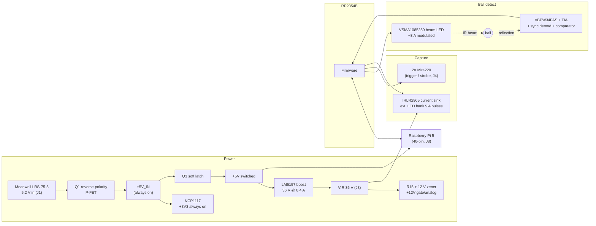

# PiTrac — The Second Board To Rule Them All

**Standalone launch-monitor controller board — functional documentation and RP2354 firmware pseudocode**

Board: KiCad 10.0.4, 8 sheets, Rev V1 (2026-02-12) · MCU: Raspberry Pi RP2354B (QFN-80, internal 2 MB flash) · Assembly: JLCPCB turnkey + hand-solder connectors

---

## 1. System Overview

This board is the real-time heart of the PiTrac launch monitor. It detects a golf ball crossing an IR light curtain, measures its speed from the beam transit time, triggers two Mira220 global-shutter cameras, and fires a high-power IR strobe bank in a precisely timed burst so that each camera freezes the ball ~10 times in a single exposure. A Raspberry Pi 5 rides on top of the board (powered *by* the board through the 40-pin header) and handles image pull, spin/trajectory analysis, and the vision-based "ball placed" detection that arms the system.

The RP2354 owns everything with microsecond-level timing requirements; the Pi 5 owns everything with pixels.



### Major functional blocks

| Block | Sheet | Key parts |
|---|---|---|
| Power input, latch, boost, rails | Power | Q1/Q3 SI7137DP, LM5157RTER, NCP1117-3.3, BZT52B12 |
| MCU, Pi header, USB, buttons, LEDs | MCU and Connectors | RP2354B, USB4105 Type-C, SRV05-4, ABM8 12 MHz |
| Beam (trigger) LED driver | LED Trigger | VSMA1085250X02, AO3400A, MCP1416, 74LVC1G123 |
| Photodiode TIA + DC servo | Photodiode Amplification | VBPW34FAS, OPA4323 (U11) |
| Synchronous demod, LPF, comparator | Photodiode Demodulation | 2× TMUX1219, OPA4323 (U12), LM393 |
| High-power strobe current sink | Strobe Generation | IRLR2905, LM358 + MMDT2227, MCP1416, 74LVC1G123 |
| Impact microphone | Audio Trigger | CMM-2718AT MEMS + LMV321 |

---

## 2. Theory of Operation — Anatomy of a Shot

1. **Standby.** Input power present → +3V3 rail is alive → RP2354 boots and idles. The +5V rail (Pi, boost, analog 5 V) is off; the latch FET Q3 is held open by R13.
2. **Power on.** Panel button (PWR_TOGGLE) pressed → firmware asserts LATCH_CONTROL → Q3 closes → +5V rail up → Pi 5 boots, LM5157 boost soft-starts VIR to 36 V (~86 ms).
3. **Preview / placement.** Pi runs the two Mira220s as a low-rate (2–5 Hz) video stream via libcamera/picamera2 and watches for a ball placed at the tee position behind the light curtain. When satisfied, the Pi reconfigures the sensors into external-trigger mode and sends `ARM` over UART.
4. **Armed.** RP2354 turns on the modulated IR beam (if not already running), freezes the demodulator's baseline HPF, verifies signal health, asserts System_Ready (to Pi and panel LED), and waits on the detection comparator.
5. **Detection.** Ball crosses the vertical light line → reflected, demodulated signal exceeds Threshold_DC → D_Comparator rises. Firmware timestamps the rising edge, then the falling edge; transit time Δt over the known optical width (ball diameter + beam width) yields launch speed *v*.
6. **Capture.** Firmware raises D_Cam_Trigger to both cameras, waits for both Cam_Strobe inputs to confirm exposure is open, then streams a burst of ~10 Strobe_Pulse pulses through the PIO with spacing S/v (S ≈ 1–2 ball diameters) and width chosen for ≤1 mm motion blur — all bounded by a 113 µs hardware watchdog per pulse.
7. **Handoff.** Trigger drops, IRQ_OUT pulses the Pi, and a UART report carries the measured speed, the exact pulse pattern (timestamps and widths), measured strobe current, and the microphone impact record. The Pi pulls both images and reconstructs spin and trajectory from the multiply-exposed ball positions.
8. **Re-arm / power off.** Pi re-enters preview mode and re-arms when a new ball is placed. A button press while running requests an orderly Pi shutdown (RPI5_SHUTDOWN → Pi GPIO26), waits for the Pi's 3.3 V rail to drop, then releases the latch.

---

## 3. Power Subsystem

### 3.1 Input, protection, and the soft latch

Input is **5.2 V** from a Meanwell LRS-75-5 on screw terminal **J1** (14 AWG twisted pair recommended — this rail carries the Pi 5's full load plus 36 V boost input current). Q1 (SI7137DP, ≤3 mΩ) provides reverse-polarity protection in the classic P-FET configuration (gate to GND via R10 100K), and D1 (SMBJ6.0A) clamps transients on **+5V_IN**.

+5V_IN is the always-on domain. It feeds:

- **U2 NCP1117-3.3 → +3V3** — the RP2354, its 1.1 V core (internal VREG), the 74LVC1G123 watchdogs, and (through FB1) the **+3.3VA** analog rail for the microphone front-end. The MCU is therefore alive whenever input power (or USB-C) is present.
- **Q3 SI7137DP — the soft-latch high-side switch** for the **+5V** rail. R13 (10K to +5V_IN) holds the gate up (off) by default. Q2 (AO3400A), driven by **LATCH_CONTROL** (RP2354 GPIO15, with R12 10K pulldown so the latch stays off through reset), pulls the gate down to close the switch. Jumper **J2** shorts the gate to GND to force the rail permanently on for bench work.

The switched **+5V** rail powers: the Pi 5 (J8 pins 2/4), the boost converter (L1 input and BIAS), the beam LED, the LM393 comparators, the USB-A accessory port, D3 (hard-wired green rail indicator), the panel LEDs, and — through FB2 — the **+5VA** rail for the OPA4323s, TMUX1219s, and the buffered **+2V5** virtual ground (R75/R76 divider, U11C follower, R79 10 Ω isolation).

Because +3.3VA is on the always-on side and +5VA is on the latched side, the mic front-end is powered in standby but the TIA/demodulator chain is not.

**USB-C bench power:** J6 VBUS diode-ORs into +5V_IN through D8 (SS14). This runs the MCU for flashing and CLI work without the Meanwell, at roughly 4.6–4.7 V. Firmware can tell the two apart on ADC1 (the +5V_IN ÷ 2 monitor, R46/R47) and must refuse to latch the +5V rail — and with it the Pi — when running on USB-only power.

### 3.2 36 V boost — VIR (LM5157)

| Parameter | Value | Set by |
|---|---|---|
| Output | 36 V (design 35.9 V) | FB divider R1 150K / R2 4K3, VREF 1.0 V |
| Average output current | 0.4 A | converter rating at this operating point |
| Switching frequency | 1.055 MHz | RT: R8 20K |
| Inductor | 4.7 µH, I_sat ≥ 8.5 A | L1 ASPI-0630HI |
| Rectifier | SS26 (D2) + optional R11/C9 RC snubber (DNP) | |
| Soft start | ~86 ms | C6 1 µF on SS |
| MODE | R6 ∥ R7 = 37.5K | forced-PWM / mode select |
| Compensation | R5 510K + C2 1.5 nF, C1 4.7 pF | Type II on COMP |
| UVLO on / off | **4.74 V / 4.52 V** | R3 12K / R4 5.6K from +5V |
| Bulk output capacitance | 2× 330 µF electrolytic + 8× 2.2 µF X7R (≈8 µF derated at 36 V) + 100 nF | C13/C15, C16–C21/C23/C26, C11 |

The UVLO thresholds are deliberately bracketed around the Pi 5's supply limits (brownout warning 4.64 V, fatal 4.2 V): if strobe load drags the 5 V rail down, the boost disconnects itself at 4.52 V — the Pi may log a brownout warning but survives. The FB/compensation ground is a quiet **GNDA** island tied to GND at a single net-tie (NT1).

VIR leaves the board on screw terminal **J3** (16–18 AWG twisted pair) to the external IR LED bank: currently 2 parallel strings of 5× VSMA1085400X02 with 0.39 Ω ballast per string (board supports up to 4 strings), pulsed at 4.5 A per string. VIR also reverse-biases the receive photodiode (Section 5) and sources the 12 V rail.

### 3.3 12 V gate-drive / analog rail

R15 (4K7, 1206) drops VIR to a BZT52B12 zener shunt (D4) — a simple ~5 mA 12 V rail for the strobe driver's LM358, MMDT2227 buffer, and MCP1416 gate driver. Local ceramics (C24, C50, C54–C56) supply the gate-charge peaks.

### 3.4 Power rails at a glance

| Rail | Source | Domain | Loads |
|---|---|---|---|
| +5V_IN | J1 via Q1, or USB-C via D8 | always on | LDO, latch input, 5V_IN monitor |
| +3V3 | NCP1117 from +5V_IN | always on | RP2354, watchdog one-shots, status LEDs, comparator pull-up |
| +3.3VA | +3V3 via FB1 | always on | MEMS mic, LMV321, J5 mic power |
| +5V | Q3 latch from +5V_IN | switched | Pi 5, boost input/BIAS, beam LED, LM393, USB-A, panel LEDs, D3 |
| +5VA | +5V via FB2 | switched | OPA4323 ×2, TMUX1219 ×2, +2V5 reference |
| +2V5 | R75/R76 + U11C buffer | switched | TIA / demod virtual ground |
| VIR (36 V) | LM5157 from +5V | switched | External strobe LED bank, photodiode bias, 12 V rail |
| +12V | VIR via R15 + D4 zener | switched | LM358, MMDT2227, MCP1416 (strobe side) |
| +1V1 | RP2354 internal VREG | always on | RP2354 core |

---

## 4. Optical Ball-Detect Chain

The beam LED (D11) and photodiode (D12) sit side by side behind a 1-inch acrylic half-rod that acts as a cylindrical plano-convex lens, projecting both into a coincident vertical line of light. A ball crossing the line reflects modulated IR back onto the photodiode; the transit time of that reflection is the speed measurement. Synchronous (lock-in) demodulation makes the detector immune to sunlight, room lighting, and 100/120 Hz flicker.

### 4.1 Beam transmitter (LED Trigger sheet)

`Modulation_PWM` (RP2354 GPIO31, R69 1K pulldown) drives one half of a hardware-watchdog pair:

- **U9 74LVC1G123** one-shot, wired with A = GND, B = ~CLR = Modulation_PWM, timing R68 56K / C57 2.2 nF → each high phase of the carrier is passed through but **clamped to ≤113 µs** no matter what firmware does. There is no disable path on this one — the beam LED watchdog is always armed.
- **U10 MCP1416** gate driver (5 V) → R72 4.7 Ω → **Q11 AO3400A** low-side switch.

Current path: +5V → D11 VSMA1085250X02 (both anode pads) → R73 + R74 in **series** (0.27 + 0.27 = 0.54 Ω ballast) → Q11 → GND. At ~3 A peak: Vf ≈ 3.5 V, ballast drop 1.62 V. Designer's numbers at 30 % carrier duty: 10.5 W peak / 3.15 W average electrical into the LED; 2.43 W peak / 0.73 W average per ballast resistor (3 W metal-strip parts). Local bulk (C60 330 µF + 3× 22 µF) supports the 100 kHz-class pulse train. `Strobe_GND` (TP5) is the Kelvin point at the bottom of the ballast chain.

Carrier frequency is a firmware parameter; the analog design wants it well above the 15.9 kHz post-detection filter and comfortably inside the TIA bandwidth — **~100 kHz at 30 % duty is the intended operating point.**

### 4.2 Receiver — TIA with DC servo (Photodiode Amplification sheet)

- **D12 VBPW34FAS** is reverse-biased at **36 V** (cathode → R77 10K → VIR, decoupled by C67) for minimum junction capacitance and fast response. Anode feeds the summing node.
- **U11A (OPA4323)** transimpedance stage: Rf = R80 **470K** (gain −4.7·10⁵ V/A), Cf = C68 + C70 in series = **0.5 pF** (two 1 pF parts) → feedback pole ≈ 677 kHz. Non-inverting input rides on the buffered **+2V5** virtual ground.
- **DC servo**: U11A out → R83 1M (R_int) → U11B integrator (C73 330 nF) → U11D inverter (R84/R85 10K) → R78 100K (R_inj) back into the summing node. Servo corner f₀ = Rf / (2π·R_inj·R_int·C_int) ≈ **2.27 Hz** — ambient DC photocurrent is nulled without disturbing the carrier.
- Output leaves through an isolation filter R81 22 Ω + C72 2.2 nF (**3.3 MHz**) as `TIA_Out`.
- `TIA_Out_ADC` (R82 1K + D13 BAT54S clamp → GPIO42/ADC2) gives firmware a look at the raw carrier — used for demodulator phase calibration and health checks.

### 4.3 Synchronous demodulator, filter, and comparator (Photodiode Demodulation sheet)

- **U13 TMUX1219** + **U12A** form the classic sign-switching demodulator: R95 = R97 = 10K set inverting gain −1; the mux flips U12A's + input between `TIA_Out` (gain +1) and +2V5 (gain −1 about the reference) at `Demodulation_PWM` (GPIO39, R91 pulldown). Run at the carrier frequency with adjustable phase, this rectifies the locked component of the signal to DC.
- **4th-order low-pass** (two Sallen-Key stages, all R 4.7K / C 2.2 nF): U12D unity stage (Q₁ = 0.5) then U12C gain-of-2 stage (Q₂ = 1.0, R93/R94 referenced to +2V5). f₀ ≈ **15.9 kHz**, in-block gain 2.0, −64 dB at 100 kHz (carrier residue), group delay < 7 kHz ≈ **30 µs** — this is the detection latency floor.
- **Gated baseline HPF**: C81 330 nF couples the LPF output to the final stage; **U14 TMUX1219** (SEL = `HPF_Toggle`, GPIO33) switches the node either to R96 2M → GND (**τ = 0.66 s** high-pass — tracks slow ambient/baseline drift) or to an open S2 (**hold** — baseline frozen during an armed window so a slow ball can't be tracked out by the filter).
- **Final gain stage U12B**: non-inverting, R101 27K over R100 2K → **gain 14.5** as populated (R98 2K is DNP; fitting it parallels to 1K for gain 28).
- **U15 LM393 comparator**: + input = final signal (also read back on `Comparator_ADC`, GPIO45/ADC5, via R102 + D14 clamp); − input = `Threshold_DC`, generated from `Threshold_PWM` (GPIO44) through a two-pole RC (R86/C74, R89/C76, τ ≈ 1 ms each). Open-drain output with R103 10K pull-up to +3V3 → **`D_Comparator`** (GPIO46). High = ball in beam.

So the firmware has three set-and-observe knobs on detection: carrier frequency/duty (Modulation_PWM), demod phase (Demodulation_PWM vs. Modulation_PWM), and threshold (Threshold_PWM) — plus HPF_Toggle for baseline management, and two analog taps (TIA_Out_ADC, Comparator_ADC) to close the loop in software.

---

## 5. High-Power IR Strobe Driver (Strobe Generation sheet)

An adjustable **linear-mode constant-current sink** on the return leg of the external LED bank, with a fast series gate switch and a hardware pulse-width watchdog.

**Current path:** VIR (36 V) → external strings (J3) → `VIR_RTN` → **Q9 IRLR2905** (D→S) → **Q10 AO3400A** (D→S) → **R65 ∥ R66 = 0.135 Ω** sense → GND. D10 (SS26) clamps inductive kick from the harness across VIR→VIR_RTN. R67 56K bleeds Q9's source node when the path is open (spec note: ≤250 µA leakage → ≤14 V float).

**Current setpoint (the "how much"):** `Gate_PWM` (GPIO28) → two-pole RC DAC (R55/C52, R58/C53) → **U6A LM358** non-inverting ×3 amplifier (R60 20K / R59 10K) with the **U7 MMDT2227 complementary emitter-follower inside the loop** → R63 47 Ω → **Q9's gate**. Gate voltage = 3 × V_setpoint, i.e. 0–9.9 V from a 0–3.3 V PWM DAC. Q9 runs in linear mode; source degeneration through Q10's R_DS(on) + the 0.135 Ω sense gives local feedback, but there is **no analog current-servo loop** — absolute current is calibrated in firmware against `CurrentSense_ADC` (GPIO40/ADC0, 135 mV/A through R32 4K7). At the present 2-string × 4.5 A operating point the sink carries **9 A → 1.215 V** at the ADC; 4-string/18 A operation still fits the 3.3 V range.

**Pulse gating (the "when"):** `Strobe_Pulse` (GPIO25, R57 pulldown) → **U5 74LVC1G123** one-shot (B and ~CLR both on the trigger; R56 56K / C51 2.2 nF) → MCP1416 (U8, 12 V) → R64 4.7 Ω → **Q10's gate**. The output follows Strobe_Pulse exactly but is hardware-clamped to **≤113 µs**; the falling edge of Strobe_Pulse clears it immediately, so firmware controls width up to the limit. **Q8** (gate = `Pulse_Limit_Disable`, GPIO27) clamps the one-shot's timing node so it can never time out — defeating the watchdog for bench testing only.

Design notes from the schematic on LED-bank limits at 10 A over 1 m of ball travel at 100 m/s: 23 pulses at one-diameter spacing → ≤30.9 µs each; 12 pulses at two-diameter spacing → ≤59.3 µs each.

---

## 6. Camera Interface (2× Mira220)

**J4 (2×4 header)** carries the timing-critical camera signals, each flanked by grounds for clean cabling:

| J4 pin | Signal | RP2354 | Notes |
|---|---|---|---|
| 1, 2, 5, 6 | GND | — | returns / shields |
| 3, 4 | D_Cam_Trigger | GPIO10 out, R18 220 Ω | one net, both cameras — simultaneous trigger |
| 7 | Cam_Strobe_0 | GPIO8 in, R19 220 Ω | camera 0 exposure-active monitor |
| 8 | Cam_Strobe_1 | GPIO9 in, R24 220 Ω | camera 1 exposure-active monitor |

Intended flow: cameras sit in external-trigger mode (configured by the Pi over CSI/I²C); D_Cam_Trigger requests an exposure; each sensor's strobe/monitor output confirms when its shutter is actually open; the strobe burst fires only after **both** Cam_Strobe inputs are high. This closes the loop on trigger-to-exposure latency instead of guessing it.

Pi-side software: the ams Mira EVK stack is standard libcamera/picamera2 with ams kernel drivers, selected by device-tree overlay (`dtoverlay=mira220`, and `mira220,cam0` for the second port). The Pi 5 natively supports both CSI cameras, and sensor register access (master ↔ triggered mode switching, exposure setup) is done from the Pi via the ams driver/REST tooling.

> **Verify before first power-up:** the Mira220's digital I/O bank is a 1.8 V domain at the sensor. J4 drives 3.3 V logic through only 220 Ω. Whether that's acceptable depends entirely on what's between the module's header and the sensor pins (level translation, series protection, or nothing). Check the specific sensor-board schematic; budget for a divider or level shifter on the trigger line and confirm the strobe output's swing meets RP2350 V_IH (≈2.0 V at 3.3 V I/O) — a 1.8 V strobe output will **not** register without translation.

The Pi does placement detection on the 2–5 Hz preview stream; an alternative that avoids mode-switching entirely is to leave the sensors permanently in triggered mode and have the RP2354 generate the preview cadence itself (single trigger pulses at 2–5 Hz), switching to precision bursts when armed. Both fit the same hardware; the pseudocode exposes it as a config flag.

---

## 7. Audio Subsystems

**On-board analog mic (Audio Trigger sheet):** U16 CMM-2718AT MEMS mic → C84 2.2 nF → R106 30K → **U17 LMV321** inverting amp, R107 200K ∥ C86 33 pF feedback, mid-rail bias (R104/R105). Band-pass ≈ **2.4–24 kHz, gain ≈ −6.7**, output biased at 1.65 V into `AnalogMic_ADC` (GPIO47/ADC7). Runs on the always-on +3.3VA rail. Role: impact detection as confirmation/backup for the optical trigger, and a precise strike timestamp.

**External digital mic (J5, 2×3 header):** an I²S microphone breakout, RP2354 as bus master via PIO — GPIO4 = SCK (J5.5), GPIO5 = WS (J5.3), GPIO6 = DATA in (J5.1), 3.3VA power on J5.2, all through 220 Ω series resistors. Higher-quality capture path for characterizing impact acoustics; optional.

---

## 8. USB, Controls, Indicators, Debug

**USB-C (J6):** RP2354 native USB device — firmware upload (BOOTSEL), CDC serial CLI. 27 Ω series (R34/R35), SRV05-4 ESD array, CC1/CC2 5.1K pulldowns (UFP). VBUS feeds +5V_IN through D8 for bench power.

**USB-A (J9):** switched 5 V **accessory power outlet only**. Q7 (AO3401A) high-side switch driven by `USB_ENABLE` (GPIO32) via Q6; D+/D− shorted (dedicated-charging-port signature); SMAJ6.0A TVS. Explicit schematic warning: **do not use it to power the Pi 5.**

**Buttons:** SW1 = BOOTSEL (QSPI_SS via R22), SW2 = RUN/reset, SW3 = off-board panel power button (Adafruit 481, illuminated) on J7 → `PWR_TOGGLE` (GPIO14, active low, R42 1K + C40 100 nF debounce, **no external pull-up — enable the internal one**).

**Panel connector J7 (1×6):** 1 = +5V, 2 = PWR_LED− (Q4 sink via R48 47 Ω, `Power_LED` GPIO11), 3 = PWR_TOGGLE, 4 = GND, 5 = +5V, 6 = RDY_LED− (Q5 sink via R49 220 Ω, `System_Ready_LED` GPIO12). Note both panel LEDs are fed from the *switched* +5V rail, so neither can indicate standby.

**On-board LEDs:** D3 green = hard-wired +5V rail indicator; D6 red (GPIO18) and D5 yellow (GPIO19) = firmware status, 120 Ω to GND, active high.

**Debug:** RP2354 SWDIO/SWCLK are routed to Pi header pins 18/22 (Pi GPIO24/25) — the Pi 5 can flash and debug the RP2354 in-system with OpenOCD, no external probe needed. Test points are covered in the reference table in §8.1.

**DNP / build options:** C9 + R11 (boost snubber, fit if SW-node ringing observed), R98 (demod final gain 14.5 → 28).

### 8.1 Test-Point Reference

All voltages referenced to **TP1** (the only soldered loop — Keystone 5001; TP2–TP10 are bare pads per the BOM). "Latched" means the +5V rail is on (button or J2 jumper); the +12V and analog rows read 0 V in standby.

| TP | Node | Domain | Quiescent (expected) | In operation |
|---|---|---|---|---|
| TP1 | GND | — | 0 V by definition | Scope ground clip point. |
| TP2 | +12 V zener rail (D4) | VIR-derived, latched | **≈12 V** (BZT52B12 window 11.4–12.7 V) | mV-scale dips during strobe bursts as the MCP1416 pulls gate charge from C24/C50/C54–56; recovers between pulses. Bias budget is only ~5 mA (R15 from 36 V) against ~1–2 mA of static load — a rail sitting at 9–10 V means something extra is loading it. |
| TP3 | Strobe gate drive (U7 emitters → R63 → Q9 gate) | +12 V, latched | **0 V** at Gate_PWM = 0; otherwise **3 × filtered Gate_PWM** (0 to ~10 V) | Steady DC even during bursts — the level is continuous, Q10 does the switching. At the 9 A calibration point expect **~4.5–6 V** (Q9 V_th-dependent; the spread is exactly what `cal_strobe_current` absorbs). Ringing here during a pulse edge → gate-loop stability, look at R63/layout. |
| TP4 | Strobe current sense (R65∥R66, 0.135 Ω) | GND-ref | **0 V** idle | Rectangular pulses: plateau **135 mV/A** → **1.215 V at 9 A** (0.61 V single-string 4.5 A, 2.43 V at 18 A/4-string). Rise ~1–2 µs (di/dt ≈ headroom/harness-L ≈ 5 A/µs). Plateau should be flat; sag within a pulse or on late pulses in a burst = VIR headroom exhausted — shorten pulses or shed count. This node is what ADC0 reads. |
| TP5 | Beam-LED low side (Q11 drain, below R73+R74) | +5 V, latched | Floats at the LED's sub-conduction knee (~2–3 V, ill-defined) with the beam off | Beam running: 100 kHz / 30 % switching waveform, on-phase low level **≤0.15 V** (≈0.09 V at 2.8 A × Q11 R_DS). Peak LED current: probe differentially across the ballast pair (D11 pad 1 → TP5), **0.54 V/A** → ≈1.5 V at 2.8 A. |
| TP6 | +2V5 virtual ground | +5VA, latched | **2.50 V ± 0.05**, <5 mVpp noise | Should be dead quiet. Visible 100 kHz content = decoupling/FB2 issue or demod switch injection into the reference. |
| TP7 | TIA_Out | +5VA, latched | **2.50 V DC regardless of ambient light** — the 2.27 Hz DC servo nulls it | Beam on: 100 kHz carrier riding on 2.5 V; **light pulls the node down** (inverting TIA, **0.47 V/µA** of photocurrent); reflections grow the carrier amplitude. Pinned at a rail = ambient photocurrent beyond the servo's **±25 µA** null range (U11D swing ÷ R78 100K) or a photodiode-bias fault (R77/VIR). |
| TP8 | Threshold_DC | +3V3 (works in standby) | **0 V at reset**; = 3.3 V × Threshold_PWM duty; typically **0.1–0.5 V** after `auto_threshold` | Settles in 5–10 ms (two RC poles, τ ≈ 1 ms); PWM ripple is sub-mV. Directly comparable to the detect signal on ADC5 — comparator trips when signal exceeds this. |
| TP9 | 4th-order LPF output (U12C, pre-HPF) | +5VA, latched | **2.50 V** | **The best single scope point for detection.** A ball transit is a smooth positive bump: amplitude = 2× the TP10 demod shift, width = the transit time (~0.5 ms driver → ~4.5 ms chip), edges shaped by the 15.9 kHz filter, carrier fully absent (−64 dB). Quiescent far from 2.5 V → demod phase badly off or TP7 saturated. |
| TP10 | Demodulated_Signal (U12A out) | +5VA, latched | **2.50 V** + small static offset (optical crosstalk × phase) | Strong 200 kHz (2× carrier) ripple is **normal** here — the LPF downstream removes it. After phase cal, a reflection steps the mean **upward**. Mean shift here vs. TP9 should track ×2; a broken ratio isolates an LPF-stage fault. |

Two derived checks with no dedicated pad: the comparator's actual input (U12B out, readable on **ADC5/Comparator_ADC**) idles near **0 V** — it's the TP9 bump, AC-coupled through the gated HPF and amplified ×14.5 (×28 with R98) referenced to ground — so a 100 mV bump at TP9 should appear as ~1.45 V at ADC5. And the +5V_IN monitor (**ADC1**) should read half of 5.2 V from the Meanwell vs. ~2.3 V (half of ~4.6 V) on USB-C-only power — the firmware's latch-inhibit discriminator.


---

## 9. Connector Summary

| Ref | Type | Function |
|---|---|---|
| J1 | 2-pos screw terminal | 5.2 V power in (Meanwell LRS-75-5), 14 AWG TP |
| J2 | 1×2 pin header | Latch bypass jumper (force +5V on) |
| J3 | 2-pos screw terminal | VIR 36 V out to external strobe LED bank, 16–18 AWG TP |
| J4 | 2×4 pin header | Camera trigger + 2× exposure-monitor inputs |
| J5 | 2×3 pin header | External I²S microphone |
| J6 | USB-C 16-pin | RP2354 native USB (flash/CLI) + bench power |
| J7 | 1×6 pin header | Panel: power button w/ LED, ready LED |
| J8 | 2×20 socket | Raspberry Pi 5 (power + signals) |
| J9 | USB-A | Switched 5 V accessory power out (DCP) |

## 10. RP2354B Pin Map

| GPIO | Signal | Dir | Peripheral | Function |
|---|---|---|---|---|
| 0 | RPI5_ON | in | SIO | Pi GPIO22 — Pi userspace up |
| 1 | RPI5_RP2350_0 | bidir | SIO | spare handshake (Pi GPIO23) |
| 2 | System_Ready | out | SIO | to Pi GPIO27 |
| 3 | IRQ_OUT | out | SIO | event interrupt to Pi GPIO17 |
| 4 | D_SCK | out | PIO1 | I²S bit clock (J5) |
| 5 | D_WS | out | PIO1 | I²S word select (J5) |
| 6 | D_DATA | in | PIO1 | I²S data (J5) |
| 7 | RPI5_RP2350_1 | bidir | SIO | spare handshake (Pi GPIO16) |
| 8 | Cam_Strobe_0 | in | SIO/IRQ | camera 0 exposure active |
| 9 | Cam_Strobe_1 | in | SIO/IRQ | camera 1 exposure active |
| 10 | D_Cam_Trigger | out | SIO | trigger to both cameras |
| 11 | Power_LED | out | SIO | panel power-button LED (Q4) |
| 12 | System_Ready_LED | out | SIO | panel ready LED (Q5) |
| 14 | PWR_TOGGLE | in | SIO/IRQ | panel button, active low, **internal pull-up** |
| 15 | LATCH_CONTROL | out | SIO | high = hold +5V latch |
| 18 | StatusLED_R | out | SIO | on-board red |
| 19 | StatusLED_Y | out | SIO | on-board yellow |
| 24 | (Pi 3V3 sense) | in | SIO | +3V3_Pi5 ÷ 1.1 (R45/R44) — Pi presence |
| 25 | Strobe_Pulse | out | **PIO0** | strobe burst (≤113 µs/pulse HW limit) |
| 27 | Pulse_Limit_Disable | out | SIO | defeat strobe watchdog — **test only** |
| 28 | Gate_PWM | out | PWM 2A | strobe current setpoint DAC |
| 31 | Modulation_PWM | out | PWM 3B | beam carrier (~100 kHz, 30 %) |
| 32 | USB_ENABLE | out | SIO | USB-A VBUS switch |
| 33 | HPF_Toggle | out | SIO | baseline HPF: track / hold |
| 36 | UART1 TX | out | UART1 | → Pi RXD |
| 37 | UART1 RX | in | UART1 | ← Pi TXD |
| 39 | Demodulation_PWM | out | PWM 7B | demod clock, phase-locked to 3B |
| 40 | CurrentSense_ADC | in | ADC0 | strobe current, 135 mV/A |
| 41 | (5V_IN monitor) | in | ADC1 | +5V_IN ÷ 2 |
| 42 | TIA_Out_ADC | in | ADC2 | raw carrier (phase cal) |
| 43 | RPI5_SHUTDOWN | out | SIO | shutdown request → Pi GPIO26 |
| 44 | Threshold_PWM | out | PWM 10A | comparator threshold DAC |
| 45 | Comparator_ADC | in | ADC5 | post-filter detect signal |
| 46 | D_Comparator | in | SIO/IRQ | ball-detect comparator |
| 47 | AnalogMic_ADC | in | ADC7 | mic amp (1.65 V bias) |

Unused/NC: 13, 16, 17, 20–23, 26, 29, 30, 34, 35, 38. Modulation (slice 3) and demodulation (slice 7) sit on different PWM slices — phase lock is achieved by loading both counters while disabled and enabling both slices in a single write (Section 13.3).

## 11. Raspberry Pi 5 Header Map (signals)

| J8 pin | Pi GPIO | Signal | Dir (Pi view) |
|---|---|---|---|
| 2, 4 | — | **+5V power to the Pi** | in |
| 1, 17 | — | Pi 3.3 V out → presence sense divider | out |
| 8 | 14 (TXD) | UART to RP2354 | out |
| 10 | 15 (RXD) | UART from RP2354 | in |
| 11 | 17 | IRQ_OUT (capture complete etc.) | in |
| 13 | 27 | System_Ready | in |
| 15 | 22 | RPI5_ON — "userspace alive" | out |
| 16 | 23 | RPI5_RP2350_0 spare handshake | bidir |
| 18 | 24 | SWDIO → RP2354 debug/flash | out |
| 22 | 25 | SWCLK → RP2354 debug/flash | out |
| 36 | 16 | RPI5_RP2350_1 spare handshake | bidir |
| 37 | 26 | RPI5_SHUTDOWN (use `gpio-shutdown` overlay) | in |

Broken out to the header but unused by the board (available for expansion): I²C1 (pins 3/5), ID I²C (27/28), SPI0 (19/21/23/24/26), PCM (12/35/38/40), GPIO4/5/6/12/13 (7/29/31/32/33). All inter-processor signals carry 220 Ω (UART) or 1K series resistors, so contention during boot is harmless.
---

## 12. Firmware Architecture

**Core split.** Core 0 owns everything slow and stateful: the power-management state machine, the UART link to the Pi, the USB-CDC bench CLI, configuration/calibration storage, LEDs, and the hardware watchdog. Core 1 owns the hot path: comparator edge timing, speed math, camera handshake, and the strobe burst — nothing on core 1 blocks, allocates, or touches flash while armed (time-critical handlers live in RAM; the RP2354's flash is XIP and a flash write would stall it).

**Peripheral allocation.**

| Peripheral | Use |
|---|---|
| PWM slice 3 (ch B, GPIO31) | Beam carrier — ~100 kHz, 30 % duty |
| PWM slice 7 (ch B, GPIO39) | Demod clock — same TOP/DIV as slice 3, counter pre-loaded for phase offset, both slices enabled in one register write |
| PWM slice 2 (ch A, GPIO28) | Gate DAC — ~146 kHz, filtered to DC strobe-current setpoint |
| PWM slice 10 (ch A, GPIO44) | Threshold DAC — ~146 kHz, filtered to DC comparator threshold |
| PIO0 SM0 (GPIO25) | Strobe burst engine — DMA-fed (width, gap) pairs, 1 µs granularity |
| PIO1 SM0 (GPIO4/5/6) | I²S master for external digital mic (optional) |
| UART1 (GPIO36/37) | Pi link, 921600 8N1, framed binary protocol |
| ADC + DMA | Mode A (idle/armed): round-robin ch1/ch2/ch5/ch7 into a ring buffer. Mode B (burst): ch0 only, free-running 500 ksps across the strobe window for per-pulse current |
| GPIO IRQs | GPIO46 both edges (detection, core 1, RAM handler), GPIO8/9 rising (exposure open), GPIO14 falling (button), GPIO0/24 (Pi status) |
| Hardware watchdog | Fed by core 0 only when core 1's heartbeat is fresh |

**Latency budget (detection → first strobe).** Analog group delay ≈ 30 µs (LPF) + comparator ≈ 1 µs + edge ISR ≈ 1–2 µs. Camera trigger-to-exposure latency is not guessed: firmware waits on the Cam_Strobe feedback edges and measures it every shot. All remaining timing is PIO-deterministic.

---

## 13. RP2354 Firmware Pseudocode

### 13.1 Pin map and configuration

```c
// ---------------- pins (from netlist) ----------------
#define PIN_RPI5_ON          0   // in : Pi userspace up (Pi GPIO22)
#define PIN_HANDSHAKE_0      1   // bidir spare (Pi GPIO23)
#define PIN_SYSTEM_READY     2   // out: to Pi GPIO27
#define PIN_IRQ_OUT          3   // out: to Pi GPIO17
#define PIN_I2S_SCK          4
#define PIN_I2S_WS           5
#define PIN_I2S_DATA         6
#define PIN_HANDSHAKE_1      7   // bidir spare (Pi GPIO16)
#define PIN_CAM_STROBE_0     8   // in : cam0 exposure active
#define PIN_CAM_STROBE_1     9   // in : cam1 exposure active
#define PIN_CAM_TRIGGER     10   // out: both cameras
#define PIN_PWR_BTN_LED     11   // out: panel button LED
#define PIN_READY_LED       12   // out: panel ready LED
#define PIN_PWR_TOGGLE      14   // in : panel button, ACTIVE LOW, INTERNAL PULL-UP
#define PIN_LATCH_CONTROL   15   // out: high = +5V rail on
#define PIN_LED_RED         18
#define PIN_LED_YELLOW      19
#define PIN_PI_3V3_SENSE    24   // in : Pi 3.3V present (divider, reads high when Pi powered)
#define PIN_STROBE_PULSE    25   // out: PIO0 — HW-clamped to 113 us/pulse
#define PIN_PULSE_LIMIT_DIS 27   // out: DANGER — test only, defeats HW watchdog
#define PIN_GATE_PWM        28   // PWM 2A: strobe current setpoint
#define PIN_MOD_PWM         31   // PWM 3B: beam carrier
#define PIN_USB_ENABLE      32   // out: USB-A accessory power
#define PIN_HPF_TOGGLE      33   // out: 1 = baseline tracking, 0 = hold
#define PIN_UART_TX         36
#define PIN_UART_RX         37
#define PIN_DEMOD_PWM       39   // PWM 7B: demod clock (phase-locked to slice 3)
#define PIN_RPI5_SHUTDOWN   43   // out: shutdown request to Pi GPIO26
#define ADC_CURRENT_SENSE    0   // GPIO40: 135 mV/A (0.135 ohm)
#define ADC_5VIN_MON         1   // GPIO41: +5V_IN / 2
#define ADC_TIA_RAW          2   // GPIO42
#define ADC_DETECT_SIG       5   // GPIO45: comparator + input
#define ADC_MIC              7   // GPIO47
#define PIN_D_COMPARATOR    46   // in : detection comparator (edge IRQ)

// ---------------- physics & geometry ----------------
#define BALL_DIAMETER_MM     42.67f
config.beam_width_mm       = 3.0f;    // measured optical line width at ball height — calibrate!
config.beam_to_fov_mm      = 150.0f;  // light line -> first freeze position in camera FOV
config.freeze_spacing_mm   = 42.67f;  // 1 ball diameter between freezes (2.0x for slow mode)
config.n_pulses            = 10;
config.blur_budget_mm      = 1.0f;    // max ball travel during one strobe pulse
config.v_min_mps           = 2.0f;    // plausibility window for transit time
config.v_max_mps           = 100.0f;

// ---------------- electrical limits ----------------
#define STROBE_HW_LIMIT_US   113      // 74LVC1G123 one-shot — do not rely on exceeding
#define STROBE_SW_MAX_US     100      // firmware clamp, margin under HW limit
#define STROBE_MIN_GAP_US    150      // let VIR bulk caps breathe between pulses
#define BURST_CHARGE_MAX_mC  6.0f     // ~9 V sag on ~670 uF — keeps headroom over string Vf
config.strobe_amps_target  = 9.0f;    // 2 strings x 4.5 A (sense: 135 mV/A -> 1.215 V)
config.carrier_hz          = 100000;  // beam modulation
config.carrier_duty        = 0.30f;
#define V5_MIN_FOR_PI        4.90f    // below this we're on USB-C power: never latch the Pi on
```

### 13.2 Boot and peripheral init (core 0)

```c
void main_core0(void) {
    // GPIO defaults FIRST — everything dangerous idles safe
    gpio_out(PIN_LATCH_CONTROL, 0);          // +5V rail off (R12 also pulls down thru reset)
    gpio_out(PIN_STROBE_PULSE, 0);           // R57 pulldown backs this up
    gpio_out(PIN_PULSE_LIMIT_DIS, 0);        // HW watchdog ARMED — stays 0 forever in normal fw
    gpio_out(PIN_CAM_TRIGGER, 0);
    gpio_out(PIN_MOD_PWM, 0);                // beam off (R69 pulldown)
    gpio_out(PIN_USB_ENABLE, 0);
    gpio_in(PIN_PWR_TOGGLE, PULL_UP);        // no external pull-up on the board!
    gpio_in(PIN_D_COMPARATOR, PULL_NONE);    // R103 external 10K pull-up
    gpio_in(PIN_PI_3V3_SENSE, PULL_NONE);    // external divider
    gpio_in(PIN_CAM_STROBE_0, PULL_DOWN);    // defined level with cameras unplugged
    gpio_in(PIN_CAM_STROBE_1, PULL_DOWN);
    gpio_in(PIN_RPI5_ON, PULL_DOWN);

    setup_pwm_dacs();                        // Gate + Threshold at 0 duty
    setup_carrier_and_demod(config.carrier_hz, config.carrier_duty, cal.demod_phase_ticks);
    pio_load_strobe_burst(PIO0_SM0, PIN_STROBE_PULSE);
    adc_start_mode_A();                      // round-robin monitor ring
    uart_init(UART1, 921600); usb_cdc_init();
    load_config_and_cal_from_flash();
    launch_core1(detection_engine);
    watchdog_enable(500 /*ms*/);

    for (;;) {                               // core 0 superloop
        power_fsm_step();
        uart_service();                      // Pi protocol (13.7)
        cli_service();                       // USB bench CLI incl. guarded test modes
        health_monitor();                    // 5V_IN, signal sanity, Pi liveness
        leds_update();
        if (core1_heartbeat_fresh()) watchdog_feed();
    }
}
```

### 13.3 Phase-locked carrier / demod PWM

```c
// Slices 3 (carrier, GPIO31=3B) and 7 (demod, GPIO39=7B) share TOP & DIV.
// Phase lock: load both counters while disabled, then set both enable bits
// in ONE write to PWM->EN. Demod phase offset is set via its preloaded counter
// and has sysclk-tick resolution (~6.7 ns at 150 MHz).
void setup_carrier_and_demod(uint32 f_hz, float duty, int32 phase_ticks) {
    uint32 top = SYSCLK_HZ / f_hz - 1;                 // 100 kHz -> TOP = 1499
    pwm_config_slice(3, top, /*div=*/1);
    pwm_config_slice(7, top, /*div=*/1);
    pwm_set_level(3, CH_B, (uint32)(duty * top));      // 30 % beam carrier
    pwm_set_level(7, CH_B, top / 2);                   // 50 % demod square
    pwm_set_counter(3, 0);
    pwm_set_counter(7, wrap_mod(top + 1 - phase_ticks, top + 1));
    PWM->EN |= (1u << 3) | (1u << 7);                  // atomic simultaneous start
}
```

### 13.4 PIO strobe burst engine

```c
// PIO program: one FIFO word per half-phase, value = duration in us minus overhead.
// DMA streams the precomputed schedule; IRQ0 raised when the burst completes.
// The 74LVC1G123 clamps any single high phase to 113 us in hardware regardless.
.program strobe_burst              ; clock divided to 1 MHz (1 us per tick)
start:
    pull block                     ; width (us); width = 0 sentinel ends the burst
    mov x, osr
    jmp !x done
    set pins, 1
hi: jmp x-- hi
    set pins, 0
    pull block                     ; gap (us)
    mov y, osr
lo: jmp y-- lo
    jmp start
done:
    irq set 0                      ; burst complete -> wakes the engine loop
    jmp start                      ; block on pull for the next burst

// Schedule computation — runs on core 1 between comparator falling edge
// and camera trigger. All floats precomputed to integers before the burst.
burst_t compute_schedule(float v_mps) {
    burst_t b;
    b.width_us = clamp(config.blur_budget_mm / v_mps * 1000.0f,
                       5, STROBE_SW_MAX_US);
    b.gap_us   = max(config.freeze_spacing_mm / v_mps * 1000.0f - b.width_us,
                     STROBE_MIN_GAP_US);
    b.n        = config.n_pulses;
    // energy interlock: total charge from the VIR bulk caps this burst
    float mC = b.n * config.strobe_amps_target * b.width_us / 1000.0f;
    while (mC > BURST_CHARGE_MAX_mC && b.n > 3) { b.n--; mC -= ...; }   // shed pulses, keep spacing
    // first-pulse delay: ball center is (D+w)/2 past the line at the falling edge;
    // it keeps flying while we trigger and the shutters open (t_cam measured live)
    b.first_delay_us = (config.beam_to_fov_mm - (BALL_DIAMETER_MM + config.beam_width_mm)/2)
                       / v_mps * 1000.0f
                       - LATENCY_FIXED_US /* ~32 us analog+ISR */;
    return b;   // t_cam is subtracted at fire time, once the strobe edges arrive
}
```

### 13.5 Power management FSM (core 0)

```c
enum pstate { STANDBY, POWERING_ON, PI_BOOTING, RUNNING, SHUTTING_DOWN, FORCE_OFF, FAULT };

void power_fsm_step(void) {
  switch (ps) {

  case STANDBY:                              // +3V3 only; Pi, boost, analog-5V all dark
    if (button_short_press()) {
        if (adc_5vin_volts() < V5_MIN_FOR_PI) { blink_red(USB_POWER_ONLY); break; }
        gpio_set(PIN_LATCH_CONTROL, 1);      // +5V rail up -> Pi boots, boost soft-starts
        t0 = now(); ps = POWERING_ON;
    }
    break;

  case POWERING_ON:                          // wait for rails & Pi hardware
    // no PGOOD or VIR tap is wired: VIR readiness is timed (86 ms soft start + margin)
    if (elapsed(t0) > 250ms && gpio_read(PIN_PI_3V3_SENSE)) ps = PI_BOOTING;
    if (elapsed(t0) > 2s) fault(NO_PI_DETECTED);     // still allow bench mode via CLI
    break;

  case PI_BOOTING:                           // Pi OS coming up; strobes stay locked out
    if (gpio_read(PIN_RPI5_ON)) {            // Pi userspace flag (Pi GPIO22 high)
        strobe_unlock(); ps = RUNNING; notify_pi(MSG_BOOT_INFO);
    }
    if (elapsed(t0) > 90s) fault(PI_BOOT_TIMEOUT);
    break;

  case RUNNING:
    if (button_short_press() || pi_requested_shutdown()) {
        disarm(); strobe_lockout();
        pulse(PIN_RPI5_SHUTDOWN, 200ms);     // Pi runs gpio-shutdown overlay on GPIO26
        t0 = now(); ps = SHUTTING_DOWN;
    }
    if (button_held(5s)) ps = FORCE_OFF;     // escape hatch
    break;

  case SHUTTING_DOWN:                        // wait for Pi to actually halt
    if (!gpio_read(PIN_PI_3V3_SENSE) || elapsed(t0) > 60s) ps = FORCE_OFF;
    break;

  case FORCE_OFF:
    gpio_set(PIN_LATCH_CONTROL, 0);          // +5V rail drops; we stay alive on +3V3
    ps = STANDBY;
    break;
  }
}
```

### 13.6 Detection & capture engine (core 1)

```c
enum dstate { DISARMED, SETTLING, ARMED, IN_BEAM, FIRING, REPORT };

void detection_engine(void) {
  for (;;) {
    switch (ds) {

    case DISARMED:
      if (msg_arm_received()) {              // Pi saw a placed ball, cams now in trigger mode
          beam_on();                         // Modulation_PWM running
          gpio_set(PIN_HPF_TOGGLE, 1);       // track baseline
          t0 = now(); ds = SETTLING;
      }
      break;

    case SETTLING:                           // let the 0.66 s baseline HPF converge
      if (elapsed(t0) > 1500ms) {
          auto_threshold();                  // baseline + k*sigma via Threshold_PWM (13.8)
          gpio_set(PIN_HPF_TOGGLE, 0);       // FREEZE baseline: slow balls can't be tracked out
          if (gpio_read(PIN_D_COMPARATOR)) { fault_soft(BEAM_BLOCKED); ds = DISARMED; break; }
          gpio_set(PIN_SYSTEM_READY, 1); gpio_set(PIN_READY_LED, 1);
          enable_edge_irq(PIN_D_COMPARATOR, BOTH_EDGES);   // RAM-resident handler
          ds = ARMED;
      }
      break;

    case ARMED:      break;                  // everything happens in comparator_isr()
    case IN_BEAM:    break;

    case FIRING: {                           // entered from ISR with v_est & schedule ready
      burst_t b = pending_burst;
      adc_start_mode_B();                    // 500 ksps on current-sense for the whole window
      gpio_set(PIN_CAM_TRIGGER, 1);          // request exposure on both cameras
      t_trig = now_us();
      if (!wait_both(PIN_CAM_STROBE_0, PIN_CAM_STROBE_1, HIGH, 5ms)) {
          gpio_set(PIN_CAM_TRIGGER, 0); abort_shot(CAM_TIMEOUT); break;
      }
      t_cam = now_us() - t_trig;             // measured trigger->shutter-open latency
      delay_us(max(0, b.first_delay_us - t_cam));
      dma_feed_pio_burst(b);                 // deterministic from here
      wait_pio_irq0(b.total_us() + 1ms);
      gpio_set(PIN_CAM_TRIGGER, 0);          // end exposure request
      report.pulse_pattern = b;  report.t_cam_us = t_cam;
      report.currents_mA   = extract_pulse_plateaus(adc_mode_B_buffer());  // per-pulse readback
      report.mic           = mic_capture_summary();   // impact confirm + timestamp
      ds = REPORT;
    } break;

    case REPORT:
      pulse(PIN_IRQ_OUT, 10us);              // low-latency poke: "images are ready to pull"
      send_capture_report(&report);          // full detail over UART (Section 14)
      gpio_set(PIN_SYSTEM_READY, 0); gpio_set(PIN_READY_LED, 0);
      adc_start_mode_A(); ds = DISARMED;     // Pi re-arms after next ball placement
      break;
    }
    core1_heartbeat();
  }
}

// ---- RAM-resident, ~1 us ----
void comparator_isr(edge_t e) {
  uint64 t = timer_us_64();
  if (ds == ARMED && e == RISING) { t_rise = t; ds = IN_BEAM; return; }
  if (ds == IN_BEAM && e == FALLING) {
      uint32 dt = t - t_rise;                             // transit time
      float v = (BALL_DIAMETER_MM + config.beam_width_mm) / 1000.0f / (dt * 1e-6f);
      if (v < config.v_min_mps || v > config.v_max_mps) { // insect / wiggle / noise
          ds = ARMED; stats.rejects++; return;
      }
      pending_burst = compute_schedule(v);
      report.v_mps = v; report.transit_us = dt; report.t_detect = t;
      disable_edge_irq(PIN_D_COMPARATOR);
      ds = FIRING;                                        // engine loop takes it from here
  }
}
```

### 13.7 UART protocol service (core 0)

```c
// Frame: 0xA5 | len | type | payload... | crc16-ccitt
void uart_service(void) {
  while (frame_t f = uart_next_frame()) {
    switch (f.type) {
      case MSG_PING:        reply(MSG_ACK, fw_version, state_snapshot()); break;
      case MSG_ARM:         post_to_core1(ARM);  reply_ack();             break;
      case MSG_DISARM:      post_to_core1(DISARM); reply_ack();           break;
      case MSG_CONFIG_SET:  config_update(f.payload); save_later();       break;  // spacing, pulses, current, carrier...
      case MSG_CONFIG_GET:  reply(MSG_CONFIG, &config, &cal);             break;
      case MSG_CAL:         run_calibration(f.payload.which);             break;  // 13.8 — only while DISARMED
      case MSG_USB_PWR:     gpio_set(PIN_USB_ENABLE, f.payload.on);       break;
      case MSG_SHUTDOWN:    request_shutdown();                           break;
      case MSG_PREVIEW_TRIG:cam_single_trigger(f.payload.exposure_us);    break;  // alt. preview mode
    }
  }
}
```

### 13.8 Calibration routines (CLI / MSG_CAL, run disarmed)

```c
void cal_demod_phase(void) {
    // Static reflector (or ball on tee). Sweep demod counter offset across one
    // carrier period; sample ADC_DETECT_SIG each step; store argmax response.
    for (ph = 0; ph < period_ticks; ph += period_ticks/64) {
        setup_carrier_and_demod(config.carrier_hz, config.carrier_duty, ph);
        sleep_ms(5);  r[ph] = adc_avg(ADC_DETECT_SIG, 64);
    }
    cal.demod_phase_ticks = argmax(r);       // quadrature null available at +90 deg for diagnostics
}

void auto_threshold(void) {
    // With baseline tracking on and no ball: measure mean & sigma of the detect
    // signal, place threshold k*sigma above mean (k ~ 6..8), write via Threshold_PWM,
    // settle 10 ms (2-pole RC, tau ~1 ms), verify D_Comparator stays low.
}

void cal_strobe_current(void) {
    // LED bank connected, cameras NOT required. For gate setpoints ramping upward:
    // fire ONE 20 us pulse, capture ADC_CURRENT_SENSE plateau (mode B), build
    // duty -> amps LUT. Stop early if plateau exceeds 1.2x target. Solve LUT for
    // config.strobe_amps_target; verify with 3 confirmation pulses. Q9's Vth drifts
    // with temperature — re-run per session; per-shot readback trims between shots.
}
```

### 13.9 Safety interlocks (enforced everywhere)

```c
bool strobe_permitted(void) {
    return ps == RUNNING                      // rails up, VIR settle time elapsed
        && !flag.usb_only_power
        && cal.strobe_lut_valid
        && burst_energy_budget_ok()           // rolling-window charge/thermal accounting
        && !flag.fault_latched;
}
// PIN_PULSE_LIMIT_DIS is written high ONLY by the USB CLI 'unlock-watchdog' command,
// which requires a magic token, forces width <= 500 us in software, and re-arms the
// hardware watchdog on any disconnect, fault, or state change.
```

---

## 14. RP2354 ⇄ Pi 5 Protocol Summary

| Dir | Message | Payload |
|---|---|---|
| Pi → | `ARM` / `DISARM` | — (Pi has placed-ball confidence; cameras switched to trigger mode) |
| Pi → | `CONFIG_SET/GET` | spacing_mm, n_pulses, blur_mm, strobe_A, carrier_hz, geometry, mode flags |
| Pi → | `CAL` | which: demod_phase / threshold / strobe_current / mic |
| Pi → | `PING`, `USB_PWR`, `SHUTDOWN`, `PREVIEW_TRIG` | |
| ← Pi | `ACK/NAK`, `STATUS` | state, 5V_IN, thresholds, stats |
| ← Pi | `EVENT_DETECT` | t_detect, transit_us, v_mps — sent at falling edge, before the burst completes |
| ← Pi | `CAPTURE_REPORT` | shot_id, v_mps, transit_us, t_cam_us per-shot latency, n_pulses, width_us, gap_us, first_delay_us, per-pulse current mA[], mic peak + offset |
| ← Pi | `FAULT` | code: CAM_TIMEOUT, BEAM_BLOCKED, PI_BOOT_TIMEOUT, OVERCURRENT, BUDGET, ... |

Hardware side-channels: `IRQ_OUT` (Pi GPIO17) pulses on capture-complete for lowest-latency image pull; `System_Ready` (Pi GPIO27) mirrors the armed state; `RPI5_SHUTDOWN` (Pi GPIO26) pairs with the `gpio-shutdown` overlay; `RPI5_ON` (Pi GPIO22) should be driven high by a systemd unit once the PiTrac service is up. Handshake spares (Pi GPIO23/16 ↔ RP2354 GPIO1/7) are uncommitted.

---

## 15. Timing & Energy Budget

| Ball speed | Transit (45.7 mm optical width) | Pulse width (1 mm blur) | Pulse period (1 dia spacing) | 10-pulse burst | Burst charge @ 9 A |
|---|---|---|---|---|---|
| 90 m/s (driver) | 508 µs | 11 µs | 474 µs | ≈4.3 ms | 1.0 mC → ~1.5 V sag |
| 50 m/s (iron) | 914 µs | 20 µs | 853 µs | ≈7.7 ms | 1.8 mC → ~2.7 V sag |
| 20 m/s (wedge) | 2.29 ms | 50 µs | 2.13 ms | ≈19 ms | 4.5 mC → ~6.7 V sag |
| 10 m/s (chip) | 4.57 ms | 100 µs (clamped) | 4.27 ms | ≈38 ms | 9 mC → **shed pulses** |

Sag figures assume ~670 µF effective VIR bulk (2× 330 µF + ceramics); available headroom is roughly 36 V − (string Vf ≈ 21–23 V + ballast 1.8 V + sink ≈ 1.5 V) ≈ **9–11 V**, hence the ~6 mC per-burst charge interlock. Boost recharge at 0.4 A: ~2.5 ms per mC — full recovery well inside any realistic shot cadence. Slow-ball bursts are the stressed case twice over: charge budget *and* exposure time (38 ms of ambient integration) — the interlock sheds pulses and the lens-side IR bandpass carries the rest.

Detection fixed latency ≈ 32 µs (filter group delay + ISR); at 90 m/s the ball moves ~3 mm during it — folded into `first_delay_us`. Geometry constraint: the first freeze position must satisfy `beam_to_fov_mm > (D+w)/2 + v·(t_fixed + t_cam)`; with t_cam ≈ 100–300 µs (measured live per shot) a 150 mm beam-to-FOV distance holds to ~90 m/s+.

---

## 16. Bring-Up Sequence

1. **USB-C only.** Flash via BOOTSEL, verify CLI, +3V3, and that ADC1 reads ~4.6 V — confirm firmware refuses to latch on USB power.
2. **Bench 5.2 V into J1, J2 jumper fitted, no Pi, no LED bank.** Verify +5V, VIR = 36 V (current-limited supply), +12 V, +2V5, +5VA. Fit R11/C9 only if the SW node rings.
3. **Latch.** Jumper off; button on/off cycles from firmware; measure standby draw (+3V3 domain only).
4. **Detection chain.** Beam on, scope TP7 (TIA carrier) and TP10 (demodulated); run `cal demod_phase`, then `cal threshold`; wave a ball through and confirm clean D_Comparator pulses and sane speed numbers at hand speeds.
5. **Strobe.** LED bank on J3. Single 20 µs pulses from low setpoint upward; run `cal strobe_current`; verify 113 µs hardware clamp by commanding a 1 ms pulse and scoping TP4; confirm the clamp, then never do that again outside the CLI test mode.
6. **Cameras.** Resolve the 1.8 V I/O question first (Section 6). Verify trigger polarity and that both strobe-monitor edges arrive; measure t_cam.
7. **Pi integration.** UART link, `gpio-shutdown` overlay on GPIO26, RPI5_ON systemd unit, SWD flash from the Pi (OpenOCD on GPIO24/25).
8. **Dry-run shots** at wedge speeds with generous beam_to_fov margin; tighten geometry from the images.

---

## 17. Design Observations & Open Items

1. **PWR_TOGGLE has no external pull-up** — GPIO14's internal pull-up is load-bearing. Worth a note in the firmware header so it never gets "cleaned up."
2. **No VIR feedback exists**: LM5157 PGOOD is unconnected and all eight ADC-capable pins are committed (three of them as digital I/O). VIR readiness is timed open-loop, and boost health is only observable indirectly through first-pulse current droop. If a future spin frees a pin, a 36 V divider tap is the single most valuable addition to this board.
3. **Strobe current is open-loop analog.** The gain-of-3 gate driver plus source degeneration sets Q9's operating point, but absolute current depends on Q9's Vth (temperature-dependent). The design intent is firmware closed-loop via CurrentSense_ADC — calibrate per session, read back per shot, trim between shots. Cold-to-warm drift on the order of hundreds of mA at 9 A should be expected and is handled by exactly that loop.
4. **Mira220 I/O levels** — the one external unknown that can damage hardware. Confirm the sensor-board buffering before J4 sees 3.3 V (Section 6).
5. **USB-C + latch interplay**: latching on USB power would both brown out anything on +5V and sit below the boost UVLO. The V5_MIN_FOR_PI guard makes this a non-event, but it's firmware-enforced, not hardware-enforced.
6. **The beam watchdog is unconditional** (no disable transistor on U9) — a stuck-high Modulation_PWM yields a 113 µs flash, not a cooked LED. Consequence: no DC beam mode exists, by design; any carrier above ~4 kHz at 30 % duty passes untouched.
7. **Panel LEDs live on the switched +5V rail** — no standby indication is possible at the button. If a "soft-off glow" is ever wanted, it needs a wiring change, not firmware.
8. **R98 (DNP) doubles the final detection gain** from 14.5 to 28 — the cheap fix if real-world ball reflectance at distance needs more signal before touching the optics.

---

## 18. Assembly & Setup Tools (Pi-side)

Two Pi-side software tools that trade precision mechanics for measurement. Both run on the Pi 5 against the two Mira220s; neither requires a board change. They exist because the physical tolerances involved are far tighter than hobbyist fabrication holds, so the winning move is to *measure* the error rather than *manufacture* it away.

### 18.1 Why a hard-stop lens mount alone won't work — the flange budget

The tempting idea is a 3D-printed M12 mount with a hard stop instead of threads, so a lens simply drops in to a repeatable focus with no adjustment. The image-side arithmetic rules this out for a naive universal stop, and it's worth writing down because the same numbers set the design distances for the tools below.

Depth of focus (the allowable travel of the sensor/flange plane before the image blurs past a circle-of-confusion `c`) is:

```
depth_of_focus = 2 · N · c
```

independent of object distance. At the sharp-frame budget (`c` = 2 px = 5.58 µm on the Mira220):

| f-number | total depth of focus | one-sided margin |
|----------|---------------------|------------------|
| f/1.8    | ~20 µm              | ±10 µm           |
| f/2.8    | ~31 µm              | ±16 µm           |
| f/4.0    | ~45 µm              | ±22 µm           |

Everything must fit inside that one-sided margin *simultaneously*:

- the spread of sharp-frame ball distances mapped to flange travel (the ~0.34–0.43 m sharp range alone consumes ~10 µm of the f/1.8 budget),
- 3D-print dimensional error (FDM ±100–200 µm; resin ±25–50 µm),
- lens seating repeatability against a printed shoulder (±10–30 µm),
- **and the dominant term: unit-to-unit back-focal-length variation of cheap M12 lenses, typically ±50–200 µm.**

A raw FDM stop is ~10× over budget at any usable aperture, and — critically for the original goal — even a *perfect* machined stop cannot absorb the lens-to-lens BFL lottery, because that variation by itself exceeds the whole budget. The `focus / hard-stop analysis` block in the placement optimizer computes this per camera and prints one of three verdicts: **threadless universal** (margin ≥ ±200 µm — only plausible with a long focal length and small aperture), **shim-to-fit** (≥ ±35 µm — a measure-once spacer ladder, viable around f/2.8), or **focus-and-lock only** (thinner — must be focused individually). For the current f/1.8–2.8 designs the answer is focus-and-lock, which §18.2 makes painless.

The achievable mechanical forms, in ascending assembly ease:

1. **Focus-and-lock (§18.2 jig).** Keep threads; focus each lens once against a target at the design distance using the sharpness script; lock with thread-locker, a locknut, or a UV-cure dot. Sixty seconds per lens, bulletproof, no tolerance fight. This is the recommended path.
2. **Shim-to-fit.** Measure each lens's BFL once on the same jig, then select a spacer from a printed ring ladder (or shim stock) so the lens bottoms out at the right flange distance. Residual ±25–40 µm — fits f/2.8's budget, marginal at f/1.8. Reduces per-unit labor to one measurement.
3. **Lens binning.** If buying several lenses for two slots, measure and pair the two closest to the design BFL.

Two second-order effects that also live inside the 20 µm budget, worth designing out: prefer **stiff, low-CTE standoffs** (PLA/PETG expand ~0.5–0.8 µm/K over an 8 mm stack, so a 20 K outdoor swing eats 10–15 µm — ASA/PC or aluminum is a real improvement), and fix camera **exposure and gain** during any focus operation (see below).

### 18.2 Software-assisted focus jig

A printed bracket holds a high-contrast target (Siemens star or fine checkerboard) at exactly the camera's design focus distance — read the "jig target / stop design distance" value straight out of the optimizer's focus report (per camera; cam0 and cam1 differ when their focus distances differ). A short script on the Pi prints a live sharpness score; the operator threads the lens until the score peaks, then locks.

Procedure: mount board in jig → run script → thread lens in past best focus → back it out slowly while watching the score → the peak-hold marks the best position seen → settle within 95 % of peak → lock → confirm the score didn't drop.

```
# focus_jig.py — live sharpness readout (picamera2 + OpenCV)
ROI   = 400          # center crop, px — ignore frame edges
ALPHA = 0.3          # EMA smoothing on the noisy per-frame metric

cam = Picamera2(camera_index)
# CRITICAL: fixed exposure + gain, monochrome. Any AE/AGC corrupts the
# metric because it re-normalizes brightness as sharpness changes.
cam.configure(still, mono, fixed_exposure, fixed_gain)
cam.start()

ema  = 0.0
peak = 0.0
loop:
    frame = cam.capture_array()
    crop  = center_crop(frame, ROI)
    # focus metric: high-frequency energy. Laplacian variance is simple;
    # Tenengrad (mean of Sobel magnitude squared) is a touch more robust.
    sharp = variance(Laplacian(crop))          # or mean(Sobel_x^2 + Sobel_y^2)
    ema   = ALPHA * sharp + (1 - ALPHA) * ema
    peak  = max(peak, ema)
    bar   = "#" * int(40 * ema / max(peak, 1e-9))
    lock  = "  <<< LOCK HERE" if ema > 0.95 * peak else ""
    print(f"\r{ema:9.1f}  peak {peak:9.1f}  [{bar:<40}]{lock}", end="")
```

Notes: illuminate the target with 850 nm light through the sensor's bandpass filter (a strobe string at low duty, or an 850 nm flashlight) so the focus matches operating wavelength — visible-light focus lands at a slightly different plane. At f/2.8 the peak is deliberately broad; that breadth *is* the flange margin the optimizer reports, and a broad peak is the signal that shim-to-fit is viable.

### 18.3 Placement self-calibration (per-session)

The box is hand-placed each session, so standoff, downrange, and yaw errors move the trigger sheet and the freeze comb. The optimizer's `--pose-mc` tornado quantifies which axis hurts most (typically **yaw**, the least eyeball-able one). Rather than only hardening the geometry against error, the system can *measure its own misplacement*: it already stereo-detects the ball on the tee in ready mode.

Inputs: stereo tee-ball detection from both cameras yields the tee's 3-D position in the box frame, giving standoff error (`ey`) and downrange error (`ex`) directly. Yaw (`eyaw`) needs one external reference — two printed dots on the mat at a known spacing along the target line; their imaged bearing gives yaw, and their pixel spacing cross-checks standoff.

Corrections, in order of preference:

1. **Firmware constants.** Send the RP2354 corrected values: an effective sheet-to-tee distance (shifts `beam_to_fov` by `ex`), and for yaw the expected `v_n` scale factor `cos(eyaw)` applied to the measured beam-transit speed so the reported ball speed stays true.
2. **Vision extrinsics.** Fold the measured pose into the stereo solve so the reported launch *direction* is in the world frame, not the crooked box frame — this is the correction that most affects the number the golfer cares about.
3. **User coaching.** If `|eyaw|` exceeds a threshold, display "rotate box 3° CW" from live tee detection before allowing a shot. Cheapest of all, and it removes the least-correctable error at the source.

```
# selfcal.py — run at session start / on ball placement
tee_px_L, tee_px_R = detect_ball(camL), detect_ball(camR)
tee_xyz = triangulate(tee_px_L, tee_px_R, extrinsics)   # box frame

ex = tee_xyz.x - 0.0                    # nominal tee at box-frame origin
ey = tee_xyz.y - (-STANDOFF_NOM)        # +ey = box set too far from ball

if mat_fiducials_visible:
    d1, d2 = detect_dots(camL)
    eyaw = bearing(d2 - d1) - NOMINAL_LINE_BEARING
else:
    eyaw = 0                            # or carry last session's value

if abs(eyaw) > YAW_COACH_DEG:
    show(f"rotate box {eyaw:+.0f} deg"); retry   # coach, then re-measure

send_to_pico(beam_to_fov   = B_NOM + ex * cos(eyaw),
             vn_correction = 1.0 / cos(eyaw))
world_pose = (ex, ey, eyaw)            # handed to the trajectory solver
```

The value of building this is directly measurable: score the design under the raw placement-error model (`PoseModel` defaults, e.g. ±30 mm / ±5°) versus a post-self-cal residual (edit `PoseModel` to ±5 mm / ±1°) and compare 95th-percentile penalties. The delta is what self-calibration buys, in the same units as every other design trade in this project. A printed seating outline on the mat is the zero-software way to get part of the same benefit.
